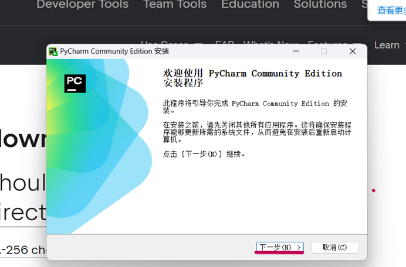

<h1><center>简锋视觉组学习路线与指南</center></h1>

<h3><center>——更适合简锋宝宝体质的学习指南</center></h3>


<h4>
<center><font face="楷体">
    沈阳建筑大学  机械工程学院  简锋实验室  2024视觉组 © </font>
<center>    
</h4><h4>
<center><font face="楷体">
   孟睿豪  https://mengruihao.github.io/
   黄周莹</font>
<center>
</h4>


# I. 版权声明

***Copyrights 沈阳建筑大学 简锋实验室 RoboMaster 2024 视觉组 孟睿豪  All Rights Reserved.***

***==只需要注明引用来源==，就可以任意使用、复制、修改、合并、散布、出版/再版本文的部分或全部内容；本文中引用的第三方内容版权归其著作者所有。***

***本指南中部分章节引用 湖南大学 RoboMaster 跃鹿战队 2022 视觉组 曾庆铖 [《了解 CV 和 RoboMaster 视觉组 —— 你的最后一本计算机视觉入门手册》]( https://github.com/HNUYueLuRM/vision_tutorial ) （点击即可进入原文档） 强烈建议读者前去阅读支持***。

> 文中的有部分取自网络图片未能识别版权信息，若出现了您的图片被使用却尚未标注出处等的情况，请通过邮箱等方式联系笔者。


# II. 关注我（们）

GitHub：孟睿豪 https://mengruihao.github.io/

作者个人邮箱：mrh@stu.sjzu.edu.cn

CSDN：星期六不太累 https://blog.csdn.net/weixin_73701209?type=blog

Bilibili：沈阳建筑大学简锋战队 https://space.bilibili.com/388263042 （ JianfengRobotics ）

Bilibili： RoboMaster机甲大师官方账号 https://space.bilibili.com/20554233

沈阳建筑大学简锋实验室微信公众号


沈阳建筑大学简锋实验室B站


# III. 致谢

感谢湖南大学 RoboMaster 跃鹿战队 2022 视觉组 曾庆铖  [《了解 CV 和 RoboMaster 视觉组 —— 你的最后一本计算机视觉入门手册》]( https://github.com/HNUYueLuRM/vision_tutorial ) 对我的启发与引领，本指南中部分章节引用此文档，强烈建议读者前去阅读支持！

感谢 **黄周莹**（沈阳建筑大学简锋实验室 2023 级视觉组成员）对本指南部分章节编写的帮助，包括但不限于 [第五章 初试深度学习 —— YOLOv5 的配置与使用](#5. 初试深度学习 —— YOLOv5 的配置与使用) 。

感谢 **张智慧**（沈阳建筑大学机械设计制造及其自动化 2203 班）在我编写本指南时进行审阅并提出建议。


# IV. 前言

---

<font face="黑体" color=red size=5>**这句话存在时，证明本指南仍处于持续更新状态！！！**</font>

---

2024年1月8日落下第一笔。

在我刚进入到简锋实验室时，视觉组可以说是家底最薄弱的一个组，根本没有系统学习资料的啊喂！我也曾迷茫，吐槽视觉组糟糕的培训体系，常常问到：“ 我们为什么没有系统学习资料？！！”。我懂得没有系统性学习资料的痛苦！但好在后来 **徐政峰学长**~~（简锋实验室视觉组 21 级老登）~~为我分享了 [《了解 CV 和 RoboMaster 视觉组 —— 你的最后一本计算机视觉入门手册》]( https://github.com/HNUYueLuRM/vision_tutorial ) 这一文档，使我倍受启发。于是在实验室经过两年的摸索拥有了一定的技术基础后，我决定回答两年前刚加入实验室时的那个疑问 —— 就由我来建立简锋实验室视觉组新的培训体系。


# V. 目录


[TOC]


# 0. 开始之前

## 0.1. 视觉组需要的数学基础

 视觉组的学习需要有**高等数学基础**、**线性代数基础**、**概率论与数理统计基础**。**高数**至少需掌握**定积分**与**不定积分**；**线代**至少要掌握**矩阵性质及其运算**、**向量组的性质**；~~**概率论**我也没学呢~~。如果才大一都不会咋办？先学着呗，能咋办。

<br>


<br>

---

<br>

## 0.2. 视觉组的学习特点

> *对于视觉组的具体介绍请看由湖南大学编写的 [《了解 CV 和 RoboMaster 视觉组 —— 你的最后一本计算机视觉入门手册》]( https://github.com/HNUYueLuRM/vision_tutorial )的前三章，在此我不做过多阐述。下面我仅为大家介绍我个人对视觉学习的感受。*

&emsp;&emsp;我认为视觉组学习的特点是内容多且杂，难度大，需要有一定的数学知识的储备(我们在0.1中介绍过)。在学习中“回头看”的情况很常见。有的知识我们在第一次学习时认为已经学会了，然而在学习其他知识时突然间发现之前的理解有错误，这时就需要我们进行“回头看”，去再学一遍。坦率地讲，我们在学习的过程中大多数时间都是沮丧的，会遇到很多困难。最令人崩溃的是这些困难可能学长们也无法为你解答，甚至在网上也找不到有效的解决办法。这时就需要你自己去探索与研究。

<br>

---

<br>

## 0.3. 视觉组电脑建议

&emsp;&emsp;坦白地说，视觉组对电脑是有一定的要求的~~（主要因为实验室穷，买不起显卡）~~。在实验室学的学习中，我们大概率需要在自己电脑上跑一些深度学习模型，例如最为我们所熟知的 YOLO 系列，它需要大量的算力。所以我建议大家买笔记本电脑时选择**有独立显卡（GPU）的游戏本**。我个人不推荐全能本~~（它那显卡只能说感知不强）~~，轻薄本更不在我们考虑范围内。我们在24年起重机备赛时决定使用 YOLOv5（一种深度学习模型）去进行视觉识别，我们一位队员使用的就是全能本了。她训练一次大约需要4分钟，而我用的是游戏本，一次仅需 30 秒左右，大家可以明显看出算力差距。顺便提一下，我们需要训练 300 次取最优解，大家算一下全能本浪费了多少时间（恼）。但是如果你已经买了电脑，那你也不要让家长再为你换一个了（如果你是富哥富姐当我没说），随遇而安吧。至少实验室肯定有人用游戏本，大不了借用一下。但也不用追求极致的性能，伴随着越高的性能电脑的价钱也会随之上涨。至于电脑具体型号我不做推荐，各位自行斟酌，但是记住 **别买苹果电脑，工科生用苹果简直灾难！！！**此外，如果你是电脑小白，我推荐你买一线品牌的电脑，售后方便，品控有保证。

<br>

---

<br>

## 0.4. 视觉组的编程基础

> *在本指南里，我默认你没有任何编程基础，完全是个小白。我会在 [3. 最流行的编程语言 —— Python](# 3. 最流行的编程语言 —— Python) 和 [4. 更接近底层的语言 —— C++](# 4. 更接近底层的语言 —— C++)  中提供一些基础资料供你学习。在本节我仅谈一谈自己的学习感悟。*

&emsp;&emsp;我推荐的编程语言学习路线是 Python → C → C++。这个学习路线是由易到难逐渐递进的。但在实际中，我们没有那么多的时间将上面提到的语言全部学精、学透。我个人是在高考结束的暑假至大一上学期结束这段时间内学习 Python ，在大一寒假学习 C++。在我们学校，大多数专业在会在大一下开 C 语言课，你可以跟着课堂去学习 C 语言。在你拥有了 Python 与 C++ 的基础后，你在课堂上学习 C 语言时会很轻松。

&emsp;&emsp;我个人认为编程语言是互相有联系的。在学习过一门语言且经过一些实战后，再去学习其他语言时速度会变得很快。我个人推荐的学习方法是**在实战中学习**。我们可以先看一些基础教程，以 **C/C++** 为例，我们需要先掌握最基本的**数据类型、运算符表达式、顺序结构、选择结构、循环结构、数组与函数**。可以自行寻找一些资料去学习，也可以看我在本小节末尾推荐的资料。在学习这些内容时**一定要将资料中的例子去实现**——不用追求完全背来，哪怕你照着抄一遍都会有很大提升。在我们学习这些内容之后就遇到 C 语言学习的一座大山——**指针**。但是学习指针的原则还是**在实战中学习**。学习时可以先看一些基础的视频教程，第一次看完你也许会很懵，这是正常的。在初步学习后可以去找一些开源实例，尝试读懂该程序的指针部分的逻辑与作用进行复现。在第一次读程序时你可能会很慢，并且发现会忘记之前的部分知识。不用担心，我们又不是在考试，不需要你去全部记住，可以去浏览器搜索或者翻翻书复习一下，~~反正没人关心程序怎么写出来的，我们只看结果（笑）~~。在看程序时如果有无论怎么研究都无法理解的地方，那我们就需要去问 Chat GPT，详情请看 0.2.2 中有关 Chat GPT 使用的介绍。

<br>

------

<br>

## 0.5. 视觉组常用的操作系统与软件

>  本节会对我们视觉组常用的操作系统、软件和 IDE 进行介绍。从这节开始，你将会看到本指南的最大特点——每一部分都会附上我学习时所用的资源和踩过的坑——减少小白们搜索资源的时间和走弯路的概率。因此，本指南在食用时**要将有关部分通读一遍后再去操作**。此外，在本节也会补充一些我认为好用的插件。

* **Git**

  Git是一个免费的、开源的**分布式版本控制系统**，可以高速处理从小型到大型的各种项目。

  **版本控制：**是一种记录文件内容变化，以便将来查阅特定版本修订情况的系统。

  **分布式版本控制工具**：如git,客户端取的不是最新的文件快照，而是把代码仓库完整的镜像下来到本地库(克隆/备份)。


* **GitHub**

  GitHub 是一个远程仓库（Git 中我们提到的代码仓库就是这个），通俗的理解就是一个可以保存自己代码的地方。在实际开发当中一个项目往往是有多个人来共同协作开发完成的，那么就需要一个统一代码保存的地方，而 GitHub 就是起到一个共享和汇总代码的作用。在使用中你可以决定自己上产的代码是否开源，当然你也可以在上面查看别人开源的代码，上面有很多技术大佬的代码很有学习价值！


- **Ubuntu**

  > ***Ubuntu** 是一种基于 **Linux** 操作系统的免费、开源的操作系统。是一款强大、稳定、易用且免费的操作系统，适用于各种用途，从个人计算机到服务器，是**最受欢迎的 Linux 发行版之一**。*

  你现在可以将 Windows 和 Ubuntu 的关系类比为手机上安卓（Android）和苹果（IOS）的关系，即使这个类比很不严谨，但是可以帮助你更好的理解。


* **Vim**

​	Vim（Vi Improved）是一款高度可定制的文本编辑器，是 Unix 和类 Unix 系统中广泛使用的一种编辑器。它是 Vi 编辑器的改进和扩展版本，提供了许多增强	功能和改进，以提高编辑效率。[Vim 安装教程](https://blog.csdn.net/weixin_73701209/article/details/135539308)可以移步我的博客。


* **CMake**

  > CMake 是一个跨平台的安装（编译）工具，可以用简单的语句来描述所有平台的安装（编译）过程。他能够输出各种各样的 makefile 或者 project 文件，能测试编译器所支持的 C++ 特性。CMake 的组态栏取名为CMakeLists.txt。CMake 并不直接建构出最终的软件，而是产生标准的建构档（如 Makefile ），然后再依一般的建构方式使用。

​	CMake 通常会出现在一些较大的 C++ 项目里。但我认为 CMake 并不需要去专门的学习，而是在你写项目大到一定程度时你自然会去学习如何使用它。


* **NoMachine**

  NoMachine 是一款高性能的远程桌面工具，它允许用户从任何地方通过联网（本地网络或互联网）访问自己的电脑桌面环境。 NoMachine 的远程桌面体验非常·流畅和响应迅速，特别适合需要远程访问高分辨率图形界面的用户。


* **Clion**

  CLion 是一款由 JetBrains 公司开发的集成开发环境（IDE），专为 C 和 C++ 编程而设计。它提供了一套强大的工具和功能，旨在提高开发人员的效率，减少编码时的重复性工作，以及简化调试和项目管理。它适用于各种项目规模，从小型项目到大型复杂的企业级应用。但是，它收费！不过用教育邮箱可以申请免费使用。详情请看《I.教育邮箱》中《二、使用教育邮箱完成 JetBrains 教育认证》。


* **Pycharm**

  PyCharm 是由 JetBrains 公司开发的一款集成开发环境（IDE），专为 Python 编程语言设计。它提供了一系列强大的工具和功能，旨在帮助开发者提高生产力和代码质量。我们一般用 Community Edition（社区版）即可。


* **Systemback**

  > ***Systemback** 使创建系统**和**用户配置文件的备份副本**变得容易。若出现问题，您可以轻松地还**原系统的先前状态。它还可以复制操作系统**，**安装操作系统**和以实时格式**创建操作系统。*

  在我们日常使用 Ubuntu 时可以使用 **Systemback** 创建一个系统副本，以便我们遇到可能出现的问题时能够及时恢复系统，不至于丢失整个系统。此外还可以使用它制作系统安装盘的功能，制作一个我们自己Ubuntu系统的启动盘。这样我们就可以在新电脑上安装上和我们之前一样的 Ubuntu 系统。


* **Ventoy**

  简单来说，Ventoy 是一个制作可启动U盘的开源工具。有了 Ventoy 你就无需反复地格式化U盘，你只需要把  ISO/WIM/IMG/VHD(x)/EFI  等类型的文件直接拷贝到 U 盘里面就可以启动了，同时还不影响 U 盘的日常使用。Ventoy 支持大部分常见类型的操作系统如 Windows 和 Linux 。


* **ChatGPT**

  > *ChatGPT 到底解决了什么本质科学问题，才能变得如此强大并受到广泛的关注呢？我们认为，ChatGPT 是继数据库和搜索引擎之后的全新一代的  “ 知识表示和调用方式 ”。*

  我们应该善于使用 ChatGPT。ChatGPT 对于我们来说就像一个近乎无所不知的老师，有什么问题都可以问它。有人会说搜索引擎不也差不多吗？但是它与搜索引擎最大的区别就是不需要我们自己从搜索出的繁杂信息中总结，而是直接告诉我们答案。下面我向 Chat GPT 询问一段代码的解释，可以看到 ChatGPT 为我们解释了关键位置的代码，大幅地提高了我们读代码的效率。


<br>

<br>

---

---


# 1.**全新的操作系统 —— Ubuntu**

<br>

##  1.1.  了解并安装 Ubuntu

> *Ubuntu 是一种基于 Linux 操作系统的免费、开源的操作系统。是一款强大、稳定、易用且免费的操作系统，适用于各种用途，从个人计算机到服务器，是最受欢迎的 Linux 发行版之一。*

&emsp;&emsp;在介绍 Ubuntu 前我们需要了解一下 Linux，并且梳理一下它和 Windows 的关系。在 0.4 中我说过，他们两个的关系不严谨的说有点像手机上的安卓（Android）系统，与苹果（IOS）系统。下面进行详细介绍。

<br>

### 1.1.1. Windows 与 Linux

&emsp;&emsp;我们在电脑上最常用的操作系统就是 Windows。Windows 是由 Microsoft 公司开发和维护的操作系统，是目前最广泛使用的桌面操作系统之一。Windows 有以下特点：

1. 用户界面：Windows 操作系统提供直观的**图形用户界面（GUI）**，用户可以通过鼠标和键盘轻松进行操作。

2. 商业软件支持：Windows 平台上有许多商业软件和应用程序的支持，尤其是一些专业设计软件（如：**CAD、SolidWorks**等）和办公软件。

3. 兼容性**：**Windows 通常拥有良好的硬件和软件兼容性，因为许多硬件和软件制造商都优先支持Windows。 

4. **游戏支持：Windows 是最主流的游戏平台之一，许多游戏首先发布Windows版本。**

   <br>

&emsp;&emsp;Linux 是一个开源的操作系统内核，有很多不同的Linux发行版，如 **Ubuntu**、Fedora、Debian 等。Linux 有以下特点：

1. 开源和自由：Linux 是一个开源的操作系统内核，有很多不同的 Linux 发行版，如 Ubuntu、Fedora、Debian 等。用户可以自由使用、修改和分发 Linux。
2. 多样性：由于 Linux 的开放性，有许多不同的发行版，适用于各种用途，从桌面到服务器再到嵌入式系统。
3. 安全性和稳定性：Linux 以其高度的安全性和稳定性而著称，特别适用于服务器环境。
4. 终端和命令行：Linux 系统更强调于使用命令行界面，这对于系统管理员和开发人员来说是一个强大的工具。
5. 性能：Linux 通常在资源利用和性能方面表现得很好，特别适用于服务器和嵌入式系统。

&emsp;&emsp;~~可以看到 Windows 和 Linux 最大的而区别就是在 Windows 上能玩更多的游戏！~~ Windows 和 Linux 在使用上最大的区别是，Windows 为用户提供直观的**图形用户界面（GUI）**，可以通过鼠标和键盘轻松进行操作。而Linux系统更强调于使用**命令行界面（CLI）**。下面我们来介绍**图形用户界面（GUI）**与**命令行界面（CLI）**。

&emsp;&emsp;**图形用户界面（Graphical User Interface，简称GUI）**是一种计算机用户界面，用户**通过图形元素（如图标、窗口、按钮）和鼠标操作来使用户与计算机系统进行交互**。与命令行界面相比，GUI更加直观、用户友好，并且通常更**容易学习和使用**。

<br>


<center>Windows 的图形界面</center>

<br>&emsp;&emsp;**命令行界面（Command Line Interface，简称CLI）或控制台**，是计算机操作系统中一种通过键盘输入文本命令来与计算机系统进行交互的用户界面。在命令行中，用户**通过输入一系列文本指令来执行系统操作、运行程序、管理文件等任务**。

&emsp;&emsp;**命令行界面（Command Line Interface，简称CLI）**相对于**图形用户界面（Graphical User Interface，简称GUI）**来说，更加灵活和强大，尤其在系统管理、自动化脚本、远程连接等方面表现出色。一些操作系统，特别是类Unix系统如Linux（我们之前说过Ubuntu是Linux的一种）和macOS（就是苹果笔记本，之前说过大多数专业设计性软件在Windows上更适配，所以作为工科生mac简直就是灾难！），强调命令行的使用；而其他系统如Windows则同时支持图形用户界面和命令行。在命令行中，用户可以通过输入命令和参数来完成各种任务，这是许多开发者、系统管理员和高级用户的首选工具。


<center> 在 Ubuntu 系统中使用命令行打开 Clion，左上角第一行$后 ./clion.sh 为输入的命令</center>

<br>

&emsp;&emsp;值得注意的是命令行界面和图形用户界面并不是绝对独立的。在Windows中点击 Win + R 后输入cmd 就可以进入Windows的终端。我们在使用Windows进行某些高级设置时会在终端用命令行进行操。相应的，Linux系统为了方便更多用户使用、降低上手难度也会有一些图形界面，如Ubuntu（见上图）。


<center>Windows 的终端</center>

&emsp;&emsp;现在你已经对 Ubuntu 和 Windows 有了大改的了解，下面你将实践去安装 Ubuntu。

<br>

---

<br>

### 1.1.2. Ubuntu 的安装

&emsp;&emsp;Ubuntu 的安装大体分为两种 —— 双系统和虚拟机，个人推荐大家使用双系统进行安装。我的习惯是将 Ubuntu 载入一块单独的硬盘，而不是和 Windows 安装在一块硬盘里。回想我第一次装 Ubuntu 就是放在一个盘里，给我制造了很多意想不到的麻烦。本节仅对 Ubuntu 双系统安装进行介绍，如有安装虚拟机的需求请自行百度。

&emsp;&emsp;Ubuntu 的安装方法在互联网上已经有很多教程了。考虑到新手在看纯图文教程时可能会心生恐惧，在这里主要推荐两个视频以供学习参考。

* BiliBili 视频： [Windows 和 Ubuntu 双系统的安装和卸载](https://www.bilibili.com/video/BV1554y1n7zv/?share_source=copy_web&vd_source=068f370ae76233cdd7be76ebaecfdc58)  （0.2.2-1）

  从准备工作到实际操作，通过详细的步骤解说，手把手教你如何安装和卸载 Windows 和 Ubuntu 双系统。（选自0.2.2-1视频简介）。正如简介所说，视频内容很详细，非常适合小白食用。此外，大家一定要有看评论区的好习惯，你的问题可能在评论区也有人遇到。
  
*  BiliBili 视频 BV 号： [Windows 和 Ubuntu 双系统的安装和卸载](https://www.bilibili.com/video/BV1Cc41127B9/?vd_source=a6f0e4e67aebf89dd9703e20cf42e7d2)  （0.2.2-2）

  0.2.2-2 补充了在 Win11 下安装双系统可能会遇见的问题，以及解决办法。观看时也要注意评论区。

<br>

<font face="黑体" size=4>**〚可能遇到的问题〛**</font>

1. 在0.2.2-1 P4 制作 Ubuntu 启动盘中，3 分 40 秒让我们查看U盘内容。操作时系统可能提示U盘无法显示或者其他报错。不用理会它，正常进行下一步操作。
2. 大家在设置密码之后一定要记住！！！这个用户密码在之后的使用中将会被大量提及。

<br>

---

<br>

### 1.1.3. 入门 Ubuntu

&emsp;&emsp;在本节开始时有提到过，Ubuntu 是一种基于 Linux 开发的操作系统。显而易见的是 Ubuntu 也继承了 Linux 操作系统的特点——更倾向于使用命令行。这与我们所熟悉的 Windows 有所不同。不用担心，在此部分将带你简单入门与熟悉 Ubuntu 的部分基本操作。

**（一）. Ubuntu的目录**

&emsp;&emsp;在 Windows 里我们都知道有 C 盘、D 盘。C 盘中又有 C:\Users、C:\Program Files 等目录。那 Ubuntu 是否有类似的结构呢？答案是肯定的！

​	Ubuntu 中我们常用的目录有 home（用户主目录）、/etc（系统配置文件）、/opt。我们可以看见这些目录前面都有 “ / ”，按照 Windows 的思维来说，这些目录都应该在名为 “ / ” 的文件夹中，事实是这样的。我们把 “ / ” 叫做根目录，而这些根系统目录，如 /home（用户主目录）、/etc（系统配置文件）和 /opt等。


<center>文中所提到的 /home、/etc、/opt 目录</center>

**（二）. Ubuntu的权限**

&emsp;&emsp;如果你按照教程在Ubuntu里下载完成Vim 后，你一定其中对 sudo 的操作有很深的印象。那什么是 sudo 呢？

1.  sudo

   sudo 是用于执行需要特殊权限的命令的工具。通过使用 sudo，用户可以在没有直接登录为超级用户（root）的情况下执行特权操作，执行sudo操作前需要我们输入密码。

2.  chmod

   在使用 Ubuntu 中，我们经常要去更改文件和目录的权限，这时就需要使用到 chmod 指令 。假设我想把所有用户（所有者、所属组和其它用户）test.txt 赋予读写执行权限，我们需要在终端输入 chmod 777 test.txt。至于赋予权限的作用在后文会进行详细讲。

3. 权限位

   每个文件和目录有三组权限位，分别对应于所有者、所属组和其他用户。这三组权限分别是读（r）、写（w）、执行（x）。

   读权限（r）：允许查看文件内容或目录中的文件列表。

   写权限（w）：允许修改文件内容或在目录中创建、删除文件。

   执行权限（x）：对文件而言，允许执行；对目录而言，允许进入目录。

   权限也有数字表示法。每一组三个权限位使用一个八进制数表示，分别对应读、写、执行权限。八进制数的每一位的值分别是 4（读权限）、2（写权限）、1（执行权限）的组合，也就是：7。

<br>

**（三）. Ubuntu的基本命令**

  &emsp;&emsp;这里提供一篇 CSDN 上的文章，里面基本囊括了我们所常用的指令。

* CSDN 链接： [Linux Ubuntu 入门基本命令整理_Ubuntu 命令行入门 - CSDN 博客](https://blog.csdn.net/qq_45277212/article/details/120834748)

<br>

## 1.2. Ubuntu 的备份

> ***Systemback** 使 **创建系统** 和 **用户配置文件的备份副本** 变得容易。若出现问题，您可以轻松地还 **原系统的先前状态**。它还可以 **复制操作系统**，**安装操作系统** 和以实时格式 **创建操作系统**。*

&emsp;&emsp;在这里我给出一篇 CSDN 上的文章供参考，**我们仅需要参考使用镜像制作启动盘部分的内容**，文章后面安装部分（第五部分 之后）的内容在我们的 NUC 上并不适用。至于安装镜像系统，我在 [**1.3. Ubuntu 的还原与复制** ](#1.3.-Ubuntu-的还原与复制)中会进行介绍。

* CSDN 链接：[Ubuntu 20 使用 Systemback 克隆系统_Ubuntu clone 系统 - CSDN 博客](https://blog.csdn.net/m0_38101947/article/details/128938229)


&emsp;&emsp;文章中有提到两个软件 —— Systemback 和 Ventoy —— 这两个软件在实验室所有的 NUC 上均已安装。 此外，我已经将装有成熟自瞄的系统复制，制作成启动盘了，你们可以直接使用，不需要再进行制作。	

<br>

---

<br>

## 1.3. Ubuntu 的复制与还原

&emsp;&emsp;在 [**1.2. Ubuntu 的备份**](#1.2. Ubuntu 的备份) 中我们已经将原有的系统经过 Systemback 生成镜像文件，并使用 Ventoy 写入到U盘中，成功制作了启动盘。接下来我们要使用启动盘在新电脑上安装镜像系统，自瞄安装盘请联系学长获取。

* CSDN 链接：[使用 Systemback 制作启动盘以及安装到新电脑 - CSDN 博客](https://blog.csdn.net/weixin_73701209/article/details/136437756?ops_request_misc=%7B%22request%5Fid%22%3A%22170947476016800225540824%22%2C%22scm%22%3A%2220140713.130102334.pc%5Fall.%22%7D&request_id=170947476016800225540824&biz_id=0&utm_medium=distribute.pc_search_result.none-task-blog-2~all~first_rank_ecpm_v1~rank_v31_ecpm-1-136437756-null-null.142^v99^pc_search_result_base6&utm_term=使用Systemback制作启动盘以及安装到新电脑&spm=1018.2226.3001.4187)


<br>

---

<br>

## 1.4. Ubuntu 的开机自启

&emsp;&emsp;Ubuntu的开机自启常用写法有两种：使用 rc.local 和 Ubuntu 自带的 Gnome。**我个人建议大家使用 Gnome 去实现开机自启**，不过在本节我会都进行介绍。

<br>

### 1.4.1. 使用 rc.local

&emsp;&emsp;使用rc.local实现的自启动不能进入桌面进行操作。如果我们开机自启的源文件有问题，不能通过shell文件成功运行源文件，这会导致Ubuntu系统堵塞。直接体现的现象就是系统卡住，不会正常执行开机。如果你在写自启动的时候不幸遭遇这种情况，详情请看 [**1.4.3. rc.local 卡死的解决办法**](#1.4.3. rc.local 卡死的解决办法)。

* CSDN 链接：[Ubuntu rc.local的开机自启与配置-CSDN博客](http://t.csdnimg.cn/9Szoh)

---

### 1.4.2. 使用 Gnome

&emsp;&emsp;与 rc.local 相比，我更推荐使用 Gnome 去实现自启动。Gnome 可以在 Ubuntu 打开图形界面后再去进行程序的自启动。这样我们就可以使用图形界面去随时修改代码并重新编译。

* CSDN 链接：[Ubuntu 20.04 通过 gnome-session-properties 实现开机自启动 shell 脚本](https://blog.csdn.net/weixin_40497850/article/details/127383230?csdn_share_tail=%7B%22type%22%3A%22blog%22%2C%22rType%22%3A%22article%22%2C%22rId%22%3A%22127383230%22%2C%22source%22%3A%22weixin_73701209%22%7D&fromshare=blogdetail)


&emsp;&emsp;我们对比 rc.local 和 Gnome 两种方式不难看出 Gnome 更加的便于我们调试，可以直接在 Gnome 中选择是否自启动，并且不会有卡死导致 Ubuntu 无法开机的情况。

---

### 1.4.3. rc.local 卡死的解决办法

&emsp;&emsp;如果在使用rc.local时真的遇到 [**1.4.1. 使用 rc.local**](#1.4.1. 使用 rc.local) 中卡死的情况，下面我提供一种解决办法。

* CSDN 链接：[Ubuntu 中使用 rc.local 开机自启卡死的解决办法 - CSDN 博客](https://blog.csdn.net/weixin_73701209/article/details/136515904?ops_request_misc=%7B%22request%5Fid%22%3A%22170986487716800226524938%22%2C%22scm%22%3A%2220140713.130102334.pc%5Fall.%22%7D&request_id=170986487716800226524938&biz_id=0&utm_medium=distribute.pc_search_result.none-task-blog-2~all~first_rank_ecpm_v1~rank_v31_ecpm-1-136515904-null-null.142^v99^pc_search_result_base7&utm_term=Ubuntu中使用 rc.local开机自启卡死的解决办法&spm=1018.2226.3001.4187)

  

  <center> 使用 rc.local 开机自启时因源文件无法运行导致卡死</center>

<br>

<br>

---

---

<br>

<br>

# 2. 视觉组的战友 —— 工业相机

<br>

## 2.1. 在简锋常用的相机

&emsp;&emsp;实验室里最常用的摄像机有海康的 **工业相机** 和普通的  **USB 相机 **。普通的  **USB 相机 **通常使用在起重机比赛上，而 **工业相机** 则是使用在 RoboMaster 上。下面你将对工业相机和 USB 相机有基本了解。

<br>

### 2.1.1. 工业相机

&emsp;&emsp;工业相机设计用于长时间运行和在恶劣环境下工作，如高温、震动和尘土环境。它们通常有更坚固的外壳和更好的防护措施。同时能提供更高的图像质量和更高的帧率。此外它们能够进行精确的曝光控制和同步，适用于机器视觉和自动化应用。还支持更广泛的传感器和接口选项，如 GigE Vision、Camera Link 和 CoaXPress 等，这些标准支持长距离传输和高数据传输速率。但是工业相机的使用相对来说更为麻烦一些，需要下载对应 SDK 进行二次开发。在后面我们会学习如何使用 SDK 调用工业相机。


<center>海康 MV-CA016-10UC 工业相机（左）和 海康 USB 相机（右）</center>

---

<br>

### 2.1.2. USB 相机

&emsp;&emsp;大多数 USB 相机设计用于一般消费者和办公环境，不适合极端条件。虽然一些高端 USB 相机也能提供良好的图像质量，但它们的性能通常不如工业相机，尤其是在帧率和曝光控制方面，但是它的使用相较于工业相机来说更简单一些。它的接口主要使用 USB，易于安装和使用，但传输距离和数据速率受限于 USB 标准。总的来说，USB 相机更多用于一些基本的图像处理应用。

<br>

---

<br>

## 2.2. 相机的成像原理

> *本节会涉及到 **线性代数** 的知识，你需要至少掌握 **矩阵乘法**、**齐次坐标** 并且对线性代数中 **线性方程如何转化为矩阵方程** 有了解后再来观看。如果你对我上面说的两个知识不了解，请观看 [【俗说矩阵】矩阵原来这么简单！从二元一次方程组开始教你~](https://www.bilibili.com/video/BV1P3411B7pp/?spm_id_from=333.337.search-card.all.click&vd_source=a6f0e4e67aebf89dd9703e20cf42e7d2) 和 [探秘三维透视投影 - 齐次坐标的妙用](https://www.bilibili.com/video/BV1LS4y1b7xZ/?spm_id_from=333.337.search-card.all.click&vd_source=a6f0e4e67aebf89dd9703e20cf42e7d2) 后再继续学习本节。*

&emsp;&emsp;相机是我们视觉组在实验室日常工作中相伴时间最长的、最密不可分的战友。因此，我们必须要了解相机的成像原理。正所谓 “ 磨刀不误砍柴工 ”，这对我们后续的学习有着很大的作用！ 

* BiliBili 视频： [**相机模型都没弄懂，怎么搞机器人视觉算法？**](https://www.bilibili.com/video/BV12u411G71A/?share_source=copy_web&vd_source=068f370ae76233cdd7be76ebaecfdc58) （2.1-1）

<br>

---

<br>

## 2.3. 相机参数

&emsp;&emsp;我们对相机参数也需要有基本的了解，这里我引用湖南大学跃鹿战 [《了解CV和RoboMaster视觉组》](https://github.com/HNUYueLuRM/vision_tutorial/blob/main/了解CV和RoboMaster视觉组.md) 中 [4.1. 相机](https://github.com/HNUYueLuRM/vision_tutorial/blob/main/了解CV和RoboMaster视觉组.md#5.0.CV的常识性概念) 章节。

> 虽然别人总觉得视觉组就是整天对着屏幕臭敲代码的程序员，实际上我们也会接触很多的底层硬件与传感器，在使用硬件的同时很可能还需要综合运用其他学科的知识。

<center>选自原作者序</center>

相机是机器人的眼睛。和人眼的成像原理一样，相机通过镜头汇聚光束使他们聚集在一块半导体感光元件上（相当于视网膜）从而产生可供读取的数据。随后图像随着数据线传如miniPC等运算平台（视网膜刺激视神经传到神经冲动到大脑）。时下的感光单元主要分为两种：**CMOS和CCD**。电类的工科生或是摄影爱好者对此应该不会感到陌生。

- CMOS(complementary metal-oxide semiconductor)传感器是由金属氧化物半导体排成的阵列，和发光半导体相反，其上的pn结受光照时会产生电荷存储在电容中，通过和内存一样的结构采用行选和列选开关，为每一行/每个像素点配备**放大器和AD**（Analog-to-Digital converter,模拟-数字信号转换器），选中位置的信号会通过OP和AD，从而将电荷转换为数字信号，最后生成图像。优点是**成本低，图像帧率高**，但是固有不可消除的采集噪声（每个采集单元的参数不可能完全一致）会影响成像的质量。

- CCD(charged couple device)传感器是由最简单的MOS电容器阵列构成的，与CMOS不同，CCD的**每一行像素只配有一个信号处理器**，利用时钟脉冲驱动产生的差压，这一行电容器采集到的电荷会以串行的方式依次通过每一行末端的信号处理器从而产生图像。因此CCD能达到**更高的像素密度**（CMOS上的op和ad都要占用空间），其优点是**成像的一致性好，噪声很小**，由于不能同时处理所有信号，其帧率一般不高。

- 想要获得关于感光单元的更多信息，请参阅[cmos和ccd](https://zhuanlan.zhihu.com/p/139394687)。

- 系统地学习成像原理，参见国防科技大学的MOOC：[《第十五讲：CCD图像传感器》]([传感器与测试技术_中国大学MOOC(慕课) (icourse163.org)](https://www.icourse163.org/learn/NUDT-1003089003?tid=1466987457#/learn/content?type=detail&id=1247289367&sm=1))

  

  <center>这是我们实验室的一枚MV工业相机，可以看到正中间有一块小小的CMOS传感器晶片</center>

相机的快门还有**全局曝光**和**卷帘曝光**之分。全局曝光时一次性采集所有感光单元的信息或为每个感光单元配备一个寄存器暂存电荷，而卷帘曝光则是分时逐行采集信息（根据其名“卷帘”就能看出是一排一排地采集数据）。若经费充足建议购买全局曝光的相机，其所有单元在同一时刻采样，曝光时间和我们设置的曝光时间才是真正一致的。而卷帘曝光的相机第一行首先完成曝光，接着是第二行、第三行...到最后一行完成曝光时，中间大概有数百ns甚至ms级的时间，这就导致整个画面其实不是在同一时间采样的，在面对**高速运动**的物体是会出现**“果冻效应”**，即图像的不同部分出现倾斜、断层等现象，极大地影响了成像质量和识别的效果。CCD相机一般使用全局快门，而CMOS相机使用全局快门的制造成本很高，需要为每个感光单元配置一个寄存器。


<center>这两幅风扇的图像是在相同时刻分别用全局快门和卷帘快门的相机拍摄的</center>

<br>

---

<br>

### 2.3.1. 镜头

就像人的晶状体，不同的是，人的晶状体是可以改变焦距但像距固定，而一般使用的工业相机和USB相机配套的镜头**是定焦但可以调节像距的**。不过在小孔成像模型中，我们把透镜看作被压缩成一个点的大小，因此在这种情况下我们认为**焦距和像距等同**。


<center>从透镜到小孔的近似过程，截取自知乎-龚健男的回答-凸透镜和小孔成像的原理与联系</center>

- 我们都知道镜头是一块凸透镜，在他的两边各有一个焦点，焦点即所有平行进入透镜的光线的汇聚点。不同焦距的镜头其视距和视野范围不同，一般来说，**视距大（看的远）的镜头，其视野范围小（可视角小）**；**而视距短（看的近些）的镜头，视野范围大**，典型的例子是广角镜头。拿生活中的例子来说，现在的手机的摄影系统都是由多个镜头组成的，每个镜头的焦距一般不同，从而适应不同焦段和视野的摄影需求。高级的镜头通常可以调节光圈大小，从而改变镜头的进光量。

- 在比赛中，我们一般给步兵机器人配置广角镜头（适用**近战**，可视角广）或是6mm的镜头（中庸的选择，**兼顾长短**）。打击能量机关的步兵机器人会选择8mm、12mm的**长焦镜头**来获得更好的远距离成像效果。哨兵机器人可能会配置两个相机，分别搭载广角镜头和中短焦镜头，广角用于“广撒网”，对敌方目标进行大致的定位，之后交由另外一个相机进行精确的定位。有些打得准（弹道精度高）的队伍甚至为所有机器人都搭载了两枚镜头或选用**变焦镜头**，让机器人成为各个距离都能实施自动打击的多面手。海康机器人的官网提供了一个镜头选型工具：[海康机器人-镜头选型工具](https://www.hikrobotics.com/cn/machinevision/visionproduct?typeId=40&id=247)，输入参数后可以自动计算需要的视场角和靶面尺寸、焦距等，不过它推荐的肯定是自家的产品，只需要拿着相应的参数自行联系经销商或去tb上找平替款即可。

  *若想要更有针对性地选择镜头的焦距，可以根据相机成像模型进行视野要求和焦距之间相关关系的计算。*

- 由于凸透镜**本身的性质**和镜头制造的**工艺**问题，使得光线在通过镜头时无法保持物体在空间中原本的位置关系而发生**畸变**，好在这些畸变都能够通过数学建模并由反向解算而得到还原。这需要我们通过**相机标定**来去除这种畸变以便还原图像中物体的真实位置。畸变主要分为切向畸变和桶型畸变，我们可以利用标定板和畸变的数学关系来进行相机标定，OpenCV中也有相关的函数可供调用。关于成像模型、畸变和标定，可以参阅[相机标定](https://zhuanlan.zhihu.com/p/30813733)和OpenCV官方文档中的[CameraCaliberation](https://docs.opencv.org/4.5.2/dc/dbb/tutorial_py_calibration.html)。在 *5.1、6.*3 中我们还会提到这一点，并且给出了提供标定流程的参考文章。

  

  <center>USB工业相机上几种不同焦距的M12镜头,依次是超广角,4mm,6mm,8mm,12mm</center>

  <center>M12镜头的12指的是相机上的接口直径为12mm</center>

- **光圈**就是镜头前面可以开闭的小扇叶（M12镜头一般不可以调节光圈，但板级工业相机一般有一个“auto aperture”的选项，可以根据环境亮度调节“虚拟光圈”，毕竟上面没有机械光圈）。不同光圈大小代表不同的镜头开度，其影响的是镜头的进光量。一般用**f值**刻画光圈的开合程度：

  

  <center>f/x，x代表的是开合程度，镜头上此数值越小说明通光孔的直径越大</center>

  光圈还和成像的景深有关系，越大的光圈得到的景深越小，即成清晰像的范围越小：

  

  <center>光圈越大，景深越小，反之景深更大</center>

  因此，在调大光圈提高进光量的同时，能够成清晰像的距离范围就缩小了，我们需要在两者之间进行权衡。不过没有关系，为了提高画面的亮度和可视性，我们还可以调节一些其他参数：在下一个小节会介绍曝光时间和增益，以及gamma这三个参数。

  此外，不可追求景深而将光圈缩得太小。一方面是进光量大大下降（平方反比级），另一方面是光在通过小孔的时候会有强烈的**衍射**现象，导致像的边缘模糊，边界不够锐利。

  

---


### 2.3.2. 相机参数调节

相机在使用过程中，除了硬件参数我们还可以调节许多采集参数，之所以很多队伍（可以说是大部分队伍）会选用工业相机，就是因为其参数调节是高度定制化的，厂商提供了SDK以方便我们进行二次发开。这里列出一些相机的主要的可调参数：

- **曝光**：每一帧图像的感光时间，其值愈大则画面的整体亮度越大，曝光时间过长过短都可能会出现宽容度不够的情况（一片雪白或是漆黑无比），**选择正确的曝光是算法能否奏效的关键**。如传统的灯条特征选取算法就要求恰当的低曝光以保证灯条**不会出现过曝而显现白色**但同时又要能够**看清装甲板中间的数字**以便进行模板匹配、svm分类或其他数字识别；运用卷积神经网络的目标检测算法则需要相机采集到的画面能尽量接近数据集中图片的情况，一般来说需要高一些的曝光。

- **帧率**：相机每秒钟能够获取的图像数。一般来说，如果你的图像处理算法的速度够快，那么帧率越高越好，这能够保证你处理结果的**实时性**。一些相机提供了***硬件触发*** 功能，这样能够让相机以固定的时间间隔触发采样，保证两帧之间的时间相同，以便于和机器人的控制进行时间线同步。视觉算法处理、数据传输、电控算法处理、再到控制执行机构动作，最后子弹在空中飞行——这几个过程中都有时间延迟，累加之后算是非常可观。***高速的算法和确定的延迟时间是打造预测算法的基础。***

- **白平衡**：设定白色是怎么样的“白”，本意是不管在任何光源下都让原本呈现白色的物体通过增加偏置而还原为白色。涉及到色温和颜色空间的概念，调节此参数即调整RGB三原色的混合比例。

- **图像保存格式**：图像的编码方法，如JPEG, RGB, YUYV, YUY2等，不同的编码格式保存的信息量可能有差别。我们会在 *5.0* 节进一步了解相关信息。

- **分辨率**：一张图像的像素数，常见的有1920x1080，1280x720，640x480，一般来说，分辨率越高则图像保留的细节就越多，但同时相机处理的数据量变大，会降低采集帧率和每秒传输的图像数量。在之后的图像处理中，同样意味着更大的开销和处理速度下降。

- **增益**：调节感光单元在**进行电荷信号放大时的增益**（gain,一般是用dB表示的,这需要你注意数量级），对于图像的亮度和各颜色信息的保存都有影响。在低曝光的时候可以有效提高成像质量，但同时也可能提高噪声（不规则噪声信号也会被放大）。

- **对比度**：图像中明暗区域最亮的白和最暗的黑之间不同亮度层级的测量，差异范围越大代表对比越大,在高动态范围和高宽容度的时候，提高对比度可以凸显图像中亮度不同部分的区别，相当于用一把刻度更精细的尺子去测量物体能够得到更精细度量信息。某些情况下，提高对比度所指的则是直接增加亮暗之间的差别，**让亮部更亮，暗部更暗。**

- **饱和度**：是[HSV色彩空间](https://baike.baidu.com/item/%E9%A5%B1%E5%92%8C%E5%BA%A6/3430026)中的概念，代表了一种颜色的纯度（Saturation）。

  *这里推荐使用qv4l2这款软件，可以方便的给相机调参并实时显示效果。*

  

  

<center>这是软件qv4l2的截图,v4l2是linux自带的相机驱动程序,可以看到有许多可供我们调整的设置</center>

<center>工业相机的配置则需要使用厂商提供的sdk,OpenCV也提供了一些修改相机参数的函数</center>


---


### 2.3.3. 硬件参数

这些参数都是在选型的时候需要注意的，衡量了一个相机在可调参数上有多大的调节空间。

- **靶面尺寸**：该参数即感光元件的面积大小，值越大表明面积越大，面积越大进光量就越大，信噪比自然会相应提高，对于暗光环境会有更好的成像效果，还有其他种种优势，这也是所谓的**底大一级压死人**。使用靶面尺寸这个看起来无厘头的metric其实是有历史渊源的。

  > 在CCD出现之前，摄像机是一直使用光导摄像管的成像器件感光成像的，其直径的大小，直接决定了其成像面积的大小。因此，后来大家就用光导摄像管的直径尺寸来表示不同感光面积的产品型号。直到CCD出现之后，也就自然而然沿用了光导摄像管的尺寸表示方法，进而扩展到所有类型的图像传感器的尺寸表示方法上。
  >
  > 例如，型号为“1/1.8”的CCD或CMOS，就表示其成像面积与一根直径为1/1.8英寸的光导摄像管的成像靶面面积近似。光导摄像管的直径与CCD/CMOS成像靶面面积之间没有固定的换算公式，从实际情况来说，CCD/CMOS成像靶面的对角线长度大约相当于光导摄像管直径长度的2/3。

  常见的靶面尺寸其和实际面积的对应关系如下：

  

  

- **宽容度/动态范围**：大家常常会问一个问题：为什么我的相机拍出来的画面很暗，但是灯条中间仍然发白？这是相机的硬件特性**动态范围**或**宽容度**（这两个词汇在摄影领域常常被混淆，但是对于数字相机而言这两个词汇代表的意思几乎一致）所决定的。动态范围即感光元件能够记录的光强从最低到最高亮度的范围。最低即感光元件刚好有输出(或是当没有任何光线进入时产生的响应，即暗电流)，会根据光线变化而产生电荷变化的**阈值**；最高亮度范围则是相机能够捕捉的最大累积光强，就像放大器一样，超过了其输出上限就会产生**截断**，此时即使继续提高曝光时间或外界光强增大，转换原件的输出也不会变得更大。因此上面的问题就出在相机的宽容度不足上。以高级的摄影器材为例，它们通常拥有超高的宽容度，下方是RM官方制作的数据集ROCO中的一张图片，可以发现画面整体明亮，但是红色装甲板表现地非常“红”，蓝色也很“蓝”，没有出现“过曝”的情况。

  

  <center>图源ROCO数据集，建议在新标签页中打开放大观看</center>

  动态范围在硬件实现上体现为单个CMOS/CCD单元能够容纳电荷的数量，光电耦合单元的容量越大就能保证曝光时间增大时不会发生“溢出”。摄影技术中常用的一种从软件层面提高动态范围的方法称作HDR（high dynamic range），这是一种一次性拍摄多张不同曝光的图片并利用算法对多帧图像进行对齐以及融合的技术。例如在逆光拍摄的时候光线来源区域往往会过曝，而背光处的物体常常“黑成一团”，这时候开启HDR，相机会采用两种曝光参数分别采样数次，高曝光图像能够捕获更多背光区域的细节，低曝光图像能够防止光线来源区域的感光单元溢出。通过自适应阈值技术自动为不同区域选择合适的图像进行填充即可得到一张完美的图像。

  

  <center>上方图片采用了6种曝光下采样的数据进行融合，左下角是融合的最终结果；图源http://bbs.a9vg.com/thread-5113593-1-1.html</center>

  因此在选购相机的时候，特别是对于传统算法，应该选择动态范围大的相机。动态范围一般以dB为单位，表明最大输入和最小输入之间的倍率关系。

  

- **像元尺寸**：顾名思义就是一个像素的实际面积有多大。在靶面尺寸相同的情况下，自然是拥有更大像元尺寸的传感器的感光能力更强了（合并后的像素可以采集更多的光线）。不过相应的，这自然会造成分辨率的下降。而相反，较小体积更小的像元尺寸可以做到更大的分辨率，不过由于单个像素的面积减小，CMOS/CCD单元保存电荷的能力也会下降导致动态范围无法提高，安放AD的位置也会缩小。

  一般工业相机的SDK都支持**合并数个像元**（通常是*水平合并* 以及*竖直合并* ，或者叫**Binning**），让用户可以合并相邻像素获得更高的画面亮度（binning也分为模拟binning[硬件支持？]和数字binning[利用算法进行插值]，模拟binning由于DSP需要处理的数据变少了/CMOS转换的行列帧数减少，可以提高采集帧率）。还有另外一种降低分辨率（一般是为了提高采样速度）的方法是下采样，这种方法和像素合并不同，直接看下图就很好理解：

  

  <center>只选择深色的像素进行成像，白色像素不工作</center>

  特别注意，若选用相机的ROI模式或者直接修改分辨率，则会在cmos上裁剪一块区域用于成像，剩下的区域不会工作。这会提高相机的工作帧率，**但是显然会减小成像的视场角**，因为有效成像面积下降了。下采样则在分辨率下降的时候保持相同的视场角。

- **信噪比**：SNR（signal noise ratio）是真正的由光线引起的动作信号和噪声（电磁干扰、杂光、暗电流和散射光等）的比值，一般也是用dB来衡量。注意区分此参数和动态范围此参数越大，在增大增益的时候，噪点引起的干扰会越小。

  

  <center>信噪比和动态范围的对比，图源https://www.znjtech.cn</center>

- **像素格式**：或者叫图像保存的格式/采样格式。常见的有这些：

  - Mono 8/10/12，黑白
  - Bayer RG 8/10/10Packed/12/12Packed
  - YUV422Packed，YUV422_YUYV_Packed
  - RGB 8，BGR 8 ；BGR 8是最友好的，采集后可以直接用`cv::Mat`处理，不需要额外的转换开销

  对于工业相机采集得到的原始数据，OpenCV可以直接处理第一种和第四种，而Bayer格式和YUV系列的则需要经过手动转换或者使用相机自带的SDK进行格式转换，才能为OpenCV所处理（OpenCV似乎也提供了转换的API）。实际上大部分相机在拍摄时的格式都是**Bayer RG**，这是因为像素的实际排列并不是规则的RGB三种像素（一个像素单元实际上只能感受一种波长的光）：

  

  <center>最常见的RGGB排列方式</center>

  既然绿色像素比红蓝像素多，其转换的时候必然要进行权重的矫正。对于没有对应颜色像素存在的地方，转换的时候肯定要进行插值，选择的插值方式（线性、双线性、泰勒）对于**转换速度/转换质量**的影响是比较大的。

  > 当初华为手机在宣传其摄影功能的时候就提到它使用的是RYYB的排列以最大程度提高感光能力，不过缺少绿色像素，其成像即使经过算法矫正也通常偏黄。

- **链接方式**：即相机连接到运算平台使用的硬件定义和通信协议。对于工业相机而言，我们会用到的、最常见的有USB3和工业网口GigE，工业场合历史遗留或标准遗留的包括CamerLink和IEEE1394，由于通用性和可扩展性不佳正在被逐渐淘汰。CoaXPress这种超高速的接口，由于通用性受限、价格昂贵，我们一般用不到。现代工业相机一般还支持自定义的可编程数字IO接口，即下图中的圆形6-pin数字IO：

  

  <center>上方为USB3.0，左下方为数字IO</center>

  6-pin接口一般包括光耦输入和输出以及光耦地（这两路信号都通过光耦二极管进行电气隔离形成保护），电源和电源地，还有一路可配置GPIO（可以配置成输入或输出）。额外电源一般在USB接口供电能力不足或高负载工作的时候才需要连接，GPIO以及光耦输入输出三条线可以用于硬件触发、采集触发等功能，对于与其他设备同步采集时间戳是一个非常有效的解决方案。

  **USB连接线在相机一端一定要选用有固定装置的接头**（相机上都有由于固定的螺孔），防止松动导致连接异常，损坏接口甚至由于不明原因的异常导致相机内部DSP损坏。USB和GigE虽然都支持热拔插，但还是**尽量停止取流并断开相机后**再行拔插，笔者使用海康威视工业相机的时候就常因为连接不稳数次后相机亮红灯，而一些机械结构的设计又让重新拔插分外困难。连接到运算平台的一侧，在确认机械结构不再改动后可以打上热熔胶或使用3D打印件进行固定防止松动。

<br>

---

<br>

## 2.4. 相机的使用

> 在本节，你将学习如何使用海康工业相机去获取图像、如何使用 SDK 进行二次开发。我建议你在拥有编程基础后再来看这一节。


<br>

---

<br>

## 2.5. 相机标定

&emsp;&emsp;相机标定是我们计算机视觉入门的必学项目之一，在学习相机标定之前大家一定要了解上文的相机工作原理。在上视频中虽然对相机标定略有涉及观看完相应视频。下面，我们开始进入相机标定。

* 知乎文章： [相机标定究竟在标定什么？- 知乎 (zhihu.com)](https://zhuanlan.zhihu.com/p/30813733)  （2.2-2）

&emsp;&emsp;在 2.2-2 中我们详细的了解了 **相机标定** 的过程与原理。其中涉及 **消畸变模型** 部分内容需要我们反复观看，彻底理解。

<br>

<br>

---

---

<br>

<br>

# 3. 最流行的编程语言 —— Python

> *Python 无处不在。很久以前，作为 Perl 的竞争对手，Python 就开始成为系统管理员编写脚本的工作。**如今它在数据科学、机器学习等领域也颇受欢迎**，同时Python 也适用于 Web 开发、后端、移动应用程序开发、甚至是（较大的）嵌入式系统等领域。*

<center>TIOBE 官方对 Python 的评价</center>

​	在本章你将学习 Python

<br>

## 3.1. 为什么要学 Python

* **易于学习**
  * **简单的语法**：Python 的语法简洁明了，接近自然语言，使得初学者容易上手
  * **丰富的标准库**：Python 附带了一个庞大的标准库，可以帮助处理各种常见的编程任务

* **广泛应用**
  * **Web开发**：使用框架如 Django 和 Flask，可以快速开发强大而灵活的 Web 应用。
  * **数据科学与机器学习**：Python 是数据科学家和机器学习工程师的首选语言，拥有丰富的库如 NumPy、Pandas、Scikit-learn、TensorFlow 和 PyTorch。
  * **人工智能与深度学习**：Python 在 AI 和深度学习领域有着广泛应用，TensorFlow、Keras 和 PyTorch 等库使得开发 AI 应用更加简单。
  * Python 是一个非常流行的编程语言。在 TOIBE 排行中 Python 位列第一，超过了我们所熟知的 C++ 和 Java。


<center>TIOBE 2024年7月排名</center>

*  **跨平台兼容性**
  * **跨平台运行**：Python 程序可以在 Windows、MacOS 和 Linux 上运行，不需要对代码进行任何修改。

<br>

## 3.2. 配置 Python 环境

### 3.2.1. Windows

#### 1. 安装 Python

* 打开浏览器搜索 Python 官网：https://www.python.org/ 。点击 Downloads > Windows。

  

  

* 选择你想要下载的版本，这里我们在稳定版中找到 Python3.10.X（其实下载哪个都可以，这里只是因为视觉盘里有这个安装包）。这里注意，我们要选择 64-bit 版本。


* 打开我们下载的安装包按照如下要求选择。


* 默认全选，点击 Next。


* 做如下勾选。


#### 2. 检查是否成功安装 Python

* 点击 win + R 键，输入cmd，进入命令行。


* 输入 python 按下回车。有类似 Python 3.10.3 的版本号即安装成功，本教程应该是输出 Python 3.11.9。


​	

#### 3. 安装 PyCharm Community Edition

* 打开浏览器搜索 PyCharm 官网：https://www.jetbrains.com/pycharm/ 。点击 Download。


* 注意不要下载 Professional ！！！翻到下面选择 PyCharm Community Edition 点击 Download 下载。


* 打开安装包，点击下一步。



* 选择你的安装位置


* 此页面全部勾选。


* 点击安装，等待安装完成即可。


#### 4. 将 PyCharm 修改为中文

* 点左侧 Plugins，找到 Chinese，安装。


* 点击 Restart IDE。


* 点 Restart 重启即变为中文。


### 3.2.2. Ubuntu


## 3.3. 正式学习 Python


## 3.4. 更方便的 Python 环境管理工具 —— Anaconda

> **Anaconda **是一个开源的 Python 和 R 语言的发行版本，用于计算科学（数据科学、机器学习、大数据处理和预测分析），Anaconda 致力于简化软件包管理系统和部署。Anaconda 透过 Conda 进行软件包管理，并拥有许多适用于 Windows、Linux 和 MacOS 的数据科学软件包。

### 3.4.1. 安装 Anaconda


### 3.4.2. 为什么要用 Anaconda ？

​	在讨论为什么要用 Anaconda 这个问题前我们先了解一下 Anaconda 里面都有一些什么


# 4. 更接近底层的语言 —— C++

##	4.1. 配置 C++ 环境


## 4.2. 正式学习 C++ 


<br>

<br>

---

---

<br>

<br>

# 5. 视觉组的第一个专业课 —— OpenCV

在本章你将学习 OpenCV 的使用，并且在 [5.5. 项目实践与指导](#5.5. 项目实践与指导) 中你将自己去完成一个中等难度的视觉识别项目

<br>

## 5.1. 初识 OpenCV

> ***OpenCV** (Open Source Computer Vision Library)，是一个跨平台的计算机视觉库。**OpenCV** 用于开发实时的图像处理、计算机视觉以及模式识别程序。*


&emsp;&emsp;可以说 OpenCV 是你进入视觉学的第一个 “ 专业课 ”，同时也是视觉组的基础。它提供了丰富的图像处理和计算机视觉的函数和工具，广泛应用于实时计算机视觉应用中。下面这个视频将使你对OpenCV有一些基本的认识。

* BiliBili 视频： [OpenCV是什么？OpenCV需要学习什么？学完之后可以做啥工作？](https://www.bilibili.com/video/BV1iG4y1s7jQ/?spm_id_from=333.337.search-card.all.click&vd_source=a6f0e4e67aebf89dd9703e20cf42e7d2)

<br>

---

<br>

## 5.2. 学习 OpenCV 之前

&emsp;&emsp;在学习 OpenCV 函数之前，有一些基本概念和原理需要大家掌握，这里我引用湖南大学跃鹿战队 [《了解CV和RoboMaster视觉组》](https://github.com/HNUYueLuRM/vision_tutorial/blob/main/了解CV和RoboMaster视觉组.md) 中 [5.0. CV 的常识性概念](https://github.com/HNUYueLuRM/vision_tutorial/blob/main/了解CV和RoboMaster视觉组.md#5.0.CV的常识性概念) 章节。

<br>

> 在大部分时候我们都不需要设计底层的算法，而是直接调用封装好的 API，设计更具体的应用于特定问题的算法。当然，**有必要了解一下造轮子（底层算法的实现）的过程**，这能够让我们深入理解算法内部的构造，从而更好地使用这些算法，出错的时候也能更快定位问题。如果只是调用 API 而不了解原理，那么只是简单的缝合+搭积木，对于提升自我的思考能力和逻辑思维没有任何帮助。应当要有* “ 使用科技的黑箱会使我惶惶不安 ”* 的觉悟。
>
> 我们最常用的 OpenCV 和一些神经网络模型都是开源的，它们都有优秀的注释和说明文档，尤其是 OpenCV 的 Documentation 和 Tutorial 十分详细，全是使用 doxygen 生成的标准文档系统。通过阅读这些材料，很快就能上手。在 GitHub 社区你可以提出 Issues ，和其他开发者一起讨论问题。

<center>节选自原作者序</center>

<br>

- **像素**：像素是构成图像的基本单元，像素通过行列组合成矩阵就形成了图像。在计算机中一般都以矩阵的形式存储图像。若仔细观察你的手机或电脑屏幕，应该能看到微小的由红绿蓝三色组成的发光单元。当像素密度足够高，人眼就会认为一张图片是连续的了。在图像处理的过程中，我们常把图像视作一个二元函数（如果是灰度图的话），在两个坐标轴上，亮度随坐标而变化。当图片是彩图时，下面会介绍颜色空间的概念。

  

  <center>一张皮卡丘的图片，由一个个像素点构成。</center>

  

- **像素深度**：自然届中的颜色固然是连续的，但是在计算机中存储的数据是离散的。存储一个像素所使用的位(bit)数叫做像素深度，可以看作图像在某一点取值的值域。常听说的8位宽颜色就是用8位数据表示一种颜色，存储一个像素使用的位数越多，其能保存的信息就越丰富，主要表现在能显示的色彩的数量和对比度上。

  

  

  <center>各中位深度图像的对比，显然24位深度的图像最能还原真实的场景，逼近连续的情况</center>						

  <center>图片源自csdn-[丁香树下丁香花开](https://blog.csdn.net/csdn66_2016)，侵删</center>

  

- **通道数和颜色空间**：当一张图像只有一个通道的时候，他只能表示一个维度的信息，比如这张灰度图，在唯一的一个亮度（灰度）通道中保存。

  

  <center>一张以灰度图形式展现的英雄机器人</center>

  当一张图片想要以彩图的形式保存，它至少需要三个通道，即 Red Green Blue（RGB），每个通道都是一个矩阵，矩阵中的每一个元素保存着 0～255 的值，对应不同的颜色分量。仔细观察下图就会发现，原图中呈现蓝色的部分在蓝色通道中比其他通道要更亮，比如机器人后轮下方的一片蓝光，在红色通道中就几乎没有分量存在。

  

  <center>图片被拆分为三个通道</center>

  除了 RGB 空间，还有其他不同的颜色空间如 HSV、YUYV、LAB等，他们都是把图片投影到不同的空间中，图片在这些空间中的每一个坐标轴的投影，就是它在这个方向上的分量（和线性代数中概念的具象）。

  

  <center>RGB空间的坐标轴-来自百度百科</center>

  

  <center>HSV空间的坐标轴（柱坐标系）</center>

- **图像的压缩编码方式**：为了达到减少空间占用的目的，我们会通过某种算法将图像进行压缩。存储图片时格式一般有 bmp,jpg,png,tif,gif 等。不同格式图片的解码速度和占用空间大小不同，有时候甚至是算法时间占用中的关键一环。

<br>

---

<br>

## 5.3. 入门 Opencv For Python

&emsp;&emsp;这里我推荐一本书供大家**初步学习**： 《Python OpenCV 从入门到精通(明日科技)》。这本书很简练，并且对图像处理的基础常识也有讲解，很**适合新手入门**。你可以在锋盘或者视觉盘里下载到。此外，我推荐在**深入学习**时可以看官方文档 [OpenCV Python Tutorials (中文版)](https://opencv-python-tutorials.readthedocs.io/zh/latest/) 。如果你不喜欢看书的话，你也可以在 B 站里直接搜索 OpenCV 会有很多资源，在这里我不做硬性推荐。


### 5.3.1. 环境搭建

1. 安装 PyCharm 与 Python

   下载安装 PyCharm Community Edition（[Windows 点击此处](https://www.jetbrains.com/pycharm/download/?section=windows)，[Ubuntu 点击此处](https://www.jetbrains.com/pycharm/download/?section=linux)）、安装 python（[Windows 点击此处](https://www.python.org/downloads/windows/)）。详细教程看 [3.2. 配置 Python 环境](#3.2. 配置 Python 环境) 。

2. 安装 opencv-python 和 opencv-contrib-python

   注意 OpenCV 与 Python 版本需要对应（[点击此处即可查看](https://pypi.tuna.tsinghua.edu.cn/simple/opencv-python/)）否则会报错，以 opencv_python-3.4.0.14-cp36-cp36m-manylinux1_x86_64 为例，其中 3.4.0.14 是 OpenCV 版本号，cp36 表示对应的 Python 版本为 python 3.6，而后面的 linux 代表是 linux 版本。

   在查看自己 Python 版本，确定 Opencv 的版本号之后直接使用 pip 安装即可。

   ```
   pip install opencv-python==3.4.9.33  # 此处 OpenCV 版本要和 Python 版本对应！
   ```

   安装 opencv-contrib-python，相当于加了一些额外拓展，比如一些特征提取的算法，在直接的 OpenCV 中是没有的，需要额外装这个扩展包。

   ```
   pip install opencv-contrib-python==3.4.9.33  # 版本号要与 OpenCV 版本号一致！
   ```

<br>

---

<br>

### 5.3.2. 阅读指南

​	在学习时一定要将书中示例代码在你的电脑上复现一遍，但我们并不需要把对应函数背下来，正如我在 [0.3. 视觉组的编程基础](# 0.3. **视觉组的编程基础**) 中所说，我们不是考试，忘记了大不了在网上搜一下就好。下面我对这本书的章节简单做了一些注释，以便帮助你缩短学习时间。

| 阅读指南                   |                                     |
| -------------------------- | ----------------------------------- |
| 第1章　Python与OpenCV      | 没有看的必要                        |
| 第2章　搭建开发环境        | 没有看的必要                        |
| 第3章　图像处理的基本操作  | 最基础的操作，必须会                |
| 第4章　像素的操作          | 会用就行，一般用不到                |
| 第5章　色彩空间与通道      | 很重要的知识，一定要彻底理解        |
| 第6章　绘制图形和文字      | 6.5 与 6.6 可以不看，其余的都很常用 |
| 第7章　图像的几何变换      | 基础操作，在之后会有更深入的学习    |
| 第8章　图像的阈值处理      | 重点！重点！重点！                  |
| 第9章　图像的运算          | 9.4 可以不看，其它的挺常用          |
| 第10章　模板匹配           | 了解即可                            |
| 第11章　滤波器             | 重中之重！！！                      |
| 第12章　腐蚀与膨胀         | 重点，要明白作用是什么              |
| 第13章　图形检测           | 重点！重点！重点！                  |
| 第14章　视频处理           | 基础操作，必须会                    |
| 第15章　人脸检测和人脸识别 | 感兴趣可以看一下                    |
| 第16章　MR智能视频打卡系统 | 没看的必要                          |

<br>

---

<br>

## 5.4. 入门 OpenCV For C++


## 5.5. 项目实践与指导

​	这里以[《 2023 年中国大学生机械工程创新创意大赛实施方案 “ 创新赛道 ” 赛项四：物流技术（起重机）创意赛》](http://lei.org.cn/uploads/soft/230417/1-23041G41H1.pdf) 为例（点击后在文档第 24 页查看详细规则）。我们的任务简单来说就是需要分别识别出乐扣盒（[参考链接](https://detail.tmall.com/item.htm?abbucket=3&id=20641176431&ns=1& spm=a230r.1.14.1.768d492e7hNMeX&skuId=28984377291) ）、可口可乐罐和A4纸外皮（[参考链接](https://item.jd.com/10043847357848.html)）这三种物品。

​	[《2024 年中国大学生机械工程创新创意大赛实施方案 “ 创新赛道 ” 赛项四：物流技术（起重机）创意赛》](http://lei.org.cn/uploads/soft/240402/1-240402142540.pdf)（点击后在文档第 26 页查看详细规则）


<br>

<br>

---

---

<br>

<br>

# 6. 初试深度学习 —— YOLOv5 的配置与使用


