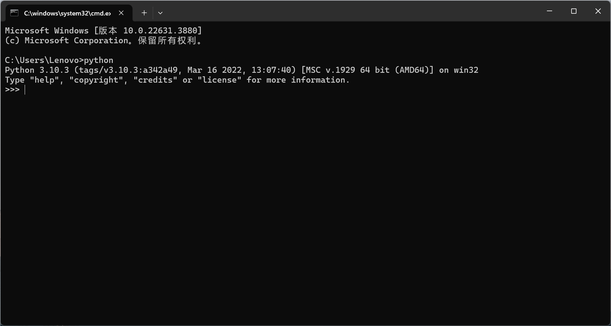
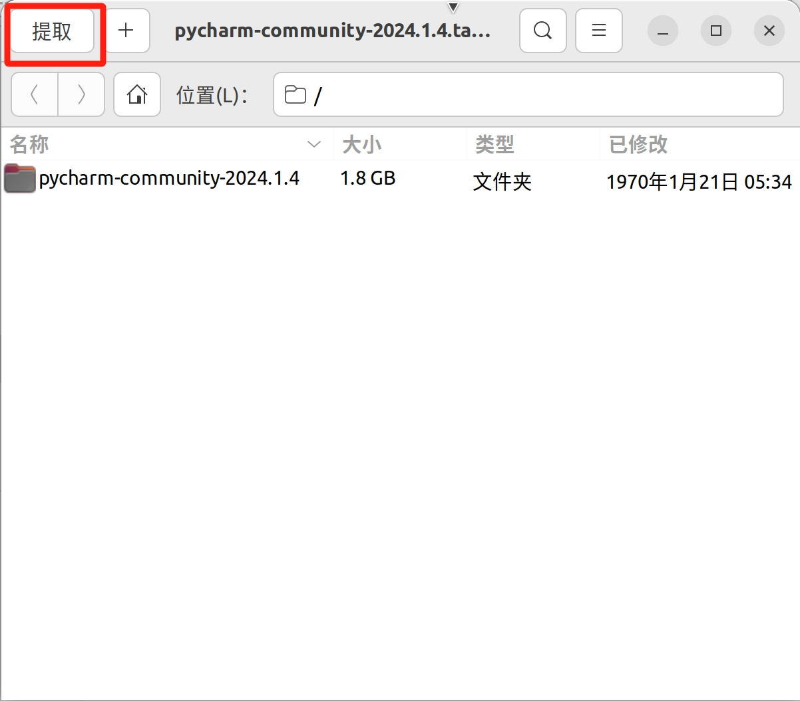
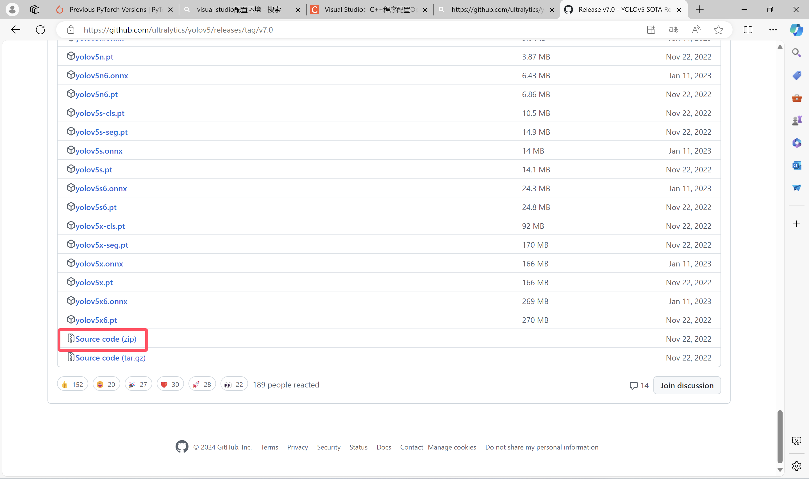
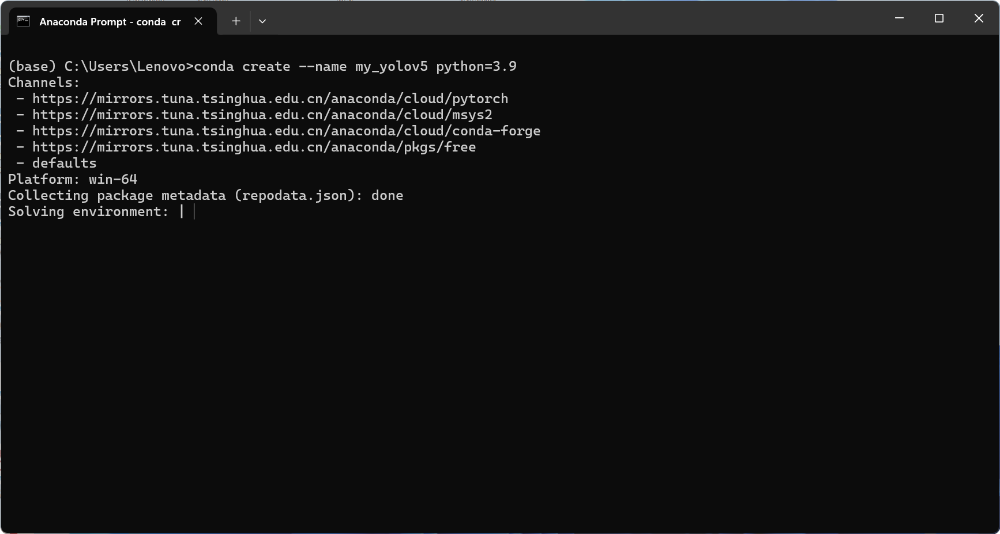
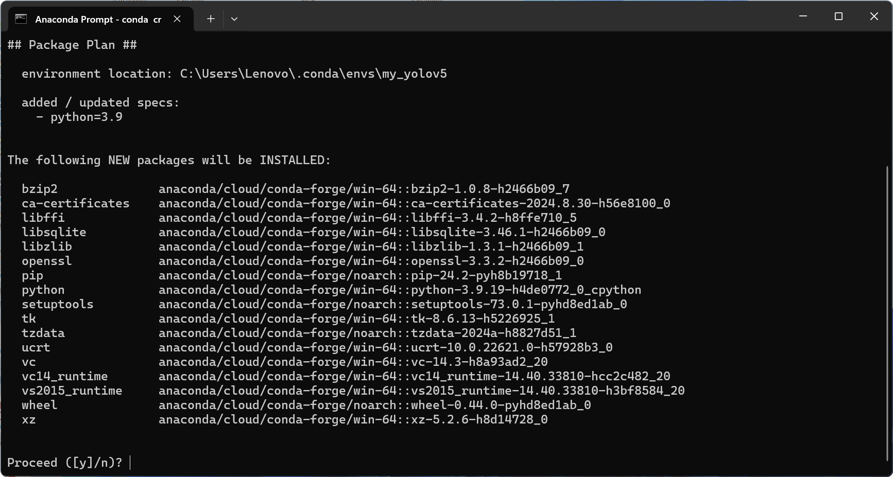

<h1><center>简锋视觉组学习路线与指南</center></h1>

<h3><center>——更适合简锋宝宝体质的学习指南</center></h3>


<h4>
<center><font face="楷体">
    沈阳建筑大学  机械工程学院  简锋实验室  2024视觉组 © </font>
<center>    
</h4><h4>
<center><font face="楷体">
   孟睿豪  https://mengruihao.github.io/
   黄周莹</font>
<center>
</h4>


# I. 版权声明

***Copyrights 沈阳建筑大学 简锋实验室 RoboMaster 2024 视觉组 孟睿豪  All Rights Reserved.***

***== 只需要注明引用来源 ==，就可以任意使用、复制、修改、合并、散布、出版/再版本文的部分或全部内容；本文中引用的第三方内容版权归其著作者所有。***

***本指南中部分章节引用 湖南大学 RoboMaster 跃鹿战队 2022 视觉组 曾庆铖 [《了解 CV 和 RoboMaster 视觉组 —— 你的最后一本计算机视觉入门手册》]( https://github.com/HNUYueLuRM/vision_tutorial ) （点击即可进入原文档） 强烈建议读者前去支持***。

> 文中的有部分取自网络图片未能识别版权信息，若出现了您的图片被使用却尚未标注出处等的情况，请通过邮箱等方式联系笔者。


---

<font face="黑体" color=red size=5>**这句话存在时，证明本指南仍处于持续更新状态！！！**</font>

---

​	


# II. 关注我（们）

作者个人 GitHub： https://mengruihao.github.io/ （ 孟睿豪 ）

作者个人邮箱：mrh@stu.sjzu.edu.cn

作者个人 CSDN： https://blog.csdn.net/weixin_73701209?type=blog（ 星期六不太累 ）

沈阳建筑大学简锋实验室 Bilibili 官方账号：https://space.bilibili.com/388263042 （ JianfengRobotics ）

 RoboMaster机甲大师官方账号：  https://space.bilibili.com/20554233 (RoboMaster机甲大师官方账号)

沈阳建筑大学简锋实验室微信公众号


沈阳建筑大学简锋实验室 Bilibili 官方账号


# III. 前言

​	在我刚进入到简锋实验室时视觉组可以说是家底最薄弱的一个组，~~根本没有系统学习资料（恼）！~~我也曾吐槽过视觉组糟糕的培训体系，常常痛苦地问到：“ 我们为什么没有系统学习资料？！！”。但抱怨是没有用的，培训体系不会因为抱怨而凭空出现，知识也不会因为抱怨而变的简单。所以我只能咬牙坚持，在这种环境下苦苦探索。所以我深刻理解没有系统性学习资料的痛苦！但好在后来 **徐政峰学长 **为我分享了 [《了解 CV 和 RoboMaster 视觉组 —— 你的最后一本计算机视觉入门手册》]( https://github.com/HNUYueLuRM/vision_tutorial ) 这一文档，使我倍受启发。可以说我始终希望视觉组能真正的拥有积累和传承，于是我有意的开始写技术文档。在我带 23 级同学时，我也在反复强调技术文档的重要性。包括在起重机备赛期间里，视觉组遇到了许多奇奇怪怪的问题，在解决后我都让 23 级同学们写下技术文档方便之后的新同学们学习。于是在实验室经过两年的摸索拥有了一定的技术基础后，我决定正式回答两年前我刚加入实验室时提出的个疑问，同时也避免之后的学弟学妹们走我们走过的弯路。

​	直白的说，本指南前身就是我写的一堆技术文档。但我觉得只有零散的技术文档仍然不是很适合新生去学习 。 这些文档都堆在一起，鬼知道什么时候要学什么，什么时候要用什么。于是我将我在视觉组学习两年所积累的所有技术文档进行适当的排序与衔接后全部粘贴到一个文档里，就有了本指南的第一版 。在后来，视觉组 23 级的同学逐渐成长起来为我减轻了不小的工作压力。指南中部分章节是以他们的技术文档为基础进行编写。因此可以说本指南具有极强的实用性。

​	在 Alpha 1.0 时我发现有很多章节知识之间的衔接并不连贯。其中有些地方需要我补充一些概念，但是这些概念无论放到前一个章节还是后一个章节都不是很合适。所以在 Alpha 1.1 之后的版本我加入了 Extra 章节以用于补充一些你需要知道的概念，增强章节之间的连贯性。

​	为了保证本指南的质量我广泛邀请了一些朋友进行了 Alpha 版的审阅。其中不仅有实验室内的成员，还有本校普通学生、计算机院有着项目经历的学生。此外我也邀请了许多外校的朋友来对本指南进行审阅，再次由衷感谢各位的支持！


<p align="right">—— 2024 年 8 月 25 日 </p>


# IV. 致谢

感谢湖南大学 RoboMaster 跃鹿战队 2022 视觉组 曾庆铖  [《了解 CV 和 RoboMaster 视觉组 —— 你的最后一本计算机视觉入门手册》](https://github.com/HNUYueLuRM/vision_tutorial) 对我的启发与引领，本指南中部分章节引用此文档，强烈建议读者前去阅读支持！

感谢简锋实验室 23 级视觉组成员对指南的帮助，包括：

* **黄周莹**（沈阳建筑大学 简锋实验室 2023 级视觉组成员）对本指南 [3.2.1. Windows 下 Python 环境配置](# 3.2.1. Windows 下 Python 环境配置) 、[4.2. 配置 C++ 环境](# 4.2. 配置 C++ 环境) 、[6. 初试深度学习 —— YOLOv5 的配置与使用](# 6. 初试深度学习 —— YOLOv5 的配置与使用) 章节编写的帮助。
* **张佳瑞**（沈阳建筑大学 简锋实验 2023 级室视觉组成员）对本指南部分章节编写的帮助。

感谢简锋实验室 21 级成员对指南的帮助，包括：

* **徐政峰**（沈阳建筑大学 简锋实验室 2021 级视觉组成员）作为我的学长带我走入视觉。
* **郭韶锋**（沈阳建筑大学 简锋实验室 2021 级硬件组成员）对本指南审阅提供了很大帮助。

为了确保指南整体知识的合理性，我特地邀请计算机学院中几位成绩靠前且有丰富学科竞赛的同学进行审阅，包括：**葛佳怡**（沈阳建筑大学 信息与计科学 2201 班）、**魏雍奇**（沈阳建筑大学 人工智能2101班）（按姓氏笔画排序）。

为了验证指南语言的通俗性，我邀请到几位没有接触过相关知识的同学进行审阅，包括：**张智慧**（沈阳建筑大学 机械设计制造及其自动化 2203 班）、**张震**（沈阳建筑大学 机械设计制造及其自动化 2203 班）、**郭韶锋**（沈阳建筑大学 简锋实验室 2021 级硬件组成员）（按姓氏笔画排序）。

此外我也邀请了其他学校的朋友进行审阅，包括：**李成功**（沈阳师范大学 数学与应用数学专业）、**李枭义**（哈尔滨工程大学 智能制造专业）、**崔儒川**（大连外国语大学 软件工程专业）、**景一哲**（华北理工大学 Horizon 战队 2023 级视觉组组长）（按姓氏笔画排序）。


# V. 目录

[TOC]


# 0. 开始之前

在本章我不仅会简单介绍一下视觉组，而且也会回答新同学存在的一些疑问。这些问题比较有参考性，我认为对新同学们很有帮助，因此统一放到第 0 章中作为正式进入视觉组的预热！

## 0.1. 视觉组需要的数学基础

> 对于大一新生来说，你最重要的事情是**补足编程基础**！算法的原理等到你大二再去理解也不迟。如果你是大一新生，本节可以略看。

​	视觉组的学习需要有**高等数学基础**、**线性代数基础**、**概率论与数理统计基础**。**高数**至少需掌握**定积分**与**不定积分**；**线代**至少要掌握**矩阵性质及其运算**、**向量组的性质**；~~**概率论**我也没学呢~~。这些数学的基础知识在一些算法中得到广泛的应用，例如坐标系的变换、滤波、卷积等等。只要你想真正的去搞一个大一点的项目，就绕不开数学这一关。

<br>


<br>

---

<br>


## 0.2. 视觉组电脑建议

&emsp;&emsp;坦白地说，视觉组对电脑是有一定的要求的~~（主要因为实验室穷，买不起显卡）~~。在实验室学的学习中，我们大概率需要在自己电脑上跑一些深度学习模型，例如最为我们所熟知的 YOLO 系列，它需要大量的算力。所以我建议大家买笔记本电脑时选择**有独立显卡（GPU）的游戏本**。我个人不推荐全能本~~（它那显卡只能说感知不强）~~，轻薄本更不在我们考虑范围内。我们在24年起重机备赛时决定使用 YOLOv5（一种深度学习模型）去进行视觉识别，我们一位队员使用的就是全能本了。她训练一次大约需要4分钟，而我用的是游戏本，一次仅需 30 秒左右，大家可以明显看出算力差距。顺便提一下，我们需要训练 300 次取最优解，大家算一下全能本浪费了多少时间（恼）。但是如果你已经买了电脑，那你也不要让家长再为你换一个了（如果你是富哥富姐当我没说），随遇而安吧。至少实验室肯定有人用游戏本，大不了借用一下。但也不用追求极致的性能，伴随着越高的性能电脑的价钱也会随之上涨。至于电脑具体型号我不做推荐，各位自行斟酌，但是记住 **别买苹果电脑，工科生用苹果简直灾难！！！**此外，如果你是电脑小白，我推荐你买一线品牌的电脑，售后方便，品控有保证。

​	

<br>

---

<br>

## 0.3. 如何学习？

> *对于视觉组的具体介绍请看由湖南大学编写的 [《了解 CV 和 RoboMaster 视觉组 —— 你的最后一本计算机视觉入门手册》]( https://github.com/HNUYueLuRM/vision_tutorial )的前三章，在此我不做过多阐述。下面我仅为大家介绍我个人对视觉学习的感受。*

&emsp;&emsp;我认为视觉组学习的特点是内容多且杂，难度大，需要有一定的数学知识的储备（我们在0.1中介绍过）。那么我们应该抱着怎样的态度去学习呢？大家可能看到我在前面说视觉组学习难度大就开始打退堂鼓了，但大家要知道难度大带来的也可能是大收益。如果你经过视觉组的锻炼，我可以保证你的代码能力至少在机械院里绝对是 TOP 级的。举个具体例子，机械院的同学们在大二下会有一门课叫做机械原理。这门课在最后两周会用到这一学期学到的知识进行课程设计。课程设计分为解析组、创新组和普通组三个组。解析组是用编程去对机械结构进行仿真，并且输出一些关键点的数据（一般使用 Visual Basic，但我嫌弃它太古老，经过和老师协商用 Python 去实现。相当于我没有参考代码，从0开始写。）；创新组是以竞赛为锚点进行机械的创新设计；普通组就是跟着老师手绘一些机构，进行创新并计算一些数值。如果你是视觉组的，你可以直接选择去解析组，你不仅这门课程会拿到一个 “ 优 ”，而且你还将收获至少一个软著（这个加分！！！）。

​	说了这么多好处了，下面来说一下我们学习节奏。我假设你是新大一，那么你应该在九月中下旬就已经加入实验室并接受培训了。按照传统我们会进行**校赛**。我一向建议无论你的意向组是什么，校赛的内容你都应该全都听。因为校赛讲的都是基础通识知识，我希望每个人对每个组都应该有个最基本的认知。这样在之后和其他组成员的沟通将会更有效。如果你真的想学习视觉，你在大一的主要工作是补足编程基础 —— 从九月开始到当年的十二月你应该至少熟悉 C++ 和 Python。当然，在这期间你校赛会占用你一些时间。在一月份我们学校会进行期末考试，因此一月中上旬就不会给大家布置太多任务。大家考完试就可以开始快乐但短暂的寒假生活了。为什么说短暂呢？因为在一月下旬，我们就会开展**冬令营培训**。在寒假开学前你应该掌握 OpenCV C++ 函数的基本用法并完成一些小项目。等到春节结束后你就开启大一下的生活了。在三月你应该再学习 OpenCV Python 的函数，不过在你有了 OpenCV C++ 的基础后学习 OpenCV Python 应该更加快速。同时你也应该抽时间复习一下 C++ 和 Python 的语法。当你完成以上这些后恭喜你，你已经成为一个 “ 调包侠 ” 了！之后会安排你去实现往届起重机的视觉识别系统，算是对你的综合提升。在四下旬你会迎来在实验室的第一个方案讨论会。我们会讨论本年度起重机的规则，然后头脑风暴出几个 idea，最终形成方案。此时你就需要去写视觉识别的代码了。然后就是枯燥的备赛。等到七月份起重机结束，你的综合实力就已经得到了质的飞跃。至此你成长为大二的正式队员了！~~你已经有资格成为一个能接受研发任务的牛马了！~~ 然后你就要进行新大一的培训和 **RoboMaster 备赛环节**。

​	那么我们该如何学习呢？不出意外的话本指南会承包你整个大一的学习需求。在这里我要强调一下，**在你看每一章节前一定一定要先全篇浏览一下！**看看这一章节的整体结构。**有可能你遇到的问题在这一节末尾有说明！**在大二，你有了一定编程基础后你就应该去 GitHub 上多看一看开源项目，看看大佬们的代码是什么样子的。并且你也要混迹在 RM 视觉救命群里看看大家都在搞什么东西，丰富自己的见识。最重要的是你要主动去尝试了解一些算法的原理，因为在这时你将会受到一些开发任务！

<br>

---

<br>

## 0.4. 视觉组的编程基础

> *在本指南里，我默认你没有任何编程基础，完全是个小白。我会在 [3. 最流行的编程语言 —— Python](# 3. 最流行的编程语言 —— Python) 和 [4. 更接近底层的语言 —— C++](# 4. 更接近底层的语言 —— C++)  中提供一些基础资料供你学习。在本节我仅谈一谈自己的感悟。*

&emsp;&emsp;我推荐的编程语言学习路线是 Python → C → C++。这个学习路线是由易到难逐渐递进的。但在实际中，我们没有那么多的时间将上面提到的语言全部学精、学透。我个人是在高考结束的暑假至大一上学期结束这段时间内学习 Python ，在大一寒假学习 C++。在我们学校，大多数专业在会在大一下开 C 语言课，你可以跟着课堂去学习 C 语言。在你拥有了 Python 与 C++ 的基础后，你在课堂上学习 C 语言时会很轻松。

&emsp;&emsp;我个人认为编程语言是互相有联系的。在学习过一门语言且经过一些实战后，再去学习其他语言时速度会变得很快。我个人推荐的学习方法是**在实战中学习**。我们可以先看一些基础教程，以 **C/C++** 为例，我们需要先掌握最基本的**数据类型、运算符表达式、顺序结构、选择结构、循环结构、数组与函数**。可以自行寻找一些资料去学习，也可以看我在本指南中推荐的资料。在学习这些内容时**一定要将资料中的例子去实现**——不用追求完全背来，哪怕你照着抄一遍都会有很大提升。在我们学习这些内容之后就遇到 C 语言学习的新手村 Boss ——**指针**。但是学习指针的原则依然是**在实战中学习**。学习时可以先看一些基础的视频教程，第一次看完你也许会很懵，这是正常的。在初步学习后可以去找一些开源实例，尝试读懂该程序的指针部分的逻辑与作用进行复现。在第一次读程序时你可能会很慢，并且发现会忘记之前的部分知识。不用担心，我们又不是在考试，不需要你去全部记住，可以去浏览器搜索或者翻翻书复习一下，~~反正没人关心程序怎么写出来的，我们只看结果（笑）~~。在看程序时如果有无论怎么研究都无法理解的地方，你就可以去问 Chat GPT。它可以帮助你理解代码，提升你的效率。

<br>

------

<br>

## 0.5. 视觉组好用工具推荐

> 本节我会介绍一些视觉组常用的操作系统、软件和 IDE 。从这节开始，你将会看到本指南的最大特点 —— 每一部分都会附上我学习时所用的资源和踩过的坑——减少小白们搜索资源的时间和走弯路的概率。因此，本指南在食用时**要将有关部分通读一遍后再去操作**。此外，在本节也会补充一些我认为好用的插件。

* **Git**

  Git是一个免费的、开源的分布式版本控制系统，可以高速处理从小型到大型的各种项目。

  版本控制：是一种记录文件内容变化，以便将来查阅特定版本修订情况的系统。

  分布式版本控制工具：如git,客户端取的不是最新的文件快照，而是把代码仓库完整的镜像下来到本地库(克隆/备份)。


* **GitHub**

  GitHub 是一个远程仓库（Git 中我们提到的代码仓库就是这个），通俗的理解就是一个可以保存自己代码的地方。在实际开发当中一个项目往往是有多个人来共同协作开发完成的，那么就需要一个统一代码保存的地方，而 GitHub 就是起到一个共享和汇总代码的作用。在使用中你可以决定自己上产的代码是否开源，当然你也可以在上面查看别人开源的代码，上面有很多技术大佬的代码很有学习价值！


* **Gitee**

  你大致可以理解为 Gitee 是国内版的 GitHub。与之对应的，Gitee 内的项目大多数都是国内作者所上传的，无论是数量还是质量都与 GitHub 有着较为明显的差距。


- **Ubuntu**

  Ubuntu 是一种基于 Linux 操作系统的免费、开源的操作系统。是一款强大、稳定、易用且免费的操作系统，适用于各种用途，从个人计算机到服务器，是最受欢迎的 Linux 发行版之一。你现在可以将 Windows 和 Ubuntu 的关系类比为手机上安卓（Android）和苹果（IOS）的关系，即使这个类比很不严谨，但是可以帮助你更好的理解。


* **Vim**

​	Vim（Vi Improved）是一款高度可定制的文本编辑器，是 Unix 和类 Unix 系统中广泛使用的一种编辑器。它是 Vi 编辑器的改进和扩展版本，提供了许多增强	功能和改进，以提高编辑效率。[Vim 安装教程](https://blog.csdn.net/weixin_73701209/article/details/135539308)可以移步我的博客。


* **CMake**

  CMake 是一个跨平台的安装（编译）工具，可以用简单的语句来描述所有平台的安装（编译）过程。他能够输出各种各样的 makefile 或者 project 文件，能测试编译器所支持的 C++ 特性。CMake 的组态栏取名为CMakeLists.txt。CMake 并不直接建构出最终的软件，而是产生标准的建构档（如 Makefile ），然后再依一般的建构方式使用。它通常会出现在一些较大的 C++ 项目里。但我认为 CMake 并不需要去专门的学习，而是在你写项目大到一定程度时你自然会去学习如何使用它。


* **NoMachine**

  NoMachine 是一款高性能的远程桌面工具，它允许用户从任何地方通过联网（本地网络或互联网）访问自己的电脑桌面环境。 NoMachine 的远程桌面体验非常·流畅和响应迅速，特别适合需要远程访问高分辨率图形界面的用户。


* **Clion**

  CLion 是一款由 JetBrains 公司开发的集成开发环境（IDE），专为 C 和 C++ 编程而设计。它提供了一套强大的工具和功能，旨在提高开发人员的效率，减少编码时的重复性工作，以及简化调试和项目管理。它适用于各种项目规模，从小型项目到大型复杂的企业级应用。但是，它收费！不过用教育邮箱可以申请免费使用。详情请看《I.教育邮箱》中《二、使用教育邮箱完成 JetBrains 教育认证》。


* **Pycharm**

  PyCharm 是由 JetBrains 公司开发的一款集成开发环境（IDE），专为 Python 编程语言设计。它提供了一系列强大的工具和功能，旨在帮助开发者提高生产力和代码质量。我们一般用 Community Edition（社区版）即可。


* **Visual Studio Code（VS Code）**

  Visual Studio Code (VSCode) 是由微软开发的一款免费且开源的源代码编辑器。它支持很多种编程语言包括 JavaScript、Python、C 和 C++，甚至连上古语言 Visual Basic 都在它的支持范围内。此外 VS Code 有着丰富且强大的插件，你可以在 VS Code 里内嵌一个网易云听歌。但你觉得这就是 VS Code 的极限了吗？当然不是！你甚至可以在它里面里玩 4399！


* **Typora**

  Typora 是一款轻量级 Markdown 编辑器，它适用于 Windows、Liunx 和 OS X 三种操作系统。与其他Markdown编辑器不同的是，Typora 采用所见即所得的编辑方式，实现了即时预览的功能。我认为它是最优雅的 Markdown 编辑器！顺便一提，本指南也是在 Typora 上所完成。


* **Systemback**

  > ***Systemback** 使创建系统和用户配置文件的备份副本变得容易。若出现问题，您可以轻松地还原系统的先前状态。它还可以复制操作系统，安装操作系统和以实时格式创建操作系统。*

  在我们日常使用 Ubuntu 时可以使用 Systemback 创建一个系统副本，以便我们遇到可能出现的问题时能够及时恢复系统，不至于丢失整个系统。此外还可以使用它制作系统安装盘的功能，制作一个我们自己Ubuntu系统的启动盘。这样我们就可以在新电脑上安装上和我们之前一样的 Ubuntu 系统。


* **Ventoy**

  简单来说，Ventoy 是一个制作可启动U盘的开源工具。有了 Ventoy 你就无需反复地格式化U盘，你只需要把  ISO/WIM/IMG/VHD(x)/EFI  等类型的文件直接拷贝到 U 盘里面就可以启动了，同时还不影响 U 盘的日常使用。Ventoy 支持大部分常见类型的操作系统如 Windows 和 Linux 。


* **ChatGPT**

  > *ChatGPT 到底解决了什么本质科学问题，才能变得如此强大并受到广泛的关注呢？我们认为，ChatGPT 是继数据库和搜索引擎之后的全新一代的  “ 知识表示和调用方式 ”。*

  我们应该善于使用 ChatGPT。ChatGPT 对于我们来说就像一个近乎无所不知的老师，有什么问题都可以问它。有人会说搜索引擎不也差不多吗？但是它与搜索引擎最大的区别就是不需要我们自己从搜索出的繁杂信息中总结，而是直接告诉我们答案。下面我向 Chat GPT 询问一段代码的解释，可以看到 ChatGPT 为我们解释了关键位置的代码，大幅地提高了我们读代码的效率。


* **CodeSnap（VS Code 插件）**

  可以生成高颜值代码图片的插件。

  

* **GBK to UTF8 for  vscode（VS Code 插件）**

  将文件在 GBK 格式和 UTF8 间相互转换。

  
  
* **DistroSea**

  DistroSea 可以在线试用各种 Linux 发行版。它会分配一个虚拟机，在浏览器里连接桌面。如果你只是想体验一下不同的 Linux 发行版，这件事你不二的选择！

  
  
* **FreeReNamer**

  FreeReNamer 是一款跨平台且开源的，用来将文件批量重命名的桌面软件。你在自建数据集时可能会需要。链接：https://github.com/cyhuajuan/FreeReNamer

  

* **Keyviz**

  Keyviz 是一个免费开源的实时键鼠输入可视化软件，让观众了解你在演示的过程中按下了什么快捷键。这个在你录演示视频时可能会用到。

  

<br>

---

<br>

## 0.6. 了解你的电脑

> 在大学，绝大多数人都有自己的电脑。不可否认的是电脑是我们在大学学习、工作和娱乐的重要工具。我们在实验室里更是会频繁的和电脑打交道，但你真的了解你的电脑吗？在本节中，我会介绍一下电脑的核心组件，让你对自己的电脑有最基本的认识。

<font size=5>**1. 电脑的核心组件**</font>

* **处理器（CPU，Central Processing Unit，中央处理器）：**CPU 是电脑的 “ 大脑 ”，负责执行各种指令和处理数据。
  * x86 和 ARM 架构：目前市场上最主流的 CPU 架构有两种，分别是 x86 和 ARM。x86 架构是由英特尔发明并广泛应用的架构，常见于桌面电脑、笔记本电脑和服务器中，例如 Intel Core（英特尔酷睿）系列和 AMD Ryzen（AMD 锐龙）系列。而 ARM 架构主要用于手机和平板电脑这种移动设备，例如你手机里的 Qualcomm Snapdragon（高通骁龙）系列和 MediaTek（联发科天玑）系列。当然也有像苹果的 M1/M2 芯片这种例外。额外一提，实验室中常用的 STM32 用的就是 ARM 架构。
  * 多核：在买电脑时你一定听过商家宣传 CPU 是多核的。简单来说多核 CPU 就是指在一块处理器中集成了多个核心，每个核心都有自己的运算单元，可以独立执行指令。常见的多核 CPU 有双核、四核、六核、八核甚至更多。
* **显卡（GPU，Graphics Processing Unit，图形处理单元）：**GPU 是一种专门用于处理图形和图像计算的处理器。它最初设计用于加速图像渲染，如 3D 图形和视频播放。但随着技术发展，GPU 的应用范围早已超越了图形处理领域，其在科学计算和人工智能领域上 GPU 也有出色的表现。目前笔记本电脑的显卡一般都是 NVIDIA（英伟达）RTX 系列的。
* **内存（RAM，Random Access Memory，随机存取存储器）：**内存用于临时存储正在处理的数据和指令。它是 CPU 与存储设备之间的桥梁，决定了计算机能多快地访问和处理数据。
  * 内存作用：内存与 CPU 直接相连，当 CPU 需要数据时，它会首先在内存中查找。如果数据在内存中存在（称为“命中”），CPU 可以立即获取并处理；如果不在（称为“未命中”），数据需要从更慢的硬盘中读取，并加载到内存中供 CPU 使用。
  * 内存的类型：我们电脑上最常用的内存类型就是 DDR（Double Data Rate）系列。其经历了从 DDR、DDR2、DDR3 到现在的 DDR4、DDR5 的升级，每一代都有更快的速度和更高的带宽。如果你想换内存条请仔细看好你电脑支持的内存条型号！
  * 内存的特点：内存是易失性存储器，断电后数据会消失。它的主要作用是为当前运行的程序提供高速临时存储空间，而非长期保存数据。
* **存储（Storage）：**存储（Storage）是计算机系统中用于长期保存数据的设备，包括操作系统、应用程序、文档、图片、视频等文件。
  * 存储类型：常见的存储设备有机械硬盘（HDD，Hard Disk Drive）和固态硬盘（SSD，Solid State Drive）。我们的笔记本电脑上通常都是固态硬盘。
  * 内存与存储的区别：存储负责长期保存数据，适合存放文件、操作系统和应用程序。而内存负责临时存储当前正在使用的数据，断电后数据会丢失。内存速度更快，但容量通常比存储小。

<font size=5>**2. 操作系统**</font>

​	我们大多数电脑的操作系统都是由 Microsoft（微软）开发的 Windows 系统，除了那该死的 MacBook。但在实验室我们会接触另外一个操作系统 —— 基于 Linux 开发的 Ubuntu 系统。有关 Windows 和 Ubuntu 我在 [1. 全新的操作系统 —— Ubuntu](# 1. 全新的操作系统 —— Ubuntu) 中有详细的介绍，在此不做赘述。我们要知道，操作系统的作用是管理硬件资源（如 [1. 电脑的核心组件](# 1. 电脑的核心组件) 中所说的处理器、显卡、硬盘、内存等）、执行应用程序，并提供用户界面。

<font size=5>**3. 如何查看电脑硬件配置**</font>

**系统信息（System Information）**

按下 `Win + R` 打开“运行”窗口，输入 `msinfo32`，然后按回车后你将看到 CPU、内存、操作系统版本、BIOS 信息等详细配置。


**任务管理器（Task Manager）**

按 `Ctrl + Shift + Esc` 或 `Ctrl + Alt + Delete` 打开任务管理器，选择 “ 性能 ” 选项卡。在“CPU”、“内存”、“磁盘”、“GPU”等项目中可以查看实时的硬件使用情况和部分配置信息。


<br>

---

<br>

## 0.7. 提问的艺术

> 我们不讳言我们对那些不愿思考、或者在发问前不做他们该做的事的人的蔑视。那些人是时间杀手 —— 他们只想索取，从不付出，消耗我们可用在更有趣的问题或更值得回答的人身上的时间。

<center>《How-To-Ask_Questions-Smart-Way》  （Eric S. Raymond, Rick Moen）</center>

​	我们在实验室的学习过程中难免会遇到一些问题。在进入实验室的初期阶段由于知识积累不够，大家通常都缺少自主解决问题的能力，这时我们需要求助学长学姐们，这无可厚非。但是大家要注意自己提问的时机与方式。学长们平时也会有自己的事情需要处理，包括实验室安排的任务、课堂的作业、各种学生组织的活动等。所以我们要注意提问的时机。在你想求助学长之前要先思考一下，你有去浏览器中搜索你遇到的问题了吗？我可以负责任的告诉大家，我们所遇到的百分之九十八的问题都可以在互联网上找到答案，而这个过程就是在锻炼你自主解决问题能力。正如我前面所说的，大家由于知识积累不够导致缺少一些自主解决问题的能力，我们也深知在这一点。所以我们允许大家有搜不到解决答案的情况（不然要学长有什么用）。如果你在进行了大量的搜索但仍然无法找到答案的情况下去提问，我相信每一个学长学姐都会帮助你解决问题（其实学长学姐们也不是万能的，遇到问题我们也要自己去网上搜）。这个无论在哪都适用哦！如果你在一些国外的问答网站上提问题收获到了 **STFW** 的回应，表示回答者认为你应该 Search The Fucking Web。那人多半是对的，去搜索一下吧。在实验室里学长会使用温和一些的说法： Google 是你的朋友！

​	话说回来，我们又该如何提问呢？首先我们应该学会截图，而不是拍屏。大家可以对比下面这两个图视觉上哪个清爽一些。这只是一个界面的截图，大家可以进一步想象一下，如果拍的是代码呢？我都不敢想直接用手机拍屏幕那要多混乱。所以请大家提问时一定一定**不要用手机去拍电脑屏幕！！！**此外，**大家也不要发语音去提问**。我们没有时间去听你那长达 60 秒的问题描述。请你把要问的问题思考好以文字的形式发给我们 —— 文字可以短时间内传达大量信息！


​	此外，你在提问时也应该描述清楚问题发生的前因，和你现在的状态，并且附带清晰的截图。不要让学长学姐们去猜你哪一步出了问题。就拿我们视觉组配置环境来举例子。

**蠢问题**

> 学长，我运行 YOLOv5 时报错了怎么办？

**聪明问题**

> 学长，我在 windows11 跑 YOLOv5 时显示 AttributeError: module ‘numpy’ has no attribute ‘int’，可是我已经安装 numpy 库了，用 import 引用也没有报错，我该怎么办？
>
> 

大家对比一下，明显第二个更利于我们尽可能快速的解决你遇到的问题。在这里我推荐 Eric S. Raymond, Rick Moen 所写的指南（已经翻译成中文）：[提问的智慧](https://github.com/ryanhanwu/How-To-Ask-Questions-The-Smart-Way/blob/main/README-zh_CN.md)。希望大家可以阅读一下，这有助于你之后在国内外的网站上提问。下面附带一个广为流传的 “ 提问收费表 ”，表明了问题描述的重要性。（在我这，所有项目的价格统一在末尾加个零！）


<br>

---

<br>

## 0.8. 教育邮箱

> EDU邮箱是学校等教育机构使用的邮箱，以.edu(.edu.cn)为后缀的邮箱地址，如：mrh@stu.sjzu.edu.cn。 只对学生、教师、教育机构开放，代表着教育机构的权威性。

### 0.8.1. 申请教育邮箱

​	办理地点位于图书馆 603 的服务中心，进去找工作人员说你要办理学生邮箱。办理时需要填写一张申请表。注意！！！所属单位为要写到你的学院，如：沈阳建筑大学机械工程学院！我们只需要填写 “ 学生 ” 一栏，不用填写 “ 教工 ” 一栏！我们的邮箱用户名是可以自定义的，建议大家用自己的名字或者名字缩写，但此时我们不能自定义密码。不过之后我们可以进行修改。此外，本张表会留在服务中心，所以我们需要拍照留存，你的密码会写在此张表的左上角。至此，教育邮箱办理完毕。我推荐大家使用 [网易灵犀邮件（https://office.163.com/）](https://office.163.com/) 登录教育邮箱（没有原因，纯个人喜好）。

0.8.2. 


<br>

<br>

---

---


# 1. 全新的操作系统 —— Ubuntu

<br>

##  1.1.  了解并安装 Ubuntu

> *Ubuntu 是一种基于 Linux 操作系统的免费、开源的操作系统。是一款强大、稳定、易用且免费的操作系统，适用于各种用途，从个人计算机到服务器，是最受欢迎的 Linux 发行版之一。*

&emsp;&emsp;在介绍 Ubuntu 前我们需要了解一下 Linux，并且梳理一下它和 Windows 的关系。在 [0.5. 视觉组常用的操作系统与软件](# 0.5. 视觉组常用的操作系统与软件) 中我说过，他们两个的关系不严谨的说有点像手机上的安卓（Android）系统，与苹果（IOS）系统。下面进行详细介绍。

<br>

### 1.1.1. Windows 与 Linux

&emsp;&emsp;我们在电脑上最常用的操作系统就是 Windows。Windows 是由 Microsoft 公司开发和维护的操作系统，是目前最广泛使用的桌面操作系统之一。Windows 有以下特点：

1. 用户界面：Windows 操作系统提供直观的**图形用户界面（GUI）**，用户可以通过鼠标和键盘轻松进行操作。

2. 商业软件支持：Windows 平台上有许多商业软件和应用程序的支持，尤其是一些专业设计软件（如：**CAD、SolidWorks**等）和办公软件。

3. 兼容性**：**Windows 通常拥有良好的硬件和软件兼容性，因为许多硬件和软件制造商都优先支持Windows。 

4. **游戏支持：Windows 是最主流的游戏平台之一，许多游戏首先发布Windows版本。**

   <br>

&emsp;&emsp;Linux 是一个开源的操作系统内核，有很多不同的Linux发行版，如 **Ubuntu**、Fedora、Debian 等。Linux 有以下特点：

1. 开源和自由：Linux 是一个开源的操作系统内核，有很多不同的 Linux 发行版，如 Ubuntu、Fedora、Debian 等。用户可以自由使用、修改和分发 Linux。
2. 多样性：由于 Linux 的开放性，有许多不同的发行版，适用于各种用途，从桌面到服务器再到嵌入式系统。
3. 安全性和稳定性：Linux 以其高度的安全性和稳定性而著称，特别适用于服务器环境。
4. 终端和命令行：Linux 系统更强调于使用命令行界面，这对于系统管理员和开发人员来说是一个强大的工具。
5. 性能：Linux 通常在资源利用和性能方面表现得很好，特别适用于服务器和嵌入式系统。

&emsp;&emsp;~~可以看到 Windows 和 Linux 最大的而区别就是在 Windows 上能玩更多的游戏！~~ Windows 和 Linux 在使用上最大的区别是，Windows 为用户提供直观的**图形用户界面（GUI）**，可以通过鼠标和键盘轻松进行操作。而Linux系统更强调于使用**命令行界面（CLI）**。下面我们来介绍**图形用户界面（GUI）**与**命令行界面（CLI）**。

&emsp;&emsp;**图形用户界面（Graphical User Interface，简称GUI）**是一种计算机用户界面，用户**通过图形元素（如图标、窗口、按钮）和鼠标操作来使用户与计算机系统进行交互**。与命令行界面相比，GUI 更加直观、用户友好，并且通常更**容易学习和使用**。

<br>


<center>Windows 的图形界面</center>

<br>&emsp;&emsp;**命令行界面（Command Line Interface，简称CLI）或控制台**，是计算机操作系统中一种通过键盘输入文本命令来与计算机系统进行交互的用户界面。在命令行中，用户**通过输入一系列文本指令来执行系统操作、运行程序、管理文件等任务**。

&emsp;&emsp;**命令行界面（Command Line Interface，简称CLI）**相对于**图形用户界面（Graphical User Interface，简称GUI）**来说，更加灵活和强大，尤其在系统管理、自动化脚本、远程连接等方面表现出色。一些操作系统，特别是类Unix系统如 Linux（我们之前说过 Ubuntu 是 Linux 的一个发行版）和 macOS（就是苹果笔记本，之前说过大多数专业设计性软件在 Windows 上更适配，所以作为工科生 mac 简直就是灾难！），强调命令行的使用；而其他系统如 Windows 则同时支持图形用户界面和命令行。在命令行中，用户可以通过输入命令和参数来完成各种任务，这是许多开发者、系统管理员和高级用户的首选工具。通俗理解一下，**命令行是用键盘敲的，而图形界面是用鼠标点的**。


<center> 在 Ubuntu 系统中使用命令行打开 Clion，左上角第一行$后 ./clion.sh 为输入的命令</center>

<br>

&emsp;&emsp;值得注意的是命令行界面和图形用户界面并不是绝对独立的。在 Windows 中点击 `Win + R` 后输入 `cmd` 就可以进入 Windows 的终端。我们在使用 Windows 进行某些高级设置时会在终端用命令行进行操。相应的，Linux 系统为了方便更多用户使用、降低上手难度也会有一些图形界面，如 Ubuntu（见上图）。


<center>Windows 的终端</center>

&emsp;&emsp;现在你已经对 Ubuntu 和 Windows 有了大改的了解，下面你将实践去安装 Ubuntu。

<br>

---

<br>

### 1.1.2. Ubuntu 的安装

&emsp;&emsp;Ubuntu 的安装大体分为两种 —— 双系统和虚拟机，个人推荐大家使用双系统进行安装。我的习惯是将 Ubuntu 载入一块单独的硬盘，而不是和 Windows 安装在一块硬盘里。回想我第一次装 Ubuntu 就是放在一个盘里，给我制造了很多意想不到的麻烦。本节仅对 Ubuntu 双系统安装进行介绍，如有安装虚拟机的需求请自行百度。

&emsp;&emsp;Ubuntu 的安装方法在互联网上已经有很多教程了。考虑到新手在看纯图文教程时可能会心生恐惧，在这里主要推荐两个视频以供学习参考。

* BiliBili 视频： [Windows 和 Ubuntu 双系统的安装和卸载](https://www.bilibili.com/video/BV1554y1n7zv/?share_source=copy_web&vd_source=068f370ae76233cdd7be76ebaecfdc58)  （0.2.2-1）

  从准备工作到实际操作，通过详细的步骤解说，手把手教你如何安装和卸载 Windows 和 Ubuntu 双系统。（选自0.2.2-1视频简介）。正如简介所说，视频内容很详细，非常适合小白食用。此外，大家一定要有看评论区的好习惯，你的问题可能在评论区也有人遇到。
  
*  BiliBili 视频 BV 号： [Windows 和 Ubuntu 双系统的安装和卸载](https://www.bilibili.com/video/BV1Cc41127B9/?vd_source=a6f0e4e67aebf89dd9703e20cf42e7d2)  （0.2.2-2）

  0.2.2-2 补充了在 Win11 下安装双系统可能会遇见的问题，以及解决办法。观看时也要注意评论区。

<br>

<font face="黑体" size=5>**〚可能遇到的问题〛**</font>

1. 在0.2.2-1 P4 制作 Ubuntu 启动盘中，3 分 40 秒让我们查看U盘内容。操作时系统可能提示U盘无法显示或者其他报错。不用理会它，正常进行下一步操作。
2. 大家在设置密码之后一定要记住！！！这个用户密码在之后的使用中将会被大量提及。

<br>

---

<br>

### 1.1.3. 入门 Ubuntu

&emsp;&emsp;在本节开始时有提到过，Ubuntu 是一种基于 Linux 开发的操作系统。显而易见的是 Ubuntu 也继承了 Linux 操作系统的特点——更倾向于使用命令行。这与我们所熟悉的 Windows 有所不同。不用担心，在此部分将带你简单入门与熟悉 Ubuntu 的部分基本操作。

**（一）. Ubuntu的目录**

&emsp;&emsp;在 Windows 里我们都知道有 C 盘、D 盘。C 盘中又有 C:\Users、C:\Program Files 等目录。那 Ubuntu 是否有类似的结构呢？答案是肯定的！

​	Ubuntu 中我们常用的目录有 home（用户主目录）、/etc（系统配置文件）、/opt。我们可以看见这些目录前面都有 “ / ”，按照 Windows 的思维来说，这些目录都应该在名为 “ / ” 的文件夹中，事实是这样的。我们把 “ / ” 叫做根目录，而这些根系统目录，如 /home（用户主目录）、/etc（系统配置文件）和 /opt等。


<center>文中所提到的 /home、/etc、/opt 目录</center>

**（二）. Ubuntu的权限**

&emsp;&emsp;如果你按照教程在Ubuntu里下载完成Vim 后，你一定其中对 sudo 的操作有很深的印象。那什么是 sudo 呢？

1.  sudo

   sudo 是用于执行需要特殊权限的命令的工具。通过使用 sudo，用户可以在没有直接登录为超级用户（root）的情况下执行特权操作，执行sudo操作前需要我们输入密码。

2.  chmod

   在使用 Ubuntu 中，我们经常要去更改文件和目录的权限，这时就需要使用到 chmod 指令 。假设我想把所有用户（所有者、所属组和其它用户）test.txt 赋予读写执行权限，我们需要在终端输入 chmod 777 test.txt。至于赋予权限的作用在后文会进行详细讲。

3. 权限位

   每个文件和目录有三组权限位，分别对应于所有者、所属组和其他用户。这三组权限分别是读（r）、写（w）、执行（x）。

   读权限（r）：允许查看文件内容或目录中的文件列表。

   写权限（w）：允许修改文件内容或在目录中创建、删除文件。

   执行权限（x）：对文件而言，允许执行；对目录而言，允许进入目录。

   值得注意的是权限也有数字表示法。每一组三个权限位（所有者、所属组和其它用户）使用一个八进制数表示。这个八进制数的每一位的值分别是 4（读权限）、2（写权限）、1（执行权限）的组合。例如我想同时赋予读写执权限，八进制数就是 7（4 + 2 + 1）；赋予读写权限，八进制数就是 6（4 + 2）。  现在我们再回头看 `chmod 777` ，则表示所有者、所属组和其它用户对这个文件都享有读写执行权限。

<br>

**（三）. Ubuntu的基本命令**

  &emsp;&emsp;这里提供一篇 CSDN 上的文章，里面基本囊括了我们所常用的指令。

* CSDN 链接： [Linux Ubuntu 入门基本命令整理_Ubuntu 命令行入门 - CSDN 博客](https://blog.csdn.net/qq_45277212/article/details/120834748)

<br>

## 1.2. Ubuntu 的备份

> ***Systemback** 使 **创建系统** 和 **用户配置文件的备份副本** 变得容易。若出现问题，您可以轻松地还 **原系统的先前状态**。它还可以 **复制操作系统**，**安装操作系统** 和以实时格式 **创建操作系统**。*

&emsp;&emsp;在这里我给出一篇 CSDN 上的文章供参考，**我们仅需要参考使用镜像制作启动盘部分的内容**，文章后面安装部分（第五部分 之后）的内容在我们的 NUC 上并不适用。至于安装镜像系统，我在 [**1.3. Ubuntu 的还原与复制** ](#1.3.-Ubuntu-的还原与复制)中会进行介绍。

* CSDN 链接：[Ubuntu 20 使用 Systemback 克隆系统_Ubuntu clone 系统 - CSDN 博客](https://blog.csdn.net/m0_38101947/article/details/128938229)


&emsp;&emsp;文章中有提到两个软件 —— Systemback 和 Ventoy —— 这两个软件在实验室所有的 NUC 上均已安装。 此外，我已经将装有成熟自瞄的系统复制，制作成启动盘了，你们可以直接使用，不需要再进行制作。	

<br>

---

<br>

## 1.3. Ubuntu 的复制与还原

&emsp;&emsp;在 [**1.2. Ubuntu 的备份**](#1.2. Ubuntu 的备份) 中我们已经将原有的系统经过 Systemback 生成镜像文件，并使用 Ventoy 写入到U盘中，成功制作了启动盘。接下来我们要使用启动盘在新电脑上安装镜像系统，自瞄安装盘请联系学长获取。

* CSDN 链接：[使用 Systemback 制作启动盘以及安装到新电脑 - CSDN 博客](https://blog.csdn.net/weixin_73701209/article/details/136437756?ops_request_misc=%7B%22request%5Fid%22%3A%22170947476016800225540824%22%2C%22scm%22%3A%2220140713.130102334.pc%5Fall.%22%7D&request_id=170947476016800225540824&biz_id=0&utm_medium=distribute.pc_search_result.none-task-blog-2~all~first_rank_ecpm_v1~rank_v31_ecpm-1-136437756-null-null.142^v99^pc_search_result_base6&utm_term=使用Systemback制作启动盘以及安装到新电脑&spm=1018.2226.3001.4187)

<br>

---

<br>

## 1.4. Ubuntu 的开机自启

&emsp;&emsp;Ubuntu的开机自启常用写法有两种：使用 rc.local 和 Ubuntu 自带的 Gnome。**我个人建议大家使用 Gnome 去实现开机自启**，不过在本节我会都进行介绍。

<br>

### 1.4.1. 使用 rc.local

&emsp;&emsp;使用rc.local实现的自启动不能进入桌面进行操作。如果我们开机自启的源文件有问题，不能通过shell文件成功运行源文件，这会导致Ubuntu系统堵塞。直接体现的现象就是系统卡住，不会正常执行开机。如果你在写自启动的时候不幸遭遇这种情况，详情请看 [**1.4.3. rc.local 卡死的解决办法**](#1.4.3. rc.local 卡死的解决办法)。

* CSDN 链接：[Ubuntu rc.local的开机自启与配置-CSDN博客](http://t.csdnimg.cn/9Szoh)

---

### 1.4.2. 使用 Gnome

&emsp;&emsp;与 rc.local 相比，我更推荐使用 Gnome 去实现自启动。Gnome 可以在 Ubuntu 打开图形界面后再去进行程序的自启动。这样我们就可以使用图形界面去随时修改代码并重新编译。

* CSDN 链接：[Ubuntu 20.04 通过 gnome-session-properties 实现开机自启动 shell 脚本](https://blog.csdn.net/weixin_40497850/article/details/127383230?csdn_share_tail=%7B%22type%22%3A%22blog%22%2C%22rType%22%3A%22article%22%2C%22rId%22%3A%22127383230%22%2C%22source%22%3A%22weixin_73701209%22%7D&fromshare=blogdetail)


&emsp;&emsp;我们对比 rc.local 和 Gnome 两种方式不难看出 Gnome 更加的便于我们调试，可以直接在 Gnome 中选择是否自启动，并且不会有卡死导致 Ubuntu 无法开机的情况。

---

### 1.4.3. rc.local 卡死的解决办法

&emsp;&emsp;如果在使用rc.local时真的遇到 [**1.4.1. 使用 rc.local**](#1.4.1. 使用 rc.local) 中卡死的情况，我提供一种解决办法。

* CSDN 链接：[Ubuntu 中使用 rc.local 开机自启卡死的解决办法 - CSDN 博客](https://blog.csdn.net/weixin_73701209/article/details/136515904?ops_request_misc=%7B%22request%5Fid%22%3A%22170986487716800226524938%22%2C%22scm%22%3A%2220140713.130102334.pc%5Fall.%22%7D&request_id=170986487716800226524938&biz_id=0&utm_medium=distribute.pc_search_result.none-task-blog-2~all~first_rank_ecpm_v1~rank_v31_ecpm-1-136515904-null-null.142^v99^pc_search_result_base7&utm_term=Ubuntu中使用 rc.local开机自启卡死的解决办法&spm=1018.2226.3001.4187)

  ​	我们在启动时疯狂按ctrl + alt + F1/F2/F3（三个中先选一个）会分别进入三个虚拟终端（TTY1/TTY2/TTY3）。现在我们就可以用命令行进行操作了，我们先停止这个病毒程序（我的程序是按下 ctrl + c 终止），之后进入shell文件所在的文件夹里删除shell文件的内容。最后保存退出，输入reboot重启。经过这一套流程我们的Ubuntu就可以恢复正常了！

  
  
  <center> 使用 rc.local 开机自启时因源文件无法运行导致卡死</center>

<br>

<br>

---

---

<br>

<br>

# 2. 视觉组的战友 —— 工业相机

> 工业相机是机器视觉系统中的一个关键组件，其最基础功能就是将光信号转变成为有序的电信号。选择合适的工业相机也是机器视觉系统设计中的重要环节，工业相机不仅是直接决定所采集到的图像分辨率、图像质量等，同时也与整个系统的运行模式直接相关。

<center>来源于互联网</center>

​	在本章中，你将学习工业相机的基本原理、主要功能和如何应用。我们将从工业相机的工作原理入手了解它的相关硬件。此外我们还需要学习如何使用 SDK 去获取图像。

## 2.1. 在简锋常用的相机

&emsp;&emsp;实验室里最常用的摄像机有海康的 **工业相机** 和普通的  **USB 相机 **。普通的  **USB 相机 **通常使用在起重机比赛上，而 **工业相机** 则是使用在 RoboMaster 上。经过本节的学习你将对工业相机和 USB 相机有基本了解。

<br>

### 2.1.1. 工业相机

&emsp;&emsp;工业相机设计用于长时间运行和在恶劣环境下工作，如高温、震动和尘土环境。它们通常有更坚固的外壳和更好的防护措施。同时能提供更高的图像质量和更高的帧率。此外它们能够进行精确的曝光控制和同步，适用于机器视觉和自动化应用。还支持更广泛的传感器和接口选项，如 GigE Vision、Camera Link 和 CoaXPress 等，这些标准支持长距离传输和高数据传输速率。但是工业相机的使用相对来说更为麻烦一些，需要下载对应 SDK 进行二次开发。在后面我们会学习如何使用 SDK 调用工业相机。


<center>海康 MV-CA016-10UC 工业相机（左）和 海康 USB 相机（右）</center>


### 2.1.2. USB 相机

&emsp;&emsp;大多数 USB 相机设计用于一般消费者和办公环境，不适合极端条件。虽然一些高端 USB 相机也能提供良好的图像质量，但它们的性能通常不如工业相机，尤其是在帧率和曝光控制方面，但是它的使用相较于工业相机来说更简单一些。它的接口主要使用 USB，易于安装和使用，但传输距离和数据速率受限于 USB 标准。总的来说，USB 相机更多用于一些基本的图像处理应用。

<br>

---

<br>

## 2.2. 相机的成像原理

> *本节会涉及到 **线性代数** 的知识，你需要至少掌握 **矩阵乘法**、**齐次坐标** 并且对线性代数中 **线性方程如何转化为矩阵方程** 有了解后再来观看。如果你对我上面说的两个知识不了解，请观看 [【俗说矩阵】矩阵原来这么简单！从二元一次方程组开始教你~](https://www.bilibili.com/video/BV1P3411B7pp/?spm_id_from=333.337.search-card.all.click&vd_source=a6f0e4e67aebf89dd9703e20cf42e7d2) 和 [探秘三维透视投影 - 齐次坐标的妙用](https://www.bilibili.com/video/BV1LS4y1b7xZ/?spm_id_from=333.337.search-card.all.click&vd_source=a6f0e4e67aebf89dd9703e20cf42e7d2) 后再继续学习本节。*

&emsp;&emsp;相机是我们视觉组在实验室日常工作中相伴时间最长的、最密不可分的战友。因此，我们必须要了解相机的成像原理。正所谓 “ 磨刀不误砍柴工 ”，这对我们后续的学习有着很大的作用！ 

* BiliBili 视频： [**相机模型都没弄懂，怎么搞机器人视觉算法？**](https://www.bilibili.com/video/BV12u411G71A/?share_source=copy_web&vd_source=068f370ae76233cdd7be76ebaecfdc58) （2.1-1）

<br>

---

<br>

## 2.3. 相机参数

&emsp;&emsp;我们对相机参数也需要有基本的了解，这里我引用湖南大学跃鹿战 [《了解CV和RoboMaster视觉组》](https://github.com/HNUYueLuRM/vision_tutorial/blob/main/了解CV和RoboMaster视觉组.md) 中 [4.1. 相机](https://github.com/HNUYueLuRM/vision_tutorial/blob/main/了解CV和RoboMaster视觉组.md#5.0.CV的常识性概念) 章节。

> 虽然别人总觉得视觉组就是整天对着屏幕臭敲代码的程序员，实际上我们也会接触很多的底层硬件与传感器，在使用硬件的同时很可能还需要综合运用其他学科的知识。

<center>选自原作者序</center>

相机是机器人的眼睛。和人眼的成像原理一样，相机通过镜头汇聚光束使他们聚集在一块半导体感光元件上（相当于视网膜）从而产生可供读取的数据。随后图像随着数据线传如miniPC等运算平台（视网膜刺激视神经传到神经冲动到大脑）。时下的感光单元主要分为两种：**CMOS和CCD**。电类的工科生或是摄影爱好者对此应该不会感到陌生。

- CMOS(complementary metal-oxide semiconductor)传感器是由金属氧化物半导体排成的阵列，和发光半导体相反，其上的pn结受光照时会产生电荷存储在电容中，通过和内存一样的结构采用行选和列选开关，为每一行/每个像素点配备**放大器和AD**（Analog-to-Digital converter,模拟-数字信号转换器），选中位置的信号会通过OP和AD，从而将电荷转换为数字信号，最后生成图像。优点是**成本低，图像帧率高**，但是固有不可消除的采集噪声（每个采集单元的参数不可能完全一致）会影响成像的质量。

- CCD(charged couple device)传感器是由最简单的MOS电容器阵列构成的，与CMOS不同，CCD的**每一行像素只配有一个信号处理器**，利用时钟脉冲驱动产生的差压，这一行电容器采集到的电荷会以串行的方式依次通过每一行末端的信号处理器从而产生图像。因此CCD能达到**更高的像素密度**（CMOS上的op和ad都要占用空间），其优点是**成像的一致性好，噪声很小**，由于不能同时处理所有信号，其帧率一般不高。

- 想要获得关于感光单元的更多信息，请参阅[cmos和ccd](https://zhuanlan.zhihu.com/p/139394687)。

- 系统地学习成像原理，参见国防科技大学的MOOC：[《第十五讲：CCD图像传感器》]([传感器与测试技术_中国大学MOOC(慕课) (icourse163.org)](https://www.icourse163.org/learn/NUDT-1003089003?tid=1466987457#/learn/content?type=detail&id=1247289367&sm=1))

  

  <center>这是我们实验室的一枚MV工业相机，可以看到正中间有一块小小的CMOS传感器晶片</center>

相机的快门还有**全局曝光**和**卷帘曝光**之分。全局曝光时一次性采集所有感光单元的信息或为每个感光单元配备一个寄存器暂存电荷，而卷帘曝光则是分时逐行采集信息（根据其名“卷帘”就能看出是一排一排地采集数据）。若经费充足建议购买全局曝光的相机，其所有单元在同一时刻采样，曝光时间和我们设置的曝光时间才是真正一致的。而卷帘曝光的相机第一行首先完成曝光，接着是第二行、第三行...到最后一行完成曝光时，中间大概有数百ns甚至ms级的时间，这就导致整个画面其实不是在同一时间采样的，在面对**高速运动**的物体是会出现**“果冻效应”**，即图像的不同部分出现倾斜、断层等现象，极大地影响了成像质量和识别的效果。CCD相机一般使用全局快门，而CMOS相机使用全局快门的制造成本很高，需要为每个感光单元配置一个寄存器。


<center>这两幅风扇的图像是在相同时刻分别用全局快门和卷帘快门的相机拍摄的</center>

<br>

---

<br>

### 2.3.1. 镜头

就像人的晶状体，不同的是，人的晶状体是可以改变焦距但像距固定，而一般使用的工业相机和USB相机配套的镜头**是定焦但可以调节像距的**。不过在小孔成像模型中，我们把透镜看作被压缩成一个点的大小，因此在这种情况下我们认为**焦距和像距等同**。


<center>从透镜到小孔的近似过程，截取自知乎-龚健男的回答-凸透镜和小孔成像的原理与联系</center>

- 我们都知道镜头是一块凸透镜，在他的两边各有一个焦点，焦点即所有平行进入透镜的光线的汇聚点。不同焦距的镜头其视距和视野范围不同，一般来说，**视距大（看的远）的镜头，其视野范围小（可视角小）**；**而视距短（看的近些）的镜头，视野范围大**，典型的例子是广角镜头。拿生活中的例子来说，现在的手机的摄影系统都是由多个镜头组成的，每个镜头的焦距一般不同，从而适应不同焦段和视野的摄影需求。高级的镜头通常可以调节光圈大小，从而改变镜头的进光量。

- 在比赛中，我们一般给步兵机器人配置广角镜头（适用**近战**，可视角广）或是6mm的镜头（中庸的选择，**兼顾长短**）。打击能量机关的步兵机器人会选择8mm、12mm的**长焦镜头**来获得更好的远距离成像效果。哨兵机器人可能会配置两个相机，分别搭载广角镜头和中短焦镜头，广角用于“广撒网”，对敌方目标进行大致的定位，之后交由另外一个相机进行精确的定位。有些打得准（弹道精度高）的队伍甚至为所有机器人都搭载了两枚镜头或选用**变焦镜头**，让机器人成为各个距离都能实施自动打击的多面手。海康机器人的官网提供了一个镜头选型工具：[海康机器人-镜头选型工具](https://www.hikrobotics.com/cn/machinevision/visionproduct?typeId=40&id=247)，输入参数后可以自动计算需要的视场角和靶面尺寸、焦距等，不过它推荐的肯定是自家的产品，只需要拿着相应的参数自行联系经销商或去tb上找平替款即可。

  *若想要更有针对性地选择镜头的焦距，可以根据相机成像模型进行视野要求和焦距之间相关关系的计算。*

- 由于凸透镜**本身的性质**和镜头制造的**工艺**问题，使得光线在通过镜头时无法保持物体在空间中原本的位置关系而发生**畸变**，好在这些畸变都能够通过数学建模并由反向解算而得到还原。这需要我们通过**相机标定**来去除这种畸变以便还原图像中物体的真实位置。畸变主要分为切向畸变和桶型畸变，我们可以利用标定板和畸变的数学关系来进行相机标定，OpenCV中也有相关的函数可供调用。关于成像模型、畸变和标定，可以参阅[相机标定](https://zhuanlan.zhihu.com/p/30813733)和OpenCV官方文档中的[CameraCaliberation](https://docs.opencv.org/4.5.2/dc/dbb/tutorial_py_calibration.html)。在 *5.1、6.*3 中我们还会提到这一点，并且给出了提供标定流程的参考文章。

  

  <center>USB工业相机上几种不同焦距的M12镜头,依次是超广角,4mm,6mm,8mm,12mm</center>

  <center>M12镜头的12指的是相机上的接口直径为12mm</center>

- **光圈**就是镜头前面可以开闭的小扇叶（M12镜头一般不可以调节光圈，但板级工业相机一般有一个“auto aperture”的选项，可以根据环境亮度调节“虚拟光圈”，毕竟上面没有机械光圈）。不同光圈大小代表不同的镜头开度，其影响的是镜头的进光量。一般用**f值**刻画光圈的开合程度：

  

  <center>f/x，x代表的是开合程度，镜头上此数值越小说明通光孔的直径越大</center>

  光圈还和成像的景深有关系，越大的光圈得到的景深越小，即成清晰像的范围越小：

  

  <center>光圈越大，景深越小，反之景深更大</center>

  因此，在调大光圈提高进光量的同时，能够成清晰像的距离范围就缩小了，我们需要在两者之间进行权衡。不过没有关系，为了提高画面的亮度和可视性，我们还可以调节一些其他参数：在下一个小节会介绍曝光时间和增益，以及gamma这三个参数。

  此外，不可追求景深而将光圈缩得太小。一方面是进光量大大下降（平方反比级），另一方面是光在通过小孔的时候会有强烈的**衍射**现象，导致像的边缘模糊，边界不够锐利。

  

---


### 2.3.2. 相机参数调节

相机在使用过程中，除了硬件参数我们还可以调节许多采集参数，之所以很多队伍（可以说是大部分队伍）会选用工业相机，就是因为其参数调节是高度定制化的，厂商提供了SDK以方便我们进行二次发开。这里列出一些相机的主要的可调参数：

- **曝光**：每一帧图像的感光时间，其值愈大则画面的整体亮度越大，曝光时间过长过短都可能会出现宽容度不够的情况（一片雪白或是漆黑无比），**选择正确的曝光是算法能否奏效的关键**。如传统的灯条特征选取算法就要求恰当的低曝光以保证灯条**不会出现过曝而显现白色**但同时又要能够**看清装甲板中间的数字**以便进行模板匹配、svm分类或其他数字识别；运用卷积神经网络的目标检测算法则需要相机采集到的画面能尽量接近数据集中图片的情况，一般来说需要高一些的曝光。

- **帧率**：相机每秒钟能够获取的图像数。一般来说，如果你的图像处理算法的速度够快，那么帧率越高越好，这能够保证你处理结果的**实时性**。一些相机提供了***硬件触发*** 功能，这样能够让相机以固定的时间间隔触发采样，保证两帧之间的时间相同，以便于和机器人的控制进行时间线同步。视觉算法处理、数据传输、电控算法处理、再到控制执行机构动作，最后子弹在空中飞行——这几个过程中都有时间延迟，累加之后算是非常可观。***高速的算法和确定的延迟时间是打造预测算法的基础。***

- **白平衡**：设定白色是怎么样的“白”，本意是不管在任何光源下都让原本呈现白色的物体通过增加偏置而还原为白色。涉及到色温和颜色空间的概念，调节此参数即调整RGB三原色的混合比例。

- **图像保存格式**：图像的编码方法，如JPEG, RGB, YUYV, YUY2等，不同的编码格式保存的信息量可能有差别。我们会在 *5.0* 节进一步了解相关信息。

- **分辨率**：一张图像的像素数，常见的有1920x1080，1280x720，640x480，一般来说，分辨率越高则图像保留的细节就越多，但同时相机处理的数据量变大，会降低采集帧率和每秒传输的图像数量。在之后的图像处理中，同样意味着更大的开销和处理速度下降。

- **增益**：调节感光单元在**进行电荷信号放大时的增益**（gain,一般是用dB表示的,这需要你注意数量级），对于图像的亮度和各颜色信息的保存都有影响。在低曝光的时候可以有效提高成像质量，但同时也可能提高噪声（不规则噪声信号也会被放大）。

- **对比度**：图像中明暗区域最亮的白和最暗的黑之间不同亮度层级的测量，差异范围越大代表对比越大,在高动态范围和高宽容度的时候，提高对比度可以凸显图像中亮度不同部分的区别，相当于用一把刻度更精细的尺子去测量物体能够得到更精细度量信息。某些情况下，提高对比度所指的则是直接增加亮暗之间的差别，**让亮部更亮，暗部更暗。**

- **饱和度**：是[HSV色彩空间](https://baike.baidu.com/item/%E9%A5%B1%E5%92%8C%E5%BA%A6/3430026)中的概念，代表了一种颜色的纯度（Saturation）。

  *这里推荐使用qv4l2这款软件，可以方便的给相机调参并实时显示效果。*

  

  

<center>这是软件qv4l2的截图,v4l2是linux自带的相机驱动程序,可以看到有许多可供我们调整的设置</center>

<center>工业相机的配置则需要使用厂商提供的sdk,OpenCV也提供了一些修改相机参数的函数</center>


---


### 2.3.3. 硬件参数

这些参数都是在选型的时候需要注意的，衡量了一个相机在可调参数上有多大的调节空间。

- **靶面尺寸**：该参数即感光元件的面积大小，值越大表明面积越大，面积越大进光量就越大，信噪比自然会相应提高，对于暗光环境会有更好的成像效果，还有其他种种优势，这也是所谓的**底大一级压死人**。使用靶面尺寸这个看起来无厘头的metric其实是有历史渊源的。

  > 在CCD出现之前，摄像机是一直使用光导摄像管的成像器件感光成像的，其直径的大小，直接决定了其成像面积的大小。因此，后来大家就用光导摄像管的直径尺寸来表示不同感光面积的产品型号。直到CCD出现之后，也就自然而然沿用了光导摄像管的尺寸表示方法，进而扩展到所有类型的图像传感器的尺寸表示方法上。
  >
  > 例如，型号为“1/1.8”的CCD或CMOS，就表示其成像面积与一根直径为1/1.8英寸的光导摄像管的成像靶面面积近似。光导摄像管的直径与CCD/CMOS成像靶面面积之间没有固定的换算公式，从实际情况来说，CCD/CMOS成像靶面的对角线长度大约相当于光导摄像管直径长度的2/3。

  常见的靶面尺寸其和实际面积的对应关系如下：

  

  

- **宽容度/动态范围**：大家常常会问一个问题：为什么我的相机拍出来的画面很暗，但是灯条中间仍然发白？这是相机的硬件特性**动态范围**或**宽容度**（这两个词汇在摄影领域常常被混淆，但是对于数字相机而言这两个词汇代表的意思几乎一致）所决定的。动态范围即感光元件能够记录的光强从最低到最高亮度的范围。最低即感光元件刚好有输出(或是当没有任何光线进入时产生的响应，即暗电流)，会根据光线变化而产生电荷变化的**阈值**；最高亮度范围则是相机能够捕捉的最大累积光强，就像放大器一样，超过了其输出上限就会产生**截断**，此时即使继续提高曝光时间或外界光强增大，转换原件的输出也不会变得更大。因此上面的问题就出在相机的宽容度不足上。以高级的摄影器材为例，它们通常拥有超高的宽容度，下方是RM官方制作的数据集ROCO中的一张图片，可以发现画面整体明亮，但是红色装甲板表现地非常“红”，蓝色也很“蓝”，没有出现“过曝”的情况。

  

  <center>图源ROCO数据集，建议在新标签页中打开放大观看</center>

  动态范围在硬件实现上体现为单个CMOS/CCD单元能够容纳电荷的数量，光电耦合单元的容量越大就能保证曝光时间增大时不会发生“溢出”。摄影技术中常用的一种从软件层面提高动态范围的方法称作HDR（high dynamic range），这是一种一次性拍摄多张不同曝光的图片并利用算法对多帧图像进行对齐以及融合的技术。例如在逆光拍摄的时候光线来源区域往往会过曝，而背光处的物体常常“黑成一团”，这时候开启HDR，相机会采用两种曝光参数分别采样数次，高曝光图像能够捕获更多背光区域的细节，低曝光图像能够防止光线来源区域的感光单元溢出。通过自适应阈值技术自动为不同区域选择合适的图像进行填充即可得到一张完美的图像。

  

  <center>上方图片采用了6种曝光下采样的数据进行融合，左下角是融合的最终结果；图源http://bbs.a9vg.com/thread-5113593-1-1.html</center>

  因此在选购相机的时候，特别是对于传统算法，应该选择动态范围大的相机。动态范围一般以dB为单位，表明最大输入和最小输入之间的倍率关系。

  

- **像元尺寸**：顾名思义就是一个像素的实际面积有多大。在靶面尺寸相同的情况下，自然是拥有更大像元尺寸的传感器的感光能力更强了（合并后的像素可以采集更多的光线）。不过相应的，这自然会造成分辨率的下降。而相反，较小体积更小的像元尺寸可以做到更大的分辨率，不过由于单个像素的面积减小，CMOS/CCD单元保存电荷的能力也会下降导致动态范围无法提高，安放AD的位置也会缩小。

  一般工业相机的SDK都支持**合并数个像元**（通常是*水平合并* 以及*竖直合并* ，或者叫**Binning**），让用户可以合并相邻像素获得更高的画面亮度（binning也分为模拟binning[硬件支持？]和数字binning[利用算法进行插值]，模拟binning由于DSP需要处理的数据变少了/CMOS转换的行列帧数减少，可以提高采集帧率）。还有另外一种降低分辨率（一般是为了提高采样速度）的方法是下采样，这种方法和像素合并不同，直接看下图就很好理解：

  

  <center>只选择深色的像素进行成像，白色像素不工作</center>

  特别注意，若选用相机的ROI模式或者直接修改分辨率，则会在cmos上裁剪一块区域用于成像，剩下的区域不会工作。这会提高相机的工作帧率，**但是显然会减小成像的视场角**，因为有效成像面积下降了。下采样则在分辨率下降的时候保持相同的视场角。

- **信噪比**：SNR（signal noise ratio）是真正的由光线引起的动作信号和噪声（电磁干扰、杂光、暗电流和散射光等）的比值，一般也是用dB来衡量。注意区分此参数和动态范围此参数越大，在增大增益的时候，噪点引起的干扰会越小。

  

  <center>信噪比和动态范围的对比，图源https://www.znjtech.cn</center>

- **像素格式**：或者叫图像保存的格式/采样格式。常见的有这些：

  - Mono 8/10/12，黑白
  - Bayer RG 8/10/10Packed/12/12Packed
  - YUV422Packed，YUV422_YUYV_Packed
  - RGB 8，BGR 8 ；BGR 8是最友好的，采集后可以直接用`cv::Mat`处理，不需要额外的转换开销

  对于工业相机采集得到的原始数据，OpenCV可以直接处理第一种和第四种，而Bayer格式和YUV系列的则需要经过手动转换或者使用相机自带的SDK进行格式转换，才能为OpenCV所处理（OpenCV似乎也提供了转换的API）。实际上大部分相机在拍摄时的格式都是**Bayer RG**，这是因为像素的实际排列并不是规则的RGB三种像素（一个像素单元实际上只能感受一种波长的光）：

  

  <center>最常见的RGGB排列方式</center>

  既然绿色像素比红蓝像素多，其转换的时候必然要进行权重的矫正。对于没有对应颜色像素存在的地方，转换的时候肯定要进行插值，选择的插值方式（线性、双线性、泰勒）对于**转换速度/转换质量**的影响是比较大的。

  > 当初华为手机在宣传其摄影功能的时候就提到它使用的是RYYB的排列以最大程度提高感光能力，不过缺少绿色像素，其成像即使经过算法矫正也通常偏黄。

- **链接方式**：即相机连接到运算平台使用的硬件定义和通信协议。对于工业相机而言，我们会用到的、最常见的有USB3和工业网口GigE，工业场合历史遗留或标准遗留的包括CamerLink和IEEE1394，由于通用性和可扩展性不佳正在被逐渐淘汰。CoaXPress这种超高速的接口，由于通用性受限、价格昂贵，我们一般用不到。现代工业相机一般还支持自定义的可编程数字IO接口，即下图中的圆形6-pin数字IO：

  

  <center>上方为USB3.0，左下方为数字IO</center>

  6-pin接口一般包括光耦输入和输出以及光耦地（这两路信号都通过光耦二极管进行电气隔离形成保护），电源和电源地，还有一路可配置GPIO（可以配置成输入或输出）。额外电源一般在USB接口供电能力不足或高负载工作的时候才需要连接，GPIO以及光耦输入输出三条线可以用于硬件触发、采集触发等功能，对于与其他设备同步采集时间戳是一个非常有效的解决方案。

  **USB连接线在相机一端一定要选用有固定装置的接头**（相机上都有由于固定的螺孔），防止松动导致连接异常，损坏接口甚至由于不明原因的异常导致相机内部DSP损坏。USB和GigE虽然都支持热拔插，但还是**尽量停止取流并断开相机后**再行拔插，笔者使用海康威视工业相机的时候就常因为连接不稳数次后相机亮红灯，而一些机械结构的设计又让重新拔插分外困难。连接到运算平台的一侧，在确认机械结构不再改动后可以打上热熔胶或使用3D打印件进行固定防止松动。

<br>

<br>

---

---

<br>

<br>

# 3. 海康工业相机的使用

​	其实本章和 [2. 视觉组的战友 —— 工业相机](# 2. 视觉组的战友 —— 工业相机) 应该是一个章节，但由于本章里的内容需要有一定的编程基础，因此我将其独立出来自成一章。在本节，你将学习如何使用海康工业相机去获取图像、如何使用 SDK 进行二次开发。本节的学习需要有一定的编程基础，如果你是初次学习可以先跳过本章。等到你学习完 [3. 最流行的编程语言 —— Python](# 3. 最流行的编程语言 —— Python) 或者 [4. 更接近底层的语言 —— C++](# 4. 更接近底层的语言 —— C++) 后再来看本章。

## 3.1. Windows 下海康相机的使用

### 3.1.1. Windows下安装 MVS

* 在浏览器中搜索海康相机：https://www.hikrobotics.com/cn/machinevision/。点击 `服务支持` 下 `软件` 选项。

  

* 找到最新版的客户端下载即可。下载前可能会让你填一些信息，正常填写即可。

  

* 解压你下载的文件，运行安装程序，自行选择安装位置。选择安装位置时我推荐你**新建一个 MVS 的文件夹**，下载到 MVS 里以方便你找到相关文件。

  


### 3.1.2. Windows 下 MVS 附带的文件

* 海康 SDK **使用手册** 在你安装 MVS 时的 `MVS\Development\Documentations` 目录下。

  

* 海康 SDK 的 **示例** 在你安装 MVS 时的 `MVS\Development\Samples` 目录下。海康提供了许多种语言的示例，甚至有上古语言 VB。

  

* 海康 SDK 的 **头文件** 在你安装 MVS 时的 `MVS\Development\Includes` 目录下。

  

* 海康 SDK 的 **库文件** 在你安装 MVS 时的 `MVS\Development\Libraries` 目录下。

  


<br>

---

<br>

## 3.2. 相机标定

&emsp;&emsp;相机标定是我们计算机视觉入门的必学项目之一，在学习相机标定之前大家一定要了解上文的相机工作原理。在上视频中虽然对相机标定略有涉及观看完相应视频。下面，我们开始进入相机标定。

* 知乎文章： [相机标定究竟在标定什么？- 知乎 (zhihu.com)](https://zhuanlan.zhihu.com/p/30813733)  （2.2-2）

&emsp;&emsp;在 2.2-2 中我们详细的了解了 **相机标定** 的过程与原理。其中涉及 **消畸变模型** 部分内容需要我们反复观看，彻底理解。

<br>

<br>

---

---

<br>

<br>

# 4. 更接近底层的语言 —— C++

> **C++ 是一种灵活的语言，它既能处理底层事务，也能处理高层事务。但它并非完美，随着语言成熟度、兼容性以及稳定性而来的，是语言的复杂性——我们无法摒弃某些陈旧的部分。**

<p align="right">—— Bjarne Stroustrup</p>

<br>

## 4.1. 为什么要学 C++


<br>

---

<br>

##	4.2. 配置 C++ 环境

在本节我会在几种不同环境的不同编辑器上分别配置 C++ 环境，你只需按照自己的需求选择对应章节阅读即可。

### 4.2.1. Visual Studio Code（ VS Code ）（ 推荐 ）

Visual Studio Code（ VS Code ）是一款在 Windows、macOS 和 Linux 上运行的独立源代码编辑器。是 JavaScript 和 Web 开发人员的最佳选择，具有几乎可支持任何编程语言的扩展。

<center>选自 Microsorft 官网</center>

​	从微软官网的介绍中我们可以知道 VS Code 具有极强的跨平台通用性。视觉组在日常工作时经常会用在 Windows 和 Ubuntu 这两个操作系统之间反复横跳，这就对编辑器的跨平台性有一定的需求。此外 VS Code 有着丰富且强大的插件，你可以在 VS Code 里内嵌一个网易云听歌。但你觉得这就是 VS Code 的极限了吗？当然不是！你甚至可以在它里面里玩 4399！因此我个人推荐大家下载 VS Code。 


<font size="5">**Windows 下配置 VS Code C++ 环境**</font>

<font size=4>**安装 VS Code**</font>

* 搜索 VS Code 官网：https://code.visualstudio.com。点击右上角的 `DownLoad` 下载（当然如果你是 Windows 也可以直接点击此页面的 `Download for Windows` 进行下载）。


* 选择你要下载的版本，这里我们直接选择左侧的 Windows 版。


* 勾选同意条款，点击 `Next`。


* 自行选择安装路经，建议装在D盘，点击 `下一步`。


* 直接点击 `下一步`。


* 此页面全部勾选，点击 `下一步`。


* 点击 `安装`，开始安装 VS Code。


* 等待安装完成后点击 `完成`，打开 VS Code。


<font size=4>**Windows 下将 VS Code 修改为中文**</font>

* 点击左侧四个方块图标，在上方搜索栏里搜索 chinese，搜出第一个即是，点击右下角 `install`。安装完成后点击右下角弹窗 `restart` 重启，VS Code 就变成中文了。

  

<font size=4>**配置 C++ 环境**</font>

* 下载 MinGw-w64：https://sourceforge.net/projects/mingw-w64/files/mingw-w64/。

  点击链接进入后我们选择 x86_64-win32-seh 这个版本，点击下载。

  

* 下载完成后自行解压，**解压路径里不要包含中文！**这里我建议放到你安装 VS Code 的文件夹下，方便找（如果忘记 VS Code 安装在哪里可以右键桌面的快捷方式，选择打开文件所在位置）。

  

* 点开解压的 mingw64 文件夹，点击进入 bin 文件夹。点击上面的路径复制下来。

  

* 到桌面右键 `此电脑`  >  点击 `属性`  >  点击 `高级系统设置`  >  点击 `环境变量`  >  点击系统环境变量中的 `Path`  >  点击 `新建` 将刚才复制的路径粘贴到里面。然后依次点击三个 `确定` 。

  

* 键盘点击 `win` + `R`，输入 `cmd` 打开终端，输入

  ```
  gcc --version
  ```

  

  如果显示类似以下信息则代表 MinGw 配置成功。

  

* 打开 VS Code ，点击左侧四个方块，在搜索框中输入 C/C++，点击 `install` 安装扩展。安装完后需要重启插件才会生效。

  

* 自行选择位置新建一个文件夹作为工作区（这里我命名为CPP_Files），然后在 VS Code 中打开该文件夹。

  

* 新建一个文件，因为我们要用 C++，所以文件后缀为 .cpp；如果是 C 语言，文件后缀则是 .C。

  

* 点击新建的 CPP 文件，复制下面代码粘贴到文件里，点击右上角调试。

  ```
  #include<iostream>
  using namespace std;
  
  int main(){
      cout<<"hello world"<<endl;
      return 0;
  }
  ```

  

* 随便选一个，我选择的是 `gcc`。

  

* 报错不要紧，我们点击中止。

  

* 这时我们发现工作区内多了一个 .vscode 文件，点开它将下面内容复制粘贴过去。**注意！！代码中的 `"command":` 后要替换为你自己的 mingw 文件夹中 gcc.exe 的路径。**

  ```
  {
      "version": "2.0.0",
      "tasks": [
          {
              "label": "g++",
              "command": "g++",
              "args": [
                  "-g",
                  "${file}",
                  "-o",
                  "${fileDirname}/${fileBasenameNoExtension}.exe"
              ],
              "problemMatcher": {
                  "owner": "cpp",
                  "fileLocation": [
                      "relative",
                      "${workspaceRoot}"
                  ],
                  "pattern": {
                      "regexp": "^(.*):(\\d+):(\\d+):\\s+(warning|error):\\s+(.*)$",
                      "file": 1,
                      "line": 2,
                      "column": 3,
                      "severity": 4,
                      "message": 5
                  }
              },
              "group": "build"
          },
          {
              "type": "cppbuild",
              "label": "C/C++: g++.exe 生成活动文件",
              "command": "C:\\Users\\Lenovo\\AppData\\Local\\Programs\\Microsoft VS Code\\mingw64\\bin\\g++.exe",  // 替换为你的 mingw 中 g++.exe 路径
              "args": [
                  "-fdiagnostics-color=always",
                  "-g",
                  "${file}",
                  "-o",
                  "${fileDirname}\\${fileBasenameNoExtension}.exe"
              ],
              "options": {
                  "cwd": "${fileDirname}"
              },
              "problemMatcher": [
                  "$gcc"
              ],
              "group": {
                  "kind": "build",
                  "isDefault": true
              },
              "detail": "调试器生成的任务。"
          }
      ]
  }
  ```

  

* 此外我们还需要新建三个` .json` 文件，其文件名和内容分别如下。**注意 launch.json 和 c_cpp_properties.json 中有需要你替换的路径！！**（详情请看代码中的注释）

  * settings.json

    ```
    {
        "files.associations": {
          "*.py": "python",
          "iostream": "cpp",
          "*.tcc": "cpp",
          "string": "cpp",
          "unordered_map": "cpp",
          "vector": "cpp",
          "ostream": "cpp",
          "new": "cpp",
          "typeinfo": "cpp",
          "deque": "cpp",
          "initializer_list": "cpp",
          "iosfwd": "cpp",
          "fstream": "cpp",
          "sstream": "cpp",
          "map": "c",
          "stdio.h": "c",
          "algorithm": "cpp",
          "atomic": "cpp",
          "bit": "cpp",
          "cctype": "cpp",
          "clocale": "cpp",
          "cmath": "cpp",
          "compare": "cpp",
          "concepts": "cpp",
          "cstddef": "cpp",
          "cstdint": "cpp",
          "cstdio": "cpp",
          "cstdlib": "cpp",
          "cstring": "cpp",
          "ctime": "cpp",
          "cwchar": "cpp",
          "exception": "cpp",
          "ios": "cpp",
          "istream": "cpp",
          "iterator": "cpp",
          "limits": "cpp",
          "memory": "cpp",
          "random": "cpp",
          "set": "cpp",
          "stack": "cpp",
          "stdexcept": "cpp",
          "streambuf": "cpp",
          "system_error": "cpp",
          "tuple": "cpp",
          "type_traits": "cpp",
          "utility": "cpp",
          "xfacet": "cpp",
          "xiosbase": "cpp",
          "xlocale": "cpp",
          "xlocinfo": "cpp",
          "xlocnum": "cpp",
          "xmemory": "cpp",
          "xstddef": "cpp",
          "xstring": "cpp",
          "xtr1common": "cpp",
          "xtree": "cpp",
          "xutility": "cpp",
          "stdlib.h": "c",
          "string.h": "c"
        },
        "editor.suggest.snippetsPreventQuickSuggestions": false,
        "aiXcoder.showTrayIcon": true
      }
    ```

  * launch.json

    ```
    {
        "version": "0.2.0",
        "configurations": [
          {
            "name": "(gdb) Launch", 
            "type": "cppdbg", 
            "request": "launch", 
            "program": "${fileDirname}\\${fileBasenameNoExtension}.exe", 
            "args": [], 
            "stopAtEntry": false,
            "cwd": "${workspaceRoot}",
            "environment": [],
            "externalConsole": true, 
            "MIMode": "gdb",
            "miDebuggerPath": "C:/Users/Lenovo/AppData/Local/Programs/Microsoft VS Code/mingw64/bin/gdb.exe",  // 替换为你的 mingw 中 gdb.exe 路径
            "preLaunchTask": "g++",
            "setupCommands": [
              {
                "description": "Enable pretty-printing for gdb",
                "text": "-enable-pretty-printing",
                "ignoreFailures": true
              }
            ]
          }
        ]
      }
    ```

  * c_cpp_properties.json

    ```
    {
        "configurations": [
          {
            "name": "Win64",
            "includePath": ["${workspaceFolder}/**"],
            "defines": ["_DEBUG", "UNICODE", "_UNICODE"],
            "windowsSdkVersion": "10.0.18362.0",
            "compilerPath": "C:/Users/Lenovo/AppData/Local/Programs/Microsoft VS Code/mingw64/bin/g++.exe",  // 替换为你的 mingw 中 g++.exe 路径
            "cStandard": "c17",
            "cppStandard": "c++17",
            "intelliSenseMode": "gcc-x64"
          }
        ],
        "version": 4
      }
    ```

* 配置完后我们回到 CPP 文件，点击右上角调试。终端输出 hello world 则代表配置成功。

  

  

<font size="5">**Ubuntu 下配置 VS Code C++ 环境**</font>


### 4.2.2. Visual Studio（ 不推荐 ）

> Visual Studio Code（ VS Code ）适用于 Windows 上 .NET 和 C++ 开发人员的最全面 IDE。 完整打包了一系列丰富的工具和功能，可提升和增强软件开发的每个阶段。

<center>选自 Microsorft 官网</center>


* 


### 4.2.3. Clion（推荐）


<br>

---

<br>

## 4.2-Extra. 环境变量（Environment Variables)

> 在之前的学习中，无论是前面提到的 C++ 中的 VS Code 与 MinGw，还是第四章 Python 中的 PyCharm 与 Anaconda，我们都会反复地做一件事 —— 添加环境变量。大家难免会心生疑问，环境变量到底是干什么的，我们为什么要添加环境变量。在本 Extra 小节我会帮助你理解何为环境变量。这在后面讲动态库（dll，Dynamic Library）与静态库（lib，Static Library）时也会用到。

​	环境变量 (Environment Variables) 是在操作系统中用来指定操作系统运行环境的一些参数。环境变量是在操作系统中一个具有特定名字的对象，它包含了一个或者多个应用程序所将使用到的信息。在 Windows 操作系统下，**当系统运行一个程序而没有告诉它程序所在的完整路径时，系统除了在当前目录下面寻找此程序外，还会到 `path` 中指定的路径去找。**

​	上面的解释对于现在的你来说可能有些晦涩难懂，请耐心看下去，我绝对会给你讲明白。这里我举个例子，我们如果想打开每个电脑上都有的 Microsoft Edge 浏览器，我们在 Windows 上一般都用鼠标点击桌面上的图标就好。现在我们来探寻下点击图标的本质。现在你用右键点击图标然后选择 `打开文件夹所在位置`, 你会发现它本质上是一个 msedge.exe 可执行文件。也就是说我们实际是通过运行 msedge.exe 去打开 Edge 浏览器的。我们来明确一下 msedge.exe 的路径位置：C:\Program Files (x86)\Microsoft\Edge\Application\msedge.exe 在后面我将反复提到它。


<center>msedge.exe 所处位置</center>	

​	现在我们在该文件夹的路径栏里输入 `cmd` 打开终端，然后在终端中输入 `msedge` 后按下回车，我们就可以打开 Edge 浏览器了。为了方便说明，我们把这个终端称为 “ 第一个终端 ” 。这个操作可以理解为在终端中用命令去运行 msedge.exe，进而打开 Edge 浏览器。这正是上面我们探讨的 “ 鼠标点击图标 ” 这个操作的本质。


<center>在路径栏里输入 `cmd` 在此路径下打开终端</center>

​	接下来我们再用 `win` + `R` 来打开第二个终端，输入 `msedge`。我们发现系统并不能像第一个终端一样，打开 Edge 浏览器。或者说，系统并没有运行 msegde.exe。这是为什么呢？我们对比两个终端不难看出，它们两个终端使用命令的位置并不相同（我在图中已经标记出来）。我们正常打开 Edge 的终端（第一个终端）是在 C:\Program Files (x86)\Microsoft\Edge\Application 路径下执行 msedge 命令，而电脑没运行 msedge.exe 的终端（第二个终端）是在 C:\Users\Lenovo 路径下执行命令。这个现象反映出本节开头所说的 **“ 系统会在当前目录下面寻找此程序 ”**。所以我们不难得到以下理解：对于第一个终端来说，msedge.exe 在 C:\Program Files (x86)\Microsoft\Edge\Application 这个路径下，而我们第一个终端也在这个路径。由两者路径相同不难知道，这两者其实是在同一文件夹下，因此我们在第一个终端中输入 msedge，系统会自动搜索到这个文件夹中的 msedge.exe 并运行。我们看到的现象就是 Edge 浏览器启动。但我们在第二个终端中输入 msedge，因为第二个终端的路径为 C:\Users\Lenovo，而 msedge.exe 并不在此路径下。换句话说第二个终端和 msedge.exe 不在同一文件夹下。由 **“ 系统会在当前目录下面寻找此程序 ”** 这一原则可知，我们电脑的系统没有在 C:\Users\Lenovo 找到 mesdge.exe，所以 Edge 浏览器不会启动。


<center>第一个终端与第二个终端对比</center>

​	下面我们将 msedge.exe 加入系统环境变量，具体方法见 [4.2.1. Visual Studio Code（ VS Code ）](# 4.2.1. Visual Studio Code（ VS Code ）（ 推荐 ）) 中将 MinGw 添加入环境变量部分，记得把 MinGw 的路径替换为你的 msedge.exe 路径。然后我们用 `win` + `R` 来打开新的终端，输入 `msedge`。哦吼！Edge 浏览器他启动啦！这一现象反映的是 **“ 系统会到 `path` 中指定的路径去找程序 ”**。是不是恍然大悟！


<center>msedge.exe 的环境变量路径</center>

​	也就是说我们将一个程序添加到环境变量里后，无论我们在哪想运行它，统都能找到它！我们回头再来看本节开篇所说的：系统运行一个程序时，除了在当前目录下面寻找此程序外，系统还会到 `path` 中指定的路径去找。你现在再来看这句话是不是就感觉它尤为的亲切与可爱了呢？那么我们大胆的想一下，我是否可以直接用 `win` + `R` 唤起终端去运行前面所有添加过环境变量的软件呢？这个问题留给你去实践，快在你的电脑上试一试吧！

<br>

---

<br>

## 4.3. 正式学习 C++

​	正如 C++ 之父 Bjarne Stroustrup 所说，C++ 语言是较为复杂的，这意味着我们需要反复去学习 C++。也许你在刚接触 C++ 时会有种学不透彻的感觉，这是正常现象。因此我建议大家在实验室应该至少学习两遍 C++。第一遍学习 C++ 时我推荐大家看 [黑马程序员匠心之作 C++ 零基础入门到精通（bilibili）](https://www.bilibili.com/video/BV1et411b73Z/?spm_id_from=333.337.search-card.all.click&vd_source=a6f0e4e67aebf89dd9703e20cf42e7d2)。第一遍我们需要快速学习 C++ 的所有常用知识点，只需要做到会用并在电脑上复现相应的示例即可，并不需要深入理解 C++。在第一遍学习过 C++ 后你就可以去学习 OpenCV C++。借助 [5.5. Opencv 项目实践与指导](# 5.5. Opencv 项目实践与指导) 中我所安排的实践项目以强化对 C++ 的理解与应用。在这时你就可以开始第二遍学习 C++ 了。第二遍我推荐大家看 [C++ Primer Plus（本超链接附带其每章习题的答案）](https://github.com/ShujiaHuang/Cpp-Primer-Plus-6th) 这本书。但是我不太推荐大家直接硬啃这本书，因为这本书实在是太厚了。我建议大家可以看[《C++  Primer Plus》第六版 零基础从头学（bilibili）]( https://www.bilibili.com/video/BV1sK41127iZ/?p=3&share_source=copy_web&vd_source=068f370ae76233cdd7be76ebaecfdc58) 这个视频。这个视频带我们从 C++ Primer Plus 的第一章看到最后一章，并且视频作者会讲解每章的内容，便于你更深的理解 C++。


### 4.3.1. C++ 的编译过程


<br>

<br>

---

---

<br>

<br>

# 5. 最流行的编程语言 —— Python

> *Python 无处不在。很久以前，作为 Perl 的竞争对手，Python 就开始成为系统管理员编写脚本的工作。**如今它在数据科学、机器学习等领域也颇受欢迎**，同时Python 也适用于 Web 开发、后端、移动应用程序开发、甚至是（较大的）嵌入式系统等领域。*

<center>TIOBE 官方对 Python 的评价</center>

​	在本章，你将学习 Python 的基础语法，了解 Python 在不同领域的应用。同时你还会了解一些编程中的基本概念。之后你将学习使用 Anaconda —— 一个强大的 Python 发行版。最后为了大家的全面发展，我拓展了一些在数学建模中应用 Python 的内容供大家参考。希望大家在本章学习时要注重实践，要把示例代码尽可能地在电脑上复现以加深理解。

<br>

## 5.1. 为什么要学 Python

* **易于学习**
  * **简单的语法**：Python 的语法简洁明了，接近自然语言，使得初学者容易上手。
  * **丰富的标准库**：Python 附带了一个庞大的标准库，可以帮助处理各种常见的编程任务。

* **广泛应用**
  * **Web开发**：使用框架如 Django 和 Flask，可以快速开发强大而灵活的 Web 应用。这一点在 [5.3. 正式学习 Python](# 5.3. 正式学习 Python) 我推荐的《Python从入门到精通（明日科技）》这本书的第 19、20、21 和 22 这四章中可以体现出来。但是对于我们在实验室里的项目来说没有太大帮助。当然如果你感兴趣可以自行学习。
  * **数据科学与机器学习**：Python 是数据科学家和机器学习工程师的首选语言，拥有丰富的库如 NumPy、Pandas、Scikit-learn、TensorFlow 和 PyTorch。因为 Python 的这些特点，你大概率会在数学建模中使用到 Python。
  * **人工智能与深度学习**：Python 在 AI 和深度学习领域有着广泛应用，TensorFlow、Keras 和 PyTorch 等库使得开发 AI 应用更加简单。我们在 [7. 初试深度学习 —— YOLOv5 的配置与使用](# 6. 初试深度学习 —— YOLOv5 的配置与使用) 中就会介绍深度学习，让你亲手在自己的电脑上部署一个视觉识别的 AI。
  * 此外，Python 也是一个非常流行的编程语言。在 TOIBE 排行中 Python 多刺位列第一，超过了我们所熟知的 C、C++ 和 Java。


<center>TIOBE 2024年7月排名</center>


<br>

---

<br>

## 5.2. 配置 Python 环境

在本节我会在几种不同环境的不同编辑器上分别配置 Python 环境，你只需按照自己的需求选择对应章节阅读即可。但对于 Python 来说，相较于 VS Code 我还是更推荐大家使用 PyCharm。如果你是初学者，请直接无脑选择 PyCharm。

### 5.2.1. PyCharm Community Edition（推荐）

本节我会介绍在 Windows 和 Ubuntu 两种系统下安装 PyCharm 的方法。如果安装时遇到问题可以查看每一小节后的 `〚可能遇到的问题〛` 这一部分·，如果没有你出现的问题再去浏览器上搜。

<font size="5">**Windows PyCharm 下配置 Python 环境**</font>

<font size=4>**安装 Python**</font>

* 打开浏览器搜索 Python 官网：https://www.python.org/ 。点击 Downloads > Windows。

  

  

* 选择你想要下载的版本，这里我们在稳定版中找到 Python3.10.X（其实下载哪个都可以，这里只是因为视觉盘里有这个安装包）。这里注意，我们要选择 64-bit 版本。


* 打开我们下载的安装包按照如下要求选择。


* 默认全选，点击 Next。


* 做如下勾选。


* 点击 `win + R` 键，输入cmd，进入命令行。


* 输入 python 按下回车。有类似 Python 3.10.3 的版本号即安装成功，本教程应该是输出 Python 3.11.9。



<font size=3>**安装 PyCharm Community Edition**</font>

* 打开浏览器搜索 PyCharm 官网：https://www.jetbrains.com/pycharm/ 。点击 Download。


* 注意不要下载 Professional ！！！翻到下面选择 PyCharm Community Edition 点击 Download 下载。


* 打开安装包，点击下一步。


* 选择你的安装位置。


* 此页面全部勾选。


* 直接点击安装即可

  

* 点击安装，等待安装完成即可。


* 在这重不重启无所谓，为了方便我们不重启。

  

<font size=3>**Windows 下将 PyCharm Community Edition 修改为中文**</font>

* 点左侧 `Plugins`，找到 Chinese，安装。


* 点击 `Restart IDE`。


* 点 `Restart` 重启即变为中文。


<font face="黑体" size=5>**〚可能遇到的问题〛**</font>

1. （本问题由 *张智慧* 于 *2024.8.15* 提供）在 Alpha1.0 测试中我们发现了 PyCharm 下载中文插件后可能会出现汉化不彻底的问题：在下载完成插件后没有 `Restart IDE` 选项，但是显示安装完成，如下所示。

   

   论坛里已经用户与官方对线，官方给出的回复如下：

   

   根据官方说明，解决办法如下：

   * 在安装插件这一页面下（设置界面）找到 `Apperance & Behavior`，在点击 `Presentation Assistant`。

     

   * 然后在 `Language and Region` 中设置为中文然后重启即可

     


---


<font size="5">**Ubuntu 下配置 Python 环境**</font>

<font size=4>**安装 PyCharm Community Edition**</font>

* 打开浏览器搜索 PyCharm 官网：https://www.jetbrains.com/pycharm/download/?section=linux  注意看一下是不是 Linux 版，并且不要下载 Professional ！！！翻到下面选择 PyCharm Community Edition 点击 Download。

  

* 打开安装包，选择归档管理器打开。

  

* 点击提取，自行选择提取位置，我个人建议放在主文件夹下。

  


<font size=3>**Ubuntu 下将 PyCharm Community Edition 修改为中文**</font>

Ubuntu 中修改操作与 Windows 相同，详情请见  [Windows 下将 PyCharm 修改为中文](# Windows 下将 PyCharm 修改为中文)。


<font size=3>**Ubuntu 中启动 PyCharm Community Edition**</font>

考虑到有些同学第一次接触 Ubuntu 在操作上有些生疏，因此在这里单独说明如何在 Ubuntu 中启动 PyCharm。

* 找到你安装 PyCharm 的位置，打开 bin 文件。

  

* 在此界面右键打开终端，输入 `./pycharm.sh` 后按下 `Enter` 即可启动 PyCharm。

  


### 5.2.2. Visual Studio Code（ VS Code ）（ 推荐 ）

<font size=5>**Windows 下配置 VS Code Python 环境**</font>

<font size=4>**安装 VS Code** </font>

* 在 [4.2.1. Visual Studio Code（ VS Code )](# 3.2.1. Visual Studio Code（ VS Code ）（ 推荐 ）) 中有提到如何安装 VS Code，请自行前去翻阅。

<font size=4>**在 VS Code 中配置 Python 环境**</font>

* 这里我给出一篇博客供你参考：[VS Code配置使用 Python，超详细配置指南，看这一篇就够了](http://t.csdnimg.cn/bJ7fU)。这篇博客讲的很详细，在此我不赘述。


<br>

---

<br>

## 5.2-Extra. 编辑器、编译器 与 IDE

* **编辑器（Editor）**

  编辑器（Editor）是用于编写和修改代码的工具，主要功能是提供一个简单、清晰的文本编辑界面。编辑器通常不具备编译、调试等功能，但一些高级编辑器可以通过插件扩展部分功能。常见的编辑器有 Notepad++、Vim、Visual Studio code 等。

* **编译器（Compiler）**

  编译器是一种将高级编程语言代码（如 C++、Java 等）转换为机器语言（二进制代码）的工具，使得计算机能够理解并执行代码。编译器通常会进行语法检查、优化代码并生成可执行文件。常见的编译器有 GCC、Clang、MSVC、Java 等。

* **集成开发环境（IDE，Integrated Development Environment）**

  IDE（Integrated Development Environment）是集成了编辑器、编译器、调试器、构建工具等多种功能的开发环境，提供一站式的编程体验。IDE 通过提供可视化的界面、代码管理、项目管理和调试工具，极大地提高了开发效率。常见的 IDE 有 Clion、PyCharm、Visual Studio 等。

**编译器与编辑器的区别：**编辑器是用来写代码的，而编译器是将高级语言代码翻译成相对低级语言的一段小程序/指令。

<br>

---

<br>

## 5.3. 正式学习 Python

​	这里我推荐一本书供大家学习：《Python从入门到精通（明日科技）》。这本书在讲解时运用了大量比喻，并且在 2.1 中介绍了常用的编程规范。很**适合新手入门**。这本书你可以在锋盘或者视觉盘里下载到。如果你不喜欢看书的话，你也可以在 B 站里直接搜索 Python 会有很多资源，在这里我不做硬性推荐，大家自行选择。下面我对全书章节简单做了一些注释，以便帮助你缩短学习时间。

| 阅读指南                      |                                          |
| ----------------------------- | ---------------------------------------- |
| 第1章    初识 Python          | 完全不用看                               |
| 第2章    Python 语⾔基础      | 必须看，重点！                           |
| 第3章 运算符与表达式          | 必须看，重点！                           |
| 第4章 流程控制语句            | 必须看，这是你写代码的逻辑基础！         |
| 第5章 列表与元组              | 必须看，重点！                           |
| 第6章 字典与集合              | 了解即可，之后如果用到了再深入学         |
| 第7章 字符串                  | 了解即可                                 |
| 第8章 Python 中使⽤正则表达式 | 大概扫一眼，有印象就行，现用现查         |
| 第9章  函数                   | 必须看，重点！重点！重点！               |
| 第10章   面向对象程序设计     | 必须看，重中之重 ！！！                  |
| 第11章   模块                 | 必须看，重点！                           |
| 第12章   异常处理及程序调试   | 了解即可                                 |
| 第13章   文件及目录操作       | 目前不用看，现用现学                     |
| 第14章 操作数据库             | 目前不用看，现用现学                     |
| 第15章  GUI 界⾯编程          | 感兴趣可以看一下                         |
| 第 16 章 Pygame 游戏编程      | 感兴趣可以看一下                         |
| 第 17 章 网络爬虫开发         | 感兴趣可以看一下，但别乱爬，怕你进局子里 |
| 第 18 章 使用进程和线程       | 现阶段可以不看，但早晚会用到             |
| 第 19 章 网络编程             | 感兴趣可以看一下                         |
| 第 20 章  Web 编程            | 感兴趣可以看一下                         |
| 第 21 章  Flask 框架          | 感兴趣可以看一下                         |
| 第 22 章  e 起去旅行网站      | 感兴趣可以看一下                         |

<br>

---

<br>

## 5.4. Python 中的 package 和 pip

​	在本节我们会学习 Pakage 和 pip这两个概念。其中 pip 是 Python 中所特有的，而 package 则是在编程和软件开发中常见的概念，不仅局限于 Python。

* package（包）

  在编程和软件开发中，“ 包 ” 是一个常见的概念，通常指的是一组相关的模块或库，它们被打包在一起以便于分发、安装和使用。但我们更喜欢称 “ 包 ” 为 “ 库 ”。在 Python 中，包是一种组织模块的方式，使得代码更加模块化和结构化。在视觉组最常使用的包就是 OpenCV（有关 OpenCV 的详细内容我会在 [5. 视觉组的第一个专业课 —— OpenCV](# 5. 视觉组的第一个专业课 —— OpenCV) 中进行详细解释，在本节你只需要知道 OpenCV 是个处理图片的库即可）。我们在 [5.2. 配置 Python 环境](# 5.2. 配置 Python 环境) 中所安装的是 Python 语言环境，我们在 PyCharm 里只能使用 Python 的基本语法与功能。例如在 Python 中可以直接使用数字与数字相乘，如 `4 * 2 = 8` ，但是你有没有考虑过向量乘法，如点乘（Dot Product）和叉乘（Cross Product）该如何用 Python 实现？很显然在 Python 的基础语法中并没有向量乘法，那么我们该如何计算呢？我们这时就需要引入一个数值计算库 —— Numpy。Numpy 提供了支持多维数组和矩阵运算的大量数学函数，可以使向量运算更加便捷和高效。我们设向量 a 和 b 如下：
  $$
  \vec{a} =(1,2,3) \quad\quad \vec{b} =(4,5,6)
  $$
  在使用 Numpy 库的情况下，我们只需要用一个函数即可实现。

  * 点乘（Dot Prodoct）

    ```
    import numpy as np  # 导入 Numpy 库，并使用简单的缩写名 np
    
    # 定义向量
    v1 = np.array([1, 2, 3])
    v2 = np.array([4, 5, 6])
    
    # 点乘
    dot_product = np.dot(v1, v2)
    print("Dot Product:", dot_product)  # 输出 32
    ```

  * 叉乘（Cross Product）

    ```
    import numpy as np  # 导入 Numpy 库，并使用简单的缩写名 np
    
    # 定义向量
    v1 = np.array([1, 2, 3])
    v2 = np.array([4, 5, 6])
    
    # 叉乘
    cross_product = np.cross(v1, v2)
    print("Cross Product:", cross_product)  # 输出 [-3  6 -3]
    ```

  总结一下，我们想要实现向量乘法但基础 Python 语法中没有，那就找一个能实现向量乘法的库，再使用库中的函数就可以实现了。当然，你也可以用 Python 的基础语法按照向量乘法的逻辑去自己写一个函数实现向量乘法。可是现在已经有人帮你写好相关函数逻辑并封装到库里了，那不如直接使用已有的库，不仅省时又便捷还能避免我们重新造轮子。

* pip

  pip 是 Python 包管理工具，用于安装和管理 Python 软件包。它是 Python 官方推荐的包管理工具，提供了从 Python 包索引（PyPI）下载并安装包的便捷方法。我们视觉组最常用的 OpenCV 库就可以用 pip下载安装。下面我给出几个常用的 pip 指令：
  
  ```
  pip install package_name  # 下载库
  pip install package_name==1.0.0  # 下载指定版本的库
  pip install https://example.com/package_name.tar.gz  # 从指定 URL 下载包
  pip install --upgrade package_name  # 升级包
  pip uninstall package_name  # 卸载库
  pip install -r requirements.txt  # 根据 requirements.txt 文件中的包及其版本信息安装包
  ```
  
  其中第六个指令在 [7. 初试深度学习 —— YOLOv5 的配置与使用](# 7. 初试深度学习 —— YOLOv5 的配置与使用) 中会使用到，如果你经常在 GitHub 上跑开源程序那也将频繁用到这个指令。

<br>

---

<br>

## 5.5. 更方便的 Python 环境管理工具 —— Anaconda

> *Anaconda 是一个用于科学计算和数据科学的开源发行版，**它简化了 Python 环境的管理，并集成了大量科学计算库和工具**，使得开发者可以更方便地搭建和管理复杂的项目环境。*

<center>Anaconda 官方对其工具的描述</center>

​	在Python开发过程中，环境管理和依赖包的配置往往是让人头疼的问题。为了解决这一难题，Anaconda应运而生。作为一个功能强大的Python发行版，Anaconda不仅集成了大量常用的科学计算库，还提供了便捷的环境管理工具Conda，帮助开发者轻松创建和管理多个独立的Python环境。

### 5.5.1. 安装 Anaconda

#### Windows 下安装 Anaconda

* 在浏览器搜索 Anaconda 官网：https://www.anaconda.com/。点击右上角 `Free Download`。


* 这里 Anaconda 提示你注册账号，我们不用理会，点击 `Subimt` 下的 `Skip registration`。


* 我们是 Windows 则点击 ① 下载。


​	如果下载速度缓慢可以在清华镜像： https://mirrors.tuna.tsinghua.edu.cn/anaconda/archive/ 中选择你想要的版本下载。可以点击右上角的 `Date` 按照最新排序。此时要注意版本，选择你想要的版本下载。这里我们下载最新的 Windows 版 Anaconda。


* 下载完成后打开安装包，点击 `Next`。


* 点击 `I Agree`。


* 勾选 `All Users`，点击 `Next`。如果弹出窗口都选择 `是`。


* 自行选择安装位置，点击 `Next`。


* 这里全选

  

* Anaconda 询问我们是否安装 VScode，如果你有需要则安装。这里我们选择 `Skip`。


* 取消所有勾选，点击 `Finish` 完成安装


* 此时我们点击桌面下的 Windows `开始` 图标就可以看到 Anaconda 所有安装项目，我们把这些项目都拖到桌面上来，方便之后使用。

  

  

#### Ubuntu 下安装 Anaconda


### 5.5.2. 为什么要用 Anaconda ？

​	在讨论我们为什么要使用 Anaconda 这个问题前我们不妨先了解一下 Anaconda 里面都有一些什么。在了解 Anaconda 都有什么后，你自然会知道我们为什么要使用 Anaconda。大家在完成 [3.5.1.  安装 Anaconda](# 3.5.1. 安装 Anaconda) 后会发现电脑里多出一堆图标，下面我会介绍这些组件的功能与用途。

* conda

  conda 可以说是 Anaconda 的精髓（从名字也能看出来，conda 前加了一个 Ana）。它主要用来管理开源包（packages）和虚拟环境（environment）。我们可以使用 conda 实现安装、更新和卸载工具包。同时还可以使用 conda 建立多个虚拟环境，用于隔离不同项目所需要不同版本的包。简而言之就是你可以用 conda 的命令去实现 Python 中 pip 的功能，并且能存在多个互不干扰的环境。 

  

* Anaconda Navigator

  Anaconda Navigator 是用于管理工具包和环境的图形用户界面.用户可以通过Anaconda Navigator启动应用，在不使用命令行（ 在[1.1.1. Windows 与 Linux](# 1.1.1. Windows 与 Linux）)  中我对命令行和图形界面有解释）的情况下管理软件包、创建虚拟环境和管理路径。Anaconda Navigator可以在Anaconda Cloud或本地Anaconda仓库中搜索、安装和升级软件包。

* Jupyter notebook 

  Jupyter notebook 是基于web的交互式计算环境，用于展示数据分析的过程。我认为对于我们来说，它最大的特点是用户可以在单元格中编写代码并立即执行，得到即时反馈和输出。其广泛应用于数据科学与分析和机器学习等领域中。

  

<center>使用 Jupyter Noteboook 绘制出的正弦函数图像</center

* Spyder

  Spyder 是一款使用 Python 语言开发的开源跨平台科学运算集成开发环境（IDE）。Spyder 集成了 NumPy、SciPy、Matplotlib 与 IPython 等其他开源软件。它集成了许多有用的工具和功能，例如代码编辑、调试、数据探索和图形化展示，特别适合数据科学和科学计算。你可以将它看作一个使用 Python 语言的 Matlab。

  

<center>使用 Spyder 进行线性回归并绘制图像</center>

* Anaconda Powershell Prompt 与 Anaconda Prompt

  Anaconda Powershell Prompt 与 Anaconda Prompt 都是 Anaconda 命令提示符工具。两者区别是 powershell 支持的命令更多，比如查询路径的命令 pwd 和列表命令 ls。**在我们日常使用的范围内两者没什么区别**。

​	在 Anaconda 中，对于我们而言最重要的功能就是 conda。在实际中我们的电脑上往往有很多个项目。为了避免不同项目之间的包依赖冲突，我们一般建议为每个项目都创建一个新的 Conda 环境。因为 conda 可以让我们方便快捷的建立多个环境并在快速切换。当然你也可以使用 Python 自带的 Virtualenv，但它相较于 conda 则显得较为麻烦与混乱了。如果你现在对为什么使用 Anaconda 仍然有疑惑，在 [7. 初试深度学习 —— YOLOv5 的配置与使用](# 7. 初试深度学习 —— YOLOv5 的配置与使用) 中我们将再次用到 Anaconda。在 [7. 初试深度学习 —— YOLOv5 的配置与使用](# 7. 初试深度学习 —— YOLOv5 的配置与使用) 中我们将使用 Anaconda 去完成 YOLOv5 的环境配置。经过第六章的应用，你对 Anaconda 的理解将会更加深刻。

​	此外，conda 附带的Jupyter 和 Spyder 也是一个神器！在大学期间大多数人都会听到过**数学建模竞赛**。Anaconda 里的 Jupyter 和 Spyder 就可用于数学建模中替代 Matlab 进行建模。如果你参加的是中国国内的建模比赛（[如全国大学生数学建模竞赛](http://www.mcm.edu.cn/)），你可以仁义选择 Matlab 或者 Python 去建模。但如果你参加[美国大学生数学建模竞赛](https://www.comap.com/contests/mcm-icm)，因为众所周知的原因，Matlab 是被禁止使用的，所以你只能使用开源的免费的 Python 去建模。如果你对数学建模有兴趣，我建议你可以花一些时间去熟悉 Jupyter 和 Spyder 的操作。至于具体的函数，比赛时临时去查开源代码再加以修改即可。如果你真的能在视觉组坚持下去，我个人认为在数学建模上拿到奖是不难的。在本指南里我在 [4.5.3. 学会使用 Anaconda](# 3.5.3. 学会使用 Anaconda) 你了解 conda 的基础操作后在 [4.5.4. Jupyter 和 Spyder 的安装与启动](# 3.5.4. Jupyter 和 Spyder 的安装与启动) 里对 Jupyter 和 Spyder 的安装与运行进行简单介绍，若你想深入学习请自行搜索资料。


<center>我有幸在 2024 年的美赛中获得 H 奖</center>


### 5.5.3. 学习使用 Anaconda

在本节我只列出几个最常用的指令，其余指令你可以在 [Anaconda 官方文档](https://anaconda.org.cn/) 中自行学习。并且这些指令不需要特别记忆，用多了自然会记住。 

* 创建环境

  在我们想要开始一个新的项目时需要重建一个新环境

  ```
  conda create --name your_env_name python=X.X
  ```

  其中 `your_env_name` 替换为你的环境名，例如 yolov5、teset 等；`X.X` 替换为你自己想要的 Python 版本。例如我想新建一个名为 `yolov5`，Python 版本为3.8 的环境，命令会是：

  ```
  conda create --name yolov5 python=3.8
  ```

* 查看现有环境

  ```
  conda env list
  ```

  或者

  ```
  conda info --envs
  ```

* 激活环境

  在创建环境后我们需要激活才能使用对应环境

  ```
  conda activate your_env_name
  ```

  其中 `your_env_name` 替换为你想激活（使用）的环境的环境名，例如我想激活名为 `yolov5` 的环境，命令为：

  ```
  conda activate yolov5
  ```

* 安装库

  ```
  conda install package_name
  ```

  如果你需要安装多个库时，除了可以多次输入上述代码外，你还可以在 `install` 后加上多个库名，用空格隔开。如：

  ```
  conda install package_name_1 package_name_2 package_name_3 
  ```
  
  其中 `package_name` 替换为你想下载的库，例如我想下载 Numpy、OpenCV 和 Pandas 这三个库，则代码为：
  
  ```
  conda install numpy
  conda install opencv
  conda install pandas
  ```
  
   或者：
  
  ```
  conda install numpy opencv pandas 
  ```

* 卸载库

  ```
  conda uninstall package_name
  ```

  其中 `package_name` 替换为你想卸载的库，例如我想卸载 Numpy，则代码为：

  ```
  conda uninstall numpy
  ```

* 删除环境

  ```
  conda remove --name your_env_name --all
  ```

  其中，`your_env_name` 是你想要删除的环境名称，例如你想删除名为 `yolov5` 的环境，命令会是：

  ```
  conda remove --name yolov5 --all
  ```


### 5.5.4.  Jupyter 和 Spyder 的安装与启动

* #### Jupyter

  * ##### 安装 Jupyter Noteboook

    1. 通过 Anaconda 安装（推荐）：

       首先你要先按照 [4.5.1. 安装 Anaconda](# 3.5.1. 安装 Anaconda) 所述去安装并创建一个环境，然后激活此环境。

       因为 Anaconda 发行版已经包含了 Jupyter Notebook，在激活环境的终端里输入以下命令安装：

       ```
       conda install jupyter
       ```

    2. 通过 pip 安装：

       如果没有使用 Anaconda，可以使用 pip 安装 Jupyter Notebook：

       ```
       pip install notebook
       ```

  

  * ##### 启动 Jupyter Notebook

    1. 使用命令行启动：

       在终端或命令提示符中输入以下命令：

       ```
       jupyter notebook
       ```

       注意，此时有可能会提示你打开一个新的浏览器窗口或标签，显示 Jupyter Notebook 的主页，确认选择即可。

    2. 使用 Anaconda Navigator 启动：

       找到 Jupyter Notebook 图标并点击启动。

    

  * ##### Jupyter Notebook 的简单使用

    1. 创建新 Notebook：

       在 Jupyter Notebook 的主页中，点击右上角的 `New` 按钮，选择要使用的编程语言（如 Python 3），会打开一个新的 Notebook 标签。

    2. 运行代码单元：

       - 在新创建的 Notebook 中，可以在代码单元中输入代码。

       - 按 `Ctrl + Enter` 运行代码单元，但不移动到下一个单元，此时会显示出正弦函数图象。
       - 按 `Shift + Enter `运行代码单元，并移动到下一个单元。

    3. 添加新单元：

       在工具栏中点击 `+` ，添加新的代码单元或文本单元。

    4. 编辑单元：

       单元可以包含代码或 Markdown 文本。在工具栏中选择单元类型（Code 或 Markdown）。在 Markdown 单元中，可以使用 Markdown 语法和 LaTeX 公式。

  

  * ##### 用 Jupyter Notebook 实现线性回归

    1. 安装 Numpy 和 Matplotlib 库。

       ```
       conda install numpy  # 安装 Numpy 库
       conda isntall matplotlib  # 安装 Matplotlib 库
       ```
    
       当然，你也可以用下面的写法。
    
       ```
       conda install numpy matplotlib
       ```
    
    2. 安装 Jupyter Notebook
    
    3. 启动  Jupyter Notebook 点击右上角的 `New` 按钮，选择 `Python 3`，打开一个新的 Notebook 标签，将下面代码粘贴到第一个代码单元。
    
       ```
       import numpy as np
       import matplotlib.pyplot as plt
       
       x = np.linspace(0, 2 * np.pi, 100)  # 在 0 到 2π 之间生成 100 个点
       
       y = np.sin(x)
       
       plt.figure(figsize=(8, 6))
       plt.plot(x, y, label='y = sin(x)')
       
       plt.title('Plot of y = sin(x)')
       plt.xlabel('x')
       plt.ylabel('y')
       plt.legend()
       
       plt.grid(True)
       plt.show()
       ```
    
    4. 点击 `运行` 键或者按下 `Shift + Enter` 运行代码，结果如下所示。
    
       

  ​	

  

* #### Spyder

  * ##### 安装 Spyder

    1. 通过 Anaconda 安装（推荐）

       首先你要先按照 [3.5.1. 安装 Anaconda](# 3.5.1. 安装 Anaconda) 所述去安装并创建一个环境，然后激活此环境。

       因为 Anaconda 发行版已经包含了 Spyder，在激活环境的终端里输入以下命令安装：：
  
       ```
       conda install spyder
       ```

    2. 通过 pip 安装

       如果没有使用 Anaconda，可以使用 pip 安装 Spyder：
  
       ```
       pip install spyder
       ```

       点击 `win` 图标，如果出现 Spyder (你的环境名) 则表示下载成功。

       

    

  * ##### 启动 Spyder

    1. 使用 Anaconda Navigator 启动

       打开 Anaconda Navigator，在主界面找到 Spyder 图标并点击启动。

    2. 使用命令行启动

       在终端或命令提示符中输入以下命令后按下 `Enter` 即可启动：
  
       ```
       spyder
       ```

    

  * ##### Spyder 的简单使用

    编辑和运行代码

    1. 编辑器

       在编辑器中编写代码，支持多标签编辑，可以同时编辑多个文件。使用自动补全和代码高亮功能，提高编写代码的效率和准确性。

    2. 运行代码

       通过工具栏上的“运行”按钮或按 `F5` 运行当前脚本。选择“部分运行”或按 `F9` 运行选中的代码片段。

    使用控制台

    1. IPython 控制台

       在控制台中输入代码进行交互式编程，支持即时查看结果。使用 `?` 或 `help()` 查看对象的文档和帮助信息。

    2. 控制台内核

       可以选择启动不同的内核（如 Python、R），进行跨语言编程。在控制台中运行 `%matplotlib inline`，可以内嵌显示图表。

    调试代码

    1. 设置断点

       在编辑器左侧的行号栏点击，设置断点。断点用于暂停代码执行，便于检查变量和代码状态。

    2. 使用调试器

       通过工具栏上的调试按钮启动调试模式。使用单步执行、步入和步出功能，逐行检查代码。

    管理变量

    1. 变量浏览器

       在变量浏览器中查看和管理当前命名空间中的变量。支持多种数据类型的可视化，包括列表、字典、数据帧和数组。

    2. 编辑变量

       双击变量名，可以在弹出的对话框中编辑变量的值。使用“导入”和“导出”功能，加载和保存变量数据。

    插件和扩展

    1. 安装插件

       通过 `Preferences > Plugins` 菜单，管理和安装插件。安装 Kite 插件，提供更智能的代码补全功能。

    2. 自定义 Spyder

       通过 `Preferences` 菜单，配置编辑器、控制台、变量浏览器等工具的选项。设置快捷键、自定义主题和布局，提高使用体验。

    

  * ##### 用 Spyder 实现线性回归

    1. 首先你要先按照 [3.5.1. 安装 Anaconda](# 3.5.1. 安装 Anaconda) 所述去安装并创建一个环境，然后激活此环境。
  
    1. 按照 [安装 Spyder](# 安装 Spyder) 安装 Spyder。
    
    1. 安装 Numpy、Matplotlib 和 Scikit-learn（sklearn）库。
    
       ```
       conda install numpy  # 安装 Numpy 库
       conda isntall matplotlib  # 安装 Matplotlib 库
       conda install scikit-learn  # 安装 Scikit-learn 库
       ```
    
       当然，你也可以用下面的写法。
    
       ```
       conda install numpy matplotlib scikit-learn
       ```
    
    1. 安装完成后启动 Spyder ，将下面代码粘贴到左侧编辑器。
    
       ```
       import numpy as np
       import matplotlib.pyplot as plt
       from sklearn.model_selection import train_test_split
       from sklearn.linear_model import LinearRegression
       from sklearn.metrics import mean_squared_error, r2_score
       
       # 1. 生成示例数据
       np.random.seed(42)  # 固定随机种子以确保结果一致
       X = 2 * np.random.rand(100, 1)  # 生成 100 个样本，每个样本有一个特征
       y = 4 + 3 * X + np.random.randn(100, 1)  # 生成目标变量，带有一些噪声
       
       # 2. 拆分数据集为训练集和测试集
       X_train, X_test, y_train, y_test = train_test_split(X, y, test_size=0.2, random_state=42)
       
       # 3. 训练线性回归模型
       model = LinearRegression()
       model.fit(X_train, y_train)
       
       # 4. 进行预测
       y_train_pred = model.predict(X_train)
       y_test_pred = model.predict(X_test)
       
       # 5. 评估模型
       train_mse = mean_squared_error(y_train, y_train_pred)
       test_mse = mean_squared_error(y_test, y_test_pred)
       train_r2 = r2_score(y_train, y_train_pred)
       test_r2 = r2_score(y_test, y_test_pred)
       
       print(f'Training MSE: {train_mse:.2f}')
       print(f'Test MSE: {test_mse:.2f}')
       print(f'Training R2 Score: {train_r2:.2f}')
       print(f'Test R2 Score: {test_r2:.2f}')
       
       # 6. 可视化结果
       plt.figure(figsize=(12, 6))
       
       # 训练集
       plt.subplot(1, 2, 1)
       plt.scatter(X_train, y_train, color='blue', label='Training data')
       plt.plot(X_train, y_train_pred, color='red', linewidth=2, label='Regression line')
       plt.title('Training Data')
       plt.xlabel('X')
       plt.ylabel('y')
       plt.legend()
       
       # 测试集
       plt.subplot(1, 2, 2)
       plt.scatter(X_test, y_test, color='green', label='Test data')
       plt.plot(X_test, y_test_pred, color='red', linewidth=2, label='Regression line')
       plt.title('Test Data')
       plt.xlabel('X')
       plt.ylabel('y')
       plt.legend()
       
       plt.tight_layout()
       plt.show()
       ```
    
    
    
    2. 点击 `运行` 或者按 `F5`，在右上角绘图区将显示你的绘图结果，结果如下所示。
    
       


# 6. 视觉组的第一个专业课 —— OpenCV

> *OpenCV 是一套功能强大的计算机视觉库。它提供了丰富的工具和算法，从基本的图像处理到复杂的机器学习模型，**OpenCV 几乎涵盖了计算机视觉领域的所有应用场景**，广泛应用于工业、医疗、自动驾驶等多个领域。*

<center>OpenCV 官方对其库的描述</center>

在本章，你将开启视觉组的第一个专业课，学习有关视觉的一些基本知识和 OpenCV 的基本函数。我们将从图像处理的基本概念入手，逐步探索 OpenCV 在实际项目中的应用。当你了解有关视觉的基础知识并学习完基本的函数后，在 [6.5. 项目实践与指导](#6.5. 项目实践与指导) 我为你准备了往年比赛的赛题，你将自己去完成一个中等难度的传统视觉识别项目。希望你在本章的学习中能够通过实践掌握 OpenCV 的基本使用。

<br>

## 6.1. 初识 OpenCV

> ***OpenCV** (Open Source Computer Vision Library)，是一个跨平台的计算机视觉库。**OpenCV** 用于开发实时的图像处理、计算机视觉以及模式识别程序。*

<center>来源自维基百科</center>

&emsp;&emsp;可以说 OpenCV 是你进入视觉学的第一个 “ 专业课 ”，同时也是视觉组的基础。它提供了丰富的图像处理和计算机视觉的函数和工具，广泛应用于实时计算机视觉应用中。下面这个视频将使你对 OpenCV 有一些基本的认识。

* BiliBili 视频： [OpenCV是什么？OpenCV需要学习什么？学完之后可以做啥工作？](https://www.bilibili.com/video/BV1iG4y1s7jQ/?spm_id_from=333.337.search-card.all.click&vd_source=a6f0e4e67aebf89dd9703e20cf42e7d2)

<br>

---

<br>

## 6.2. 学习 OpenCV 之前

&emsp;&emsp;在学习 OpenCV 函数之前，有一些基本概念和原理需要大家掌握，这里我引用湖南大学跃鹿战队 [《了解CV和RoboMaster视觉组》](https://github.com/HNUYueLuRM/vision_tutorial/blob/main/了解CV和RoboMaster视觉组.md) 中 [5.0. CV 的常识性概念](https://github.com/HNUYueLuRM/vision_tutorial/blob/main/了解CV和RoboMaster视觉组.md#5.0.CV的常识性概念) 章节。

<br>

> 在大部分时候我们都不需要设计底层的算法，而是直接调用封装好的 API，设计更具体的应用于特定问题的算法。当然，**有必要了解一下造轮子（底层算法的实现）的过程**，这能够让我们深入理解算法内部的构造，从而更好地使用这些算法，出错的时候也能更快定位问题。如果只是调用 API 而不了解原理，那么只是简单的缝合+搭积木，对于提升自我的思考能力和逻辑思维没有任何帮助。应当要有* “ 使用科技的黑箱会使我惶惶不安 ”* 的觉悟。
>
> 我们最常用的 OpenCV 和一些神经网络模型都是开源的，它们都有优秀的注释和说明文档，尤其是 OpenCV 的 Documentation 和 Tutorial 十分详细，全是使用 doxygen 生成的标准文档系统。通过阅读这些材料，很快就能上手。在 GitHub 社区你可以提出 Issues ，和其他开发者一起讨论问题。

<center>节选自原作者序</center>

<br>

- **像素**：像素是构成图像的基本单元，像素通过行列组合成矩阵就形成了图像。在计算机中一般都以矩阵的形式存储图像。若仔细观察你的手机或电脑屏幕，应该能看到微小的由红绿蓝三色组成的发光单元。当像素密度足够高，人眼就会认为一张图片是连续的了。在图像处理的过程中，我们常把图像视作一个二元函数（如果是灰度图的话），在两个坐标轴上，亮度随坐标而变化。当图片是彩图时，下面会介绍颜色空间的概念。

  

  <center>一张皮卡丘的图片，由一个个像素点构成。</center>

  

- **像素深度**：自然届中的颜色固然是连续的，但是在计算机中存储的数据是离散的。存储一个像素所使用的位(bit)数叫做像素深度，可以看作图像在某一点取值的值域。常听说的8位宽颜色就是用8位数据表示一种颜色，存储一个像素使用的位数越多，其能保存的信息就越丰富，主要表现在能显示的色彩的数量和对比度上。

  

  

  <center>各中位深度图像的对比，显然24位深度的图像最能还原真实的场景，逼近连续的情况</center>						

  <center>图片源自csdn-[丁香树下丁香花开](https://blog.csdn.net/csdn66_2016)，侵删</center>

  

- **通道数和颜色空间**：当一张图像只有一个通道的时候，他只能表示一个维度的信息，比如这张灰度图，在唯一的一个亮度（灰度）通道中保存。

  

  <center>一张以灰度图形式展现的英雄机器人</center>

  当一张图片想要以彩图的形式保存，它至少需要三个通道，即 Red Green Blue（RGB），每个通道都是一个矩阵，矩阵中的每一个元素保存着 0～255 的值，对应不同的颜色分量。仔细观察下图就会发现，原图中呈现蓝色的部分在蓝色通道中比其他通道要更亮，比如机器人后轮下方的一片蓝光，在红色通道中就几乎没有分量存在。

  

  <center>图片被拆分为三个通道</center>

  除了 RGB 空间，还有其他不同的颜色空间如 HSV、YUYV、LAB等，他们都是把图片投影到不同的空间中，图片在这些空间中的每一个坐标轴的投影，就是它在这个方向上的分量（和线性代数中概念的具象）。

  

  <center>RGB空间的坐标轴-来自百度百科</center>

  

  <center>HSV空间的坐标轴（柱坐标系）</center>

- **图像的压缩编码方式**：为了达到减少空间占用的目的，我们会通过某种算法将图像进行压缩。存储图片时格式一般有 bmp,jpg,png,tif,gif 等。不同格式图片的解码速度和占用空间大小不同，有时候甚至是算法时间占用中的关键一环。

<br>

---

<br>

## 6.3. 入门 Opencv For Python

&emsp;&emsp;这里我推荐一本书供大家**初步学习**： 《Python OpenCV 从入门到精通(明日科技)》。这本书很简练，并且对图像处理的基础常识也有讲解，很**适合新手入门**。你可以在锋盘或者视觉盘里下载到。此外，我推荐在**深入学习**时可以看官方文档 [OpenCV Python Tutorials (中文版)](https://opencv-python-tutorials.readthedocs.io/zh/latest/) 。如果你不喜欢看书的话，你也可以在 B 站里直接搜索 OpenCV 会有很多资源，在这里我不做硬性推荐。


### 6.3.1. 环境搭建

1. 安装 PyCharm 与 Python

   下载安装 PyCharm Community Edition（[Windows 点击此处](https://www.jetbrains.com/pycharm/download/?section=windows)，[Ubuntu 点击此处](https://www.jetbrains.com/pycharm/download/?section=linux)）、安装 python（[Windows 点击此处](https://www.python.org/downloads/windows/)）。详细教程看 [3.2. 配置 Python 环境](#3.2. 配置 Python 环境) 。

2. 安装 opencv-python 和 opencv-contrib-python

   注意 OpenCV 与 Python 版本需要对应（[点击此处即可查看](https://pypi.tuna.tsinghua.edu.cn/simple/opencv-python/)）否则会报错，以 opencv_python-3.4.0.14-cp36-cp36m-manylinux1_x86_64 为例，其中 3.4.0.14 是 OpenCV 版本号，cp36 表示对应的 Python 版本为 python 3.6，而后面的 linux 代表是 linux 版本。

   在查看自己 Python 版本，确定 Opencv 的版本号之后直接使用 pip 安装即可。

   ```
   pip install opencv-python==3.4.9.33  # 此处 OpenCV 版本要和 Python 版本对应！
   ```

   安装 opencv-contrib-python，相当于加了一些额外拓展，比如一些特征提取的算法，在直接的 OpenCV 中是没有的，需要额外装这个扩展包。

   ```
   pip install opencv-contrib-python==3.4.9.33  # 版本号要与 OpenCV 版本号一致！
   ```


### 6.3.2. 阅读指南

​	在学习时一定要将书中示例代码在你的电脑上复现一遍，但我们并不需要把对应函数背下来，正如我在 [0.3. 视觉组的编程基础](# 0.3. **视觉组的编程基础**) 中所说，我们不是考试，忘记了大不了在网上搜一下就好。下面我对这本书的章节简单做了一些注释，以便帮助你缩短学习时间。

| 阅读指南                   |                                     |
| -------------------------- | ----------------------------------- |
| 第1章　Python与OpenCV      | 没有看的必要                        |
| 第2章　搭建开发环境        | 没有看的必要                        |
| 第3章　图像处理的基本操作  | 最基础的操作，必须会                |
| 第4章　像素的操作          | 会用就行，一般用不到                |
| 第5章　色彩空间与通道      | 很重要的知识，一定要彻底理解        |
| 第6章　绘制图形和文字      | 6.5 与 6.6 可以不看，其余的都很常用 |
| 第7章　图像的几何变换      | 基础操作，在之后会有更深入的学习    |
| 第8章　图像的阈值处理      | 重点！重点！重点！                  |
| 第9章　图像的运算          | 9.4 可以不看，其它的挺常用          |
| 第10章　模板匹配           | 了解即可                            |
| 第11章　滤波器             | 重中之重！！！                      |
| 第12章　腐蚀与膨胀         | 重点，要明白作用是什么              |
| 第13章　图形检测           | 重点！重点！重点！                  |
| 第14章　视频处理           | 基础操作，必须会                    |
| 第15章　人脸检测和人脸识别 | 感兴趣可以看一下                    |
| 第16章　MR智能视频打卡系统 | 没看的必要                          |

<br>

---

<br>

## 6.3-Extra. 动态库（.dll）与静态库（.lib）


<br>

---

<br>

## 6.4. 入门 OpenCV For C++


<br>

---

<br>

## 6.5. Opencv 项目实践与指导

​	经过本章前面的学习，你已经对 OpenCV 中的基本函数有了一定的了解，但我猜你仍然不知道该如何使用 OpenCV 中的函数甚至在实际项目中视觉识别的流程。不过不用担心，在本节会带领大家真正的走向实际项目。在本节，会先以实验室在[《2024 年中国大学生机械工程创新创意大赛实施方案 “ 创新赛道 ” 赛项四：物流技术（起重机）创意赛》](http://lei.org.cn/uploads/soft/240402/1-240402142540.pdf)（点击后在文档第 26 页查看详细规则）中所使用的视觉代码为例子进行讲解。之后你将自己完成[《 2023 年中国大学生机械工程创新创意大赛实施方案 “ 创新赛道 ” 赛项四：物流技术（起重机）创意赛》](http://lei.org.cn/uploads/soft/230417/1-23041G41H1.pdf) （点击后在文档第 24 页查看详细规则）的赛题，以强化你的学习成果。

###  6.5.1. 规则与思路


### 6.5.2. 视觉识别的一般流程


### 6.5.3. 源码解读

<font size="5">**目录**</font>

- [1.功能介绍]()
- [2.效果展示]()
- [3.依赖环境]()
- [4.算法框架]()
- [5.实现方案]()

<font size="5">**1.功能介绍**</font>

| 模块       | 功能                               |
| ---------- | ---------------------------------- |
| 砝码识别   | 检测摄像头视野范围内是否存在砝码   |
| 置物台识别 | 检测摄像头视野范围内是否存在置物台 |
| 串口通信   | 与下位机通信，传输砝码和置物台信息 |

***

<font size="5">**2.效果展示**</font>

<font size="5">**砝码识别**</font>

砝码识别基于 OpenCV 的传统算法，通过颜色检测和霍夫变换判定是否存在砝码，识别得到砝码半径以及二维圆心坐标信息。


<font size="5">**置物台识别**</font>

置物台识别基于 OpenCV 的传统算法，通过颜色检测、轮廓查找、面积判定确定是否存在置物台。


***

<font size="5">**3.依赖环境**</font>

<font size="5">**硬件要求**</font>

配置好 OpenCV-4.8.0 的计算机设备

USB摄像头

<font size="5">**软件要求**</font>

OpenCV-4.8.0

***

<font size="5">**4.程序框架**</font>

<font size="5">**流程图**</font>


***

<font size="5">**5.实现方案**</font>

<font size="5">**初始化**</font>

导入的库和使用的命名空间。

```c++
#include<opencv2/opencv.hpp>
#include <opencv2/core/core.hpp>
#include <opencv2/imgproc.hpp>
#include <opencv2/highgui/highgui.hpp>
#include <iostream>
#include <chrono>  // 包含 <chrono> 头文件用于使用时间相关函数
#include <thread>  // 包含 <thread> 头文件用于使用线程相关函数
#include <SerialPort.h>  // 包含你的串口类头文件

using namespace std;
using namespace cv;
```

定义的图片名称和初始的二值化阈值。

```
Mat frames, img_gray;
int thresholds = 100;
```

我们需要识别砝码和置物台两种不同物体。因为这两种物体颜色不同，所以我们需要初始化两个 HSV 色彩空间，后面调节参数时会用到。

```
int Hmin = 11;
int Hmax = 16;
int Smin = 41;
int Smax = 255;
int Vmin = 150;
int Vmax = 255;

int Hmin1 = 0;
int Hmax1 = 180;
int Smin1 = 0;
int Smax1 = 160;
int Vmin1 = 0;
int Vmax1 = 80;
```


- 定义一个识别黑色的函数。

  ```
  Mat BlackDetect(Mat img)
  {
      Mat img_hsv, mask, ret;
      cvtColor(img, img_hsv, COLOR_BGR2HSV);
      Scalar lower(Hmin1, Smin1, Vmin1);
      Scalar upper(Hmax1, Smax1, Vmax1);
      inRange(img_hsv, lower, upper, mask);
      bitwise_and(img, img, ret, mask);
      imshow("mask", ret);
      return ret;
  }
  ```

  * 因为BGR通道并不能很好地反映出物体具体的颜色信息 ， 而相对于BGR空间，HSV空间能够非常直观的表达色彩的色调，饱和度和明度，方便进行颜色之间的对比，而且有比较明确的范围，所以在进行颜色识别时，要先将BGR转换为HSV。

    ```
    cvtColor(img, img_hsv, COLOR_BGR2HSV);
    ```

    BGR 色域下的砝码

    

    HSV 色域下的砝码

    

  * 设置 H,S,V 的范围，以筛选出想要的颜色。这里范围用参数代替，方便后期调试。

    ```
    Scalar lower(Hmin1, Smin1, Vmin1);
    Scalar upper(Hmax1, Smax1, Vmax1);
    ```

  * 根据所调节的 HSV 范围追踪想要的颜色，并将之与图片分割。

    ```
    Scalar lower(Hmin1, Smin1, Vmin1);
    Scalar upper(Hmax1, Smax1, Vmax1);
    ```

  * 因为经过inRange操作后，输出的是二值化图像，为了更加直观的看到颜色追踪的效果，这里进行与运算，最终效果是在图像上加了掩膜。

    ```
    bitwise_and(img, img, ret, mask);
    ```

  * 在窗口显示最终的图像。

    ```
    imshow("mask", ret);
    ```

    

  * 让这个函数返回一张最终图像

    ```
    return ret;
    ```


* 定义一个识别黄色的函数，用法和效果与上述一致

  ```
  Mat YellowDetect(Mat img)
  {
      Mat mask_y, img_hsv, ret2;
      cvtColor(img, img_hsv, COLOR_BGR2HSV);
      Scalar lower(Hmin, Smin, Vmin);
      Scalar upper(Hmax, Smax, Vmax);
      inRange(img_hsv, lower, upper, mask_y);
      bitwise_and(frames, frames, ret2, mask_y);
      imshow("mask_y", ret2);
      return ret2;
  }
  ```

  


- 对图像进行预处理。

  ```
  Mat Filter(Mat img)
  {
      Mat ret1;
      cvtColor(img, img_gray, COLOR_BGR2GRAY);
      GaussianBlur(img_gray, img_gray, Size(7, 7), 0, 0);
      threshold(img_gray, img_gray, 2, 255, 0);
      Mat kernel1 = getStructuringElement(MORPH_RECT, Size(11, 11), Point(-1, -1));
      morphologyEx(img_gray, img_gray, MORPH_OPEN, kernel1, Point(-1, -1), 1);
      morphologyEx(img_gray, ret1, MORPH_CLOSE, kernel1, Point(-1, -1), 1);
      return ret1;
  }
  ```

  * 为了进行下面的二值化操作，先将图片转化为灰度图。

    ```
    cvtColor(img, img_gray, COLOR_BGR2GRAY);
    ```

    

  * 用高斯滤波进行去噪处理，使图片更加平滑。但是我们也不难看出边缘变得模糊了。

    ```
    GaussianBlur(img_gray, img_gray, Size(7, 7), 0, 0);
    ```

    

  * 将图片二值化，分割成黑色和白色。

    ```
    threshold(img_gray, img_gray, 2, 255, 0);
    ```

  * 定义开运算和闭运算的核。

    ```
    Mat kernel1 = getStructuringElement(MORPH_RECT, Size(11, 11), Point(-1, -1));
    ```

  * 进行开运算，在不明显改变较大连通域的面积的情况下平滑连通域的边界、轮廓，使外部轮廓更清晰。

    ```
    morphologyEx(img_gray, img_gray, MORPH_OPEN, kernel1, Point(-1, -1), 1);
    ```

    

  * 进行闭运算，消除内部细节，去除连通域内的小型空洞。

    ```
    morphologyEx(img_gray, ret1, MORPH_CLOSE, kernel1, Point(-1, -1), 1);
    ```

    

  * 让函数返回最终的图像。

    ```
    return ret1;
    ```


- 进行查找轮廓和筛选区域面积的函数。

  for 循环遍历每一个轮廓，计算每一个轮廓的面积；用if通过面积判断是不是识别目标，如果是就绘制轮廓最小外接矩形并返回 1，如果不是直接返回 0。

  ```
  int Contours(Mat img, double area)
  {
      vector<Vec4i> hierarchy;
      vector<vector<Point>> contours;
      findContours(img, contours, hierarchy, RETR_EXTERNAL, CHAIN_APPROX_SIMPLE);
      vector<Rect> boundRect(contours.size());
      Point2f rect[4];
      for (int n = 0; n < contours.size(); n++)
      {
          double Area = contourArea(contours[n]);
          boundRect[n] = boundingRect(Mat(contours[n]));
          if (Area >= area)
          {
              rectangle(img, Point(boundRect[n].x, boundRect[n].y), Point(boundRect[n].x + boundRect[n].width, boundRect[n].y + boundRect[n].height), Scalar(0, 0, 255), 3, 8);
              return 1;
          }
      }
      imshow("contour", img);
      return 0;
  }
  ```

  * 定义轮廓层次结构的容器。包含四个整型值，分别是下一个轮廓的引索、前一个轮廓的引索、第一个子轮廓的引索和父轮廓的引索，这四个值代表轮廓之间的层次关系。、

    ```
    vector<Vec4i> hierarchy;
    ```

  * 定义轮廓的容器。一个轮廓由一系列的点组成，将这些点定义成一个向量。

    ```
    vector<vector<Point>> contours;
    ```

  * 查找轮廓。因为在查找轮廓之前已经对图像进行了预处理，得到的是二值化图，明暗交替处就是我们要找的轮廓。

    ```
    findContours(img, contours, hierarchy, RETR_EXTERNAL, CHAIN_APPROX_SIMPLE);
    ```

  * 定义轮廓最小外接矩形的容器。

    ```
    vector<Rect> boundRect(contours.size());
    ```

  * 定义最小外接矩形容器。包含四个二维浮点坐标点，分别是矩形左上角、右上角、右下角和左下角坐标。

    ```
    Point2f rect[4];
    ```

  * 计算轮廓面积值，并赋给变量Area。

    ```
    double Area = contourArea(contours[n]);
    ```

  * 为每一个轮廓计算最小外接矩形，将结果储存在 `vector<Rect> boundRect(contours.size())` 中。

    ```
    boundRect[n] = boundingRect(Mat(contours[n]));
    ```

  * 绘制轮廓的最小外接矩形。

    ```
    rectangle(img, Point(boundRect[n].x, boundRect[n].y), Point(boundRect[n].x + boundRect[n].width, boundRect[n].y + boundRect[n].height), Scalar(0, 0, 255), 3, 8);
    ```


* 主函数程序。

  ```
  int main() 
  {
      namedWindow("frames");
      namedWindow("mask_y");
      namedWindow("mask");
      
      int minDist = 1000;  //最小距离
      int param1 = 150;    // Canny边缘检测高阈值,保持和和前面Canny的阈值一致
      int param2 = 11;     // 大于该阈值判定为圆
      int minRadius = 45;  // 最小半径
      int maxRadius = 100; // 最大半径
  
      createTrackbar("r", "frames", &minRadius, 300);
      createTrackbar("p", "frames", &param2, 100);
  
      createTrackbar("Hmin", "mask_y", &Hmin, 255);
      createTrackbar("Hmax", "mask_y", &Hmax, 255);
      createTrackbar("Smin", "mask_y", &Smin, 255);
      createTrackbar("Smax", "mask_y", &Smax, 255);
      createTrackbar("Vmin", "mask_y", &Vmin, 255);
      createTrackbar("Vmax", "mask_y", &Vmax, 255);
      
      createTrackbar("Hmin1", "mask", &Hmin1, 255);
      createTrackbar("Hmax1", "mask", &Hmax1, 255);
      createTrackbar("Smin1", "mask", &Smin1, 255);
      createTrackbar("Smax1", "mask", &Smax1, 255);
      createTrackbar("Vmin1", "mask", &Vmin1, 255);
      createTrackbar("Vmax1", "mask", &Vmax1, 255);
  
      CSerialPort serialPort;
      const char* portName = "COM5";  
  
      VideoCapture cap(0);
     
      if (!serialPort.open(portName, 9600, 0, 8, 1, 1)) 
      {
          std::cerr << "Failed to open serial port!" << std::endl;
      }
      
      while (true) {
          Mat img_black, img_y, img_gray1;
          vector<Vec3f> circles;
          cap >> frames;
  
          if (!cap.isOpened())
          {
              cout << "Failed to open" << endl;
          }
        
          img_y = YellowDetect(frames);
          img_gray1 = Filter(img_y);
          int y = Contours(img_gray1, 200.0);
          
          img_black = BlackDetect(frames);
          img_gray = Filter(img_black);
  
          HoughCircles(img_gray, circles, HOUGH_GRADIENT, 1, minDist, param1, param2, minRadius, maxRadius);
  
          if (circles.size()) {
              for (int i = 0; i < circles.size(); i++)
              {
                  Point center(cvRound(circles[i][0]), cvRound(circles[i][1]));
                  int radius = cvRound(circles[i][2]);
                  circle(frames, center, 3, Scalar(0, 0, 255), -1, 8); // 绘制圆心
                  circle(frames, center, radius, Scalar(0, 0, 255), 3, 8); //绘制空心圆
              }
          }
  
  
          if (circles.size() > 0 && y == 0)
          {
              cout << "weight"<< endl;
          }
  
          if (circles.size() == 0 && y == 1)
          {
              cout << "table" << endl;
          }
  
          if (circles.size() > 0 && y == 1)
          {
              cout << "both" << endl;
          }
  
          if (circles.size() == 0 && y == 0)
          {
              cout << "none" << endl;
          }
          
          imshow("frames", frames);
          if (waitKey(1) == 27)
              break;
      }
      return 0;
  };
  ```

  

  * 为了使用滑动条调参，先创建窗口。

    ```
    namedWindow("frames");
    namedWindow("mask_y");
    namedWindow("mask");
    ```

  * 定义霍夫圆使用到的参变量。

    ```
    int minDist = 1000;  //最小距离
    int param1 = 150;    // Canny边缘检测高阈值,保持和和前面Canny的阈值一致
    int param2 = 11;     // 大于该阈值判定为圆
    int minRadius = 45;  // 最小半径
    int maxRadius = 100; // 最大半径
    ```

  * 创建滑动条。

    ```
    createTrackbar("r", "frames", &minRadius, 300);   //圆的最小半径
    createTrackbar("p", "frames", &param2, 100);      //大于该阈值判定为圆
    
    createTrackbar("value", "ret1", &thresholds, 300, canny_callback);  //二值化阈值
    
    createTrackbar("Hmin", "mask_y", &Hmin, 255);
    createTrackbar("Hmax", "mask_y", &Hmax, 255);
    createTrackbar("Smin", "mask_y", &Smin, 255);
    createTrackbar("Smax", "mask_y", &Smax, 255);
    createTrackbar("Vmin", "mask_y", &Vmin, 255);
    createTrackbar("Vmax", "mask_y", &Vmax, 255);  
    
    createTrackbar("Hmin1", "mask", &Hmin1, 255);
    createTrackbar("Hmax1", "mask", &Hmax1, 255);
    createTrackbar("Smin1", "mask", &Smin1, 255);
    createTrackbar("Smax1", "mask", &Smax1, 255);
    createTrackbar("Vmin1", "mask", &Vmin1, 255);
    createTrackbar("Vmax1", "mask", &Vmax1, 255);
    ```

  * 声明CSerialPort类的对象；设置串口名。

    ```
    CSerialPort serialPort;
    const char* portName = "COM5"; 
    ```

  * 打开摄像头。0表示打开默认摄像头。

    ```
    VideoCapture cap(0);
    ```

  * 打开串口并检查串口是否成功打开。

    ```
    if (!serialPort.open(portName, 9600, 0, 8, 1, 1)) 
    {
        std::cerr << "Failed to open serial port!" << std::endl;
    }
    ```

  * 定义储存霍夫变换检测到的圆的信息的容器。包含三个浮点数的向量，分别是圆心x坐标、圆心y坐标和圆的半径。

    ```
    vector<Vec3f> circles;
    ```

  * 将摄像头读取到的帧储存到frames。

    ```
    cap >> frames;
    ```

  * 如果摄像头打开失败，输出"Failed to open"。

    ```
    if (!cap.isOpened())
            {
                cout << "Failed to open" << endl;
            }
    ```

  * 调用检测黄色的函数，初步识别置物台。

    ```
    img_y = YellowDetect(frames);
    ```

    

  * 检测置物台轮廓之前先对图片进行预处理。

    ```
    img_gray = Filter(img_y);
    ```

    

  * 调用查找轮廓和判定面积的函数。有了颜色和面积的限定，置物台就可以成功被识别。

    ```
    int y = Contours(img_gray1, 200.0);
    ```

    

  * 调用检测黑色的函数，初步识别砝码。

    

  * 检测砝码轮廓之前先对图片进行预处理。

    ```
    img_gray = Filter(img_black);
    ```

    

  * 通过霍夫变换识别圆。

    ```
    HoughCircles(img_gray, circles, HOUGH_GRADIENT, 1, minDist, param1, param2, minRadius, maxRadius);
    ```

  * 如果识别到圆，则遍历每一个圆，计算圆心和半径，并绘制出圆心和圆的外轮廓。

    ```
    if (circles.size()) {
        for (int i = 0; i < circles.size(); i++)
        {
            Point center(cvRound(circles[i][0]), cvRound(circles[i][1]));
            int radius = cvRound(circles[i][2]);
            circle(frames, center, 3, Scalar(0, 0, 255), -1, 8); // 绘制圆心
            circle(frames, center, radius, Scalar(0, 0, 255), 3, 8); //绘制空心圆
        }
    }
    ```

    

  * 进行判断，如果识别到圆并且黄色的面积过小，则认为只识别到砝码，向下位机发送“weight”。与下位机的通信协议可以自行拟定，加上校验位。

    ```
    if (circles.size() > 0 && y == 0)
    {
        std::string sendData = "weight";
        int sendResult = serialPort.send(sendData);  //发送数据
    
        if (sendResult > 0) {
            std::cout << "Send: " << sendData << std::endl;
        }
        else {
            std::cerr << "failed to send" << std::endl;
        }
    }
    ```

  * 如果没有识别到圆并且黄色的面积在期望的范围，则认为只识别到置物台。

    ```
    if (circles.size() == 0 && y == 1)
    {
        std::string sendData = "table";
        int sendResult = serialPort.send(sendData); 
    
        if (sendResult > 0) {
            std::cout << "Send: " << sendData << std::endl;
        }
        else {
            std::cerr << "failed to send" << std::endl;
        }
    }
    ```

  * 如果识别到圆并且黄色的面积在期望的范围，则认为砝码和置物台都识别到了。

    ```
    if (circles.size() > 0 && y == 1)
    {
        std::string sendData = "both";
        int sendResult = serialPort.send(sendData);  
    
        if (sendResult > 0) {
            std::cout << "Send: " << sendData << std::endl;
        }
        else {
            std::cerr << "failed to send" << std::endl;
        }
    }
    ```

  * 如果没有识别到圆并且黄色的面积过小，则认为砝码和置物台都没有识别到。

    ```
    if (circles.size() == 0 && y == 0)
    {
        std::string sendData = "none";
        int sendResult = serialPort.send(sendData);  
    
        if (sendResult > 0) {
            std::cout << "Send: " << sendData << std::endl;
        }
        else {
            std::cerr << "failed to send" << std::endl;
        }
    }
    ```

  * 退出循环条件。在等待的1毫秒内按下Esc键可以终止程序运行。

    ```
    if (waitKey(1) == 27)
        break;
    ```

    


### 6.5.4. Opencv 项目实践

​	这里以[《 2023 年中国大学生机械工程创新创意大赛实施方案 “ 创新赛道 ” 赛项四：物流技术（起重机）创意赛》](http://lei.org.cn/uploads/soft/230417/1-23041G41H1.pdf) 为例（点击后在文档第 24 页查看详细规则）。我们的任务简单来说就是需要分别识别出乐扣盒（[参考链接](https://detail.tmall.com/item.htm?abbucket=3&id=20641176431&ns=1& spm=a230r.1.14.1.768d492e7hNMeX&skuId=28984377291) ）、可口可乐罐和A4纸外皮（[参考链接](https://item.jd.com/10043847357848.html)）这三种物品。下面请你根据所学知识完成本项目实践。


<br>

<br>

---

---

<br>

<br>

# 7. 初试深度学习 —— YOLOv5 的配置与使用

> *在深度学习领域，YOLOv5 作为目标检测领域的代表模型，以其实时性和高精度广受欢迎。**从图像分类到物体检测，YOLOv5 都展现出了其强大的性能**，被广泛应用于自动驾驶、智能监控、机器人视觉等多个前沿领域。*

<center>YOLOv5 官方对模型的描述</center>

​	在本章，你将初步接触深度学习的一些概念，并学习如何配置和使用 YOLOv5 这一强大的目标检测模型。你将了解 YOLOv5 在实际应用中的重要性，以及它在各个领域的广泛应用。接下来，你不仅将学习如何安装和配置 YOLOv5 的运行环境，并通过一些简单的示例进行模型训练和推理，你还将学习如何训练自己的模型 —— 从标数据集到训练再到推理。最后，为了帮助你更好地理解与使用 YOLOv5，在XXX，我为准备了往年比赛的赛题，你将自己使用 YOLOv5 去训练一个模型。希望大家在学习过程中多动手实践，通过实际操作对深度学习有一个基本的认知。

## 7.1. Windows 下配置 YOLOv5 环境

### 7.1.1. 获取 YOLOv5 源码

* 打开 YOLOv5 官方仓库：https://github.com/ultralytics/yolov5，点击右侧栏的v7.0-YOLOv5。

  

* 翻到最下面，找到Source code(zip),点击下载。

  

* 下载完成之后打开文件，解压到想放置的位置。

  

* 打开刚才解压的 yolov5-7.0 文件夹，找到 requirements 打开。

  

* 将第八行改为 `numpy==1.20.3`，注释掉 16、17 行。记得按下 `ctrl` + `s`保存。

  


### 7.1.2. 安装 Pyhton 以及 Anaconda 环境

* 按照 [5.2.1. PyCharm Community Edition（推荐）](# 5.2.1. PyCharm Community Edition（推荐）) 安装 Python 以及 PyCharm。

* 按照 [5.5.1. 安装 Anaconda](# 5.5.1. 安装 Anaconda) 中 [Windows 下安装 Anaconda](# Windows 下安装 Anaconda) 安装 Anaconda。

* 打开 Anaconda Prompt 输入  ` conda create --name my_yolov5 python=3.9 ` 创建名为 `my_yolov5` 的环境。

  

* 等待出现  `Proceed（[y]/n）` 提示时输入 `y`。

  

* 出现 `done` 时完成。

  

* 输入 `conda activate my_yolov5` 激活刚才创建的名为 `my_yolov5` 的环境。

  

* 打开之前解压的 yolov5-7.0 文件，复制文件夹路径粘贴到终端按下回车，我们发现已经进入到 yolov5-7.0 文件夹中。

  

* 我们在终端输入 `pip install -r requirements.txt`，等待各种库安装完成即可。

### 7.1.3. 安装 Pytorch

<font size=4>**安装 Pytorch GPU 版本**</font>

* 点击 `win` + `R` ，输入 `cmd` 打开终端。 

  

* 在终端中输入 `nvidia-smi` 按下回车，在输出结果第一行的 `CUDA Version` 后显示的即使你电脑显卡支持的 CUDA 版本。

  

* 在浏览器中搜索 PyTorch 官网：https://pytorch.org/ 打开后向下翻到这个界面。

  

* 由于我们用是在 Windows 下使用 Conda 管理环境，所以在这里我们选择 `Windows` 和 `Conda`，语言选择 `Python`。注意，CUDA 是向下兼容的。因此下载 PyTorch 时所要求的 CUDA 版本应该小于你电脑的 CUDA 版本即可。例如我之前查到的 CUDA 版本是 12.3，那么在下载 PyTorch 时应该选择 CUADA 版本为 12.1 的。如果是其他版本你可以去浏览器搜索你 CUDA 对应的 Pytorch 版本。选择完后，我们复制下面的指令粘贴到之前打开的 Anaconda Prompt 中，按下回车等待安装完成。

  

* 如果你安装缓慢，也可以不选择 `Conda`，改为 `Pip`。之后步骤与选择 Conda 一致。

* 测试 PyTorch 是否安装成功

  首先输入

  ```
  conda list
  ```

  有 pytorch 则代表正常

  

  之后再输入

  ```
  python
  import torch
  torch.cuda.is_available()
  ```

  如果终端返回 True 字样则代表 PyTorch 安装成功。

  

### 7.1.4.测试 YOLOv5

* 点击左上角的文件→打开

  

* 找到 yolov5-7.0 文件夹并打开。

  

* 找到 `detect.py` 文件，点击右上角运行键。

  

* 运行结束，我们可以看到它把运行结果放在了 yolov5-7.0\runs\detect\exp 中。

  
  
* 按照以上路径打开文件夹，我们可以看到以下两张图片，则代表 YOLOv5 环境配置成功。

  


<br>

---

<br>

## 7.2. Ubuntu 下配置 YOLOv5 环境


